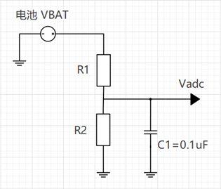

# ADC Usage and Configuration Guide

## 1. Overview
ADC (Analog-to-Digital Converter) is used to convert analog signals (such as sensor outputs, battery voltage, etc.) into digital signals.

:::{only} SF32LB58X or SF32LB56X or SF32LB52X or SF32LB55X
- **Number of Channels**: 8 channels in total (Channel 0 ~ 7).
- **Special Channel**: In the `SF32LB52x` series, **Channel 7** is fixed for battery voltage detection (VBAT input after resistor divider).
:::

:::{only} SF32LB57X
- **Number of Channels**: 12 channels in total (Channel 0 ~ 11).
- **Special Channel**: In the `SF32LB57x` series, **Channel 11** is fixed for battery voltage detection (VBAT input after resistor divider).
:::
- **Data Processing**: The ADC output value must be combined with the hardware voltage divider network and software calibration values to calculate the actual voltage.

---

## 2. Chip Model and Parameter Comparison
ADC parameters vary significantly between different chip models. Please refer to the following configuration based on your actual hardware selection:

| Feature | SF32LB55x | SF32LB56x / 58x / 52x / 57x |
| :--- | :--- | :--- |
| **Sampling Bit Width** | 10 bit | 12 bit |
| **Sampling Accuracy** | 3~4 mV | 1~2 mV |
| **Maximum Sampling Voltage** | 1.1 V | 3.3 V |
| **Recommended External Divider Resistors** | 1000k / 220k | 470k / 1000k |
| **RC Stabilization Time** | 157 ms | 200 ms |

> **💡 Tip**: Be sure to select appropriate external voltage divider resistors based on the above parameters to ensure the input voltage does not exceed the ADC's maximum sampling voltage and prevent chip damage.

---

## 3. ADC Calibration Mechanism
Due to manufacturing process variations, there is a deviation between the actual ADC voltage and the ideal voltage. The system compensates for this using factory calibration values.

- **Calibration Principle**: Software reads the chip's factory calibration values to correct measurement results.
- **Accuracy Impact**: The accuracy of external voltage divider resistors directly affects the final measurement accuracy.
- **Production Line Recommendation**: It is recommended to perform separate calibration of the voltage divider network on the customer's production line to eliminate resistor errors.



---

## 4. Power Supply and Reference Voltage (AVDD & VREF)
The ADC has only one analog power supply path. Configuration must strictly follow the specifications below:

- **AVDD33_ANA**: 3.3V analog power supply, must be stably connected.
- **GPADC_VREF**: Internal reference voltage pin, not an independent power domain.

Different platforms handle `GPADC_VREF` differently:
1. **Some platforms**: Connect GPADC_VREF to ground through an external capacitor.
2. **Some platforms**: No external pin available; provided only by internal reference voltage.

> **⚠️ Important Warning**: The ADC power supply must be connected to **AVDD33_ANA**. **Never** apply power directly to the GPADC_VREF pin.


---

## 5. Pin (PAD) Configuration
ADC pins are typically configured by setting the PIN to analog function.

### 5.1 General Configuration Example
```c
// General analog pin settings
HAL_PIN_Set_Analog(PAD_PB08, 0);
HAL_PIN_Set_Analog(PAD_PB13, 0);
```

### 5.2 SF32LB55x Specific Configuration
On SF32LB55x, PINs can be directly mapped to specific GPADC channels:
```c
HAL_PIN_Set(PAD_PB08, GPADC_CH0, PIN_NOPULL, 0);
HAL_PIN_Set(PAD_PB13, GPADC_CH3, PIN_NOPULL, 0);
```

### 5.3 ADC PAD Channel Distribution Table
Pin mapping relationships for different chip models are as follows:

| Channel | GPADC_CH0 | GPADC_CH1 | GPADC_CH2 | GPADC_CH3 | GPADC_CH4 | GPADC_CH5 | GPADC_CH6 | GPADC_CH7 | GPADC_CH8 | GPADC_CH9 | GPADC_CH10 | GPADC_CH11 |
| :--- | :--- | :--- | :--- | :--- | :--- | :--- | :--- | :--- | :--- | :--- | :--- | :--- |
| **SF32LB55x** | PB08 | PB10 | PB12 | PB13 | PB16 | PB17 | PB18 | PB19 | - | - | - | - |
| **SF32LB52x** | PA28 | PA29 | PA30 | PA31 | PA32 | PA33 | PA34 | BAT | - | - | - | - |
| **SF32LB56x** | PB22 | PB23 | PB24 | PB25 | PB26 | PB27 | PB28 | PB32 | - | - | - | - |
| **SF32LB57x** | PA28 | PA29 | PA30 | PA31 | PA32 | PA33 | PA34 | PA35 | PA36 | PA37 | PA38 | BAT |
| **SF32LB58x** | PB32 | PB33 | PB34 | PB35 | PB36 | PB37 | PB38 | PB39 | - | - | - | - |

---

## 6. Software Interface Usage
By default, the system registers the ADC as a battery voltage device with the device name `bat1`.

### 6.1 Device Interface Calls (RT-Thread)
```c
uint32_t chnl = 1; // Specify channel
uint32_t value;
rt_device_t dev = rt_device_find("bat1");

if (dev) {
    rt_device_open(dev, RT_DEVICE_FLAG_RDONLY);
    rt_device_control(dev, RT_ADC_CMD_ENABLE, (void *)chnl);
    rt_device_read(dev, chnl, &value, 1);
}
```

### 6.2 HAL Interface Calls
If using the HAL library, you can directly obtain the raw value through the following interface:
```c
HAL_ADC_GetValue(channel);
```

---

## 7. Voltage Calculation and Calibration
The ADC value has a linear relationship with the input voltage. The actual voltage calculation formula is as follows:

$$ V_{real} = (Value_{adc} - Offset) \times Ratio $$

Where:
- **Offset**: The offset when the register value corresponds to 0V.
- **Ratio**: The voltage increment (slope) corresponding to each register value increase.

### 7.1 Calibration Method
Determine parameters using two known voltage points (avoid using 0V or maximum voltage as calibration points):
1. Input two accurate and stable voltage values (55x: 0.3V and 0.8V, 56x/52x/58x/57x: 1.0V and 2.5V).
2. Read the corresponding ADC register values.
3. Calculate the slope and offset.
4. Save the parameters for subsequent use.

### 7.2 Reference Code Implementation
```c
// Global variable definitions
static uint32_t adc_vol_offset = 200;
static uint32_t adc_vol_ratio = 3930;
#define ADC_RATIO_ACCURATE 1000

// Convert ADC value to millivolts (mV)
int sifli_adc_get_mv(uint32_t value) {
    return (value - adc_vol_offset) * adc_vol_ratio / ADC_RATIO_ACCURATE;
}

// Calibration function
int sifli_adc_calibration(uint32_t value1, uint32_t value2,
                          uint32_t vol1, uint32_t vol2,
                          uint32_t *offset, uint32_t *ratio) {
    uint32_t gap1, gap2;

    if (offset == NULL || ratio == NULL) return 0;

    gap1 = (value1 > value2) ? (value1 - value2) : (value2 - value1);
    gap2 = (vol1 > vol2) ? (vol1 - vol2) : (vol2 - vol1);

    if (gap1 == 0) return 0;

    *ratio = gap2 * ADC_RATIO_ACCURATE / gap1;
    adc_vol_ratio = *ratio;

    *offset = value1 - (vol1 * ADC_RATIO_ACCURATE / adc_vol_ratio);
    adc_vol_offset = *offset;

    return adc_vol_offset;
}
```
