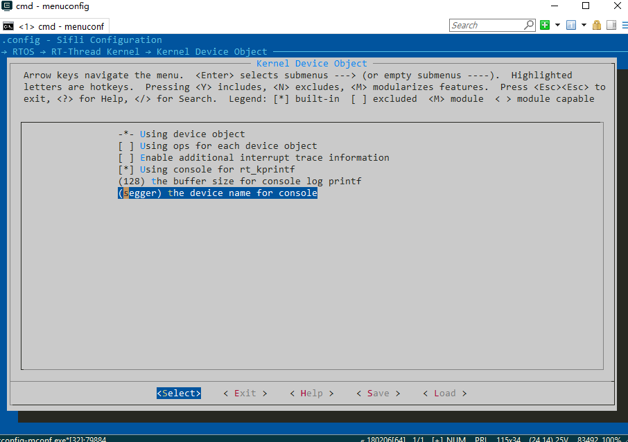

# Debugging and Logging

## 1. Hardware Interface Description
### SWD Interface

:::{only} SF32LB55X or SF32LB58X or SF32LB56X or SF32LB57X
**SWD Debug Interface**: Connected to the HCPU by default.
**Switch to LCPU**: Execute `$SDK_ROOT/tools/segger/jlink_lcpu_series.bat` (the `series` in `jlink_lcpu_series` refers to the chip series, e.g. `a0` for 55x and `pro` for 58x) or enter the corresponding command in the J-Link window, as described later.
**Switch to HCPU**: Execute `$SDK_ROOT/tools/segger/jlink_hcpu_series.bat` (the `series` in `jlink_hcpu_series` refers to the chip series, e.g. `a0` for 55x and `pro` for 58x).
**Notes**: Since the SWD interface usually reuses the PB pins, make sure that the LPSYS is in the active or light sleep state during debugging. After the LPSYS wakes up from Standby, SWD automatically switches back to the default HCPU. In addition, sending a reset command through J-Link does not change the CPU core to which SWD is currently connected.
:::
### Log Interface

:::{only} SF32LB52X
**UART Log Interface**: On common HCPU boards, logs are output from UART1 by default. The baud rate is usually 1000000 bps.
:::
:::{only} SF32LB56X or SF32LB58X or SF32LB57X
**UART Log Interface**: On common HCPU boards, logs are output from UART1 by default. The log interface can be changed to UART1/2 or SWD. If you need to select UART3/4/5, which belong to the LCPU, make sure that the LCPU is in the awake state when in use. On common LCPU boards, logs are output from UART4 by default. The baud rate is usually 1000000 bps and is used for printing logs or entering commands. It is recommended to reserve this interface for the LCPU as the log interface.
:::
:::{only} SF32LB55X
**UART Log Interface**: On common HCPU boards, logs are output from UART1 by default. The log interface can be changed to UART1/2 or SWD. If you need to select UART3/4/5, which belong to the LCPU, make sure that the LCPU is in the awake state when in use. On common LCPU boards, logs are output from UART3 by default. The baud rate is usually 1000000 bps and is used for printing logs or entering commands. It is recommended to reserve this interface for the LCPU as the log interface.
:::

## 2. Debugging Methods
  This section mainly describes how to analyze common Assert or HardFault errors and how to resolve system crashes. J-Link is used as the debugger throughout.
  
### Setting Breakpoints
When J-Link connects to the HCPU/LCPU, the system has usually finished initialization. To debug the initialization process, such as a cold boot or wake-up from standby sleep, you need to halt the system as early as possible.<br>
It is recommended that you modify the system initialization code. In the following paths, `sf32lb5xx` denotes the chip series; for the 58 series, substitute `sf32lb58x`.
 - HCPU<br>
   _$SDK_ROOT/drivers/cmsis/sf32lb5xx/Templates/arm/startup_bf0_hcpu.S_ <br>
 - LCPU<br>
   _$SDK_ROOT/drivers/cmsis/sf32lb5xx/Templates/arm/startup_bf0_lcpu.S_ <br>
Remove the comment ';' from the first instruction in Reset_Handler, changing it to <br>
  B  . <br>
In this way, the CPU stays at the first instruction after boot. Once J-Link connects successfully, you can change the PC register (+2) and set the desired breakpoints to debug the initialization process.

The same method can be used elsewhere to halt the system at the moment a certain event occurs. At the suspected location, if it is a C file, add <br>
  _asm("B .");  <br>
to keep the system at this instruction. Then connect J-Link, change the PC register (+2), and continue debugging.
```{note} 
Do not use while(1);. Otherwise the compiler will optimize and invalidate all statements after while(1).
```

### Assert/HardFault Error Analysis
When an error occurs, if the board is connected to a J-Link tool via SWD, you can use _$SDK_ROOT/tools/crash_dump_analyser/script/save_ram_5xx.bat to save the RAM (`5xx` in `save_ram_5xx.bat` denotes the chip series; for the 58 series, substitute `58x`), EPIC registers, and PSRAM contents to the current path. This helps analyze the cause of the crash.
```{note} 
You need to add the J-Link path to the Windows environment variable PATH, e.g. _C:/Program Files (x86)/SEGGER/JLink_v672b_. Later you can load the RAM through J-Link to restore the crash scene.
```
#### Analyzing Logs
By default, the SDK outputs the assertion line and the final CPU register values through the log interface when an Assert occurs. Analyze the cause based on this information. Note that if the log interface uses asynchronous output, the output may be incomplete.
```
Assertion failed at function:app_exit, line number:704 ,(app_node->next != &running_app_list)
===================
Thread Info        
===================
thread   pri  status      sp     stack size max used left tick  error
-------- ---  ------- ---------- ----------  ------  ---------- ---
app_watc  25  ready   0x00000100 0x00002800    26%   0x00000008 000
tshell    20  suspend 0x000000f4 0x00001000    13%   0x00000008 000
ble_app   15  suspend 0x000001b4 0x00000400    54%   0x00000007 000
mbox_th   10  suspend 0x00000110 0x00001000    51%   0x00000006 000
ds_proc   12  suspend 0x0000011c 0x00000800    24%   0x00000005 000
ds_mb     11  suspend 0x00000148 0x00000400    32%   0x0000000a 000
touch_th  10  suspend 0x000000ec 0x00000200    59%   0x00000006 000
test      15  suspend 0x0000011c 0x00000400    27%   0x0000000a 000
alarmsvc   8  suspend 0x00000074 0x00000200    22%   0x00000001 000
ulog_asy  30  ready   0x000000ec 0x00000400    36%   0x0000000b 000
tidle     31  ready   0x00000064 0x00000200    19%   0x00000008 000
timer      4  suspend 0x000000e0 0x00000400    23%   0x00000003 000
main      10  suspend 0x000000ec 0x00000800    31%   0x0000000c 000
===================
Mailbox Info       
===================
mailbox  entry size suspend thread
-------- ----  ---- --------------
g_bf0_si 0000  0016 0
ble_app  0000  0008 1:ble_app
===================
MessageQueue Info  
===================
msgqueue entry suspend thread
-------- ----  --------------
uisrv    0000  0
mq_guiap 0000  0
data_mb_ 0000  1:ds_mb
dserv    0000  1:ds_proc
test     0000  1:test
===================
Mutex Info         
===================
mutex      owner  hold suspend thread
-------- -------- ---- --------------
dserv    (NULL)   0000 0
tmalck   (NULL)   0000 0
alarmsvc (NULL)   0000 0
alm_mgr  (NULL)   0000 0
ulog loc (NULL)   0000 0
i2c_bus_ (NULL)   0000 0
i2c_bus_ (NULL)   0000 0
i2c_bus_ (NULL)   0000 0
spi1     (NULL)   0000 0
===================
Semaphore Info     
===================
semaphore v   suspend thread
-------- --- --------------
app_tran 000 0
lv_data  001 0
lv_lcd   001 0
lv_epic  001 0
drv_lcd  000 0
fb_sem   000 0
lvlargef 001 0
lvlarge  001 0
btn      001 0
shrx     000 1:tshell
g_sifli_ 000 0
tma525b  000 1:touch_th
aw_tim   000 0
cons_be  000 0
ulog     150 0
heap     001 0
===================
Memory Info     
===================
total memory: 260784 used memory : 69096 maximum allocated memory: 96768
===================
MemoryHeap Info     
===================
memheap   pool size  max used size available size
-------- ---------- ------------- --------------
lvlargef 309172     301588        309124
lvlarge  2473392    2201700       2473344
=====================
 sp: 0x2006ec08
psr: 0x60000000
r00: 0x00000000
r01: 0x00000000
r02: 0x200bc8f8
r03: 0x0000002a
r12: 0x10069305
 lr: 0x100642e9
 pc: 0x10020bfa
=====================
fatal error on thread: app_watc?
```


#### Viewing the Crash Scene with Ozone
##### Configuration Using J-Link (USB)
If the logs do not provide enough information to analyze the cause of the crash, you can use Ozone, a debugging tool provided by Segger. Compared with Keil, Ozone can attach to the chip through J-Link more easily when the system has crashed. Incorrect Keil configuration can easily restart the chip and destroy the crash scene.

> Ozone can also attach to a running board using the following method and support single-step debugging, similar to Keil. However, its stack analysis does not appear to be as good as Keil's.
- Create a new project, select the appropriate Device driver (`Cortex-M33`), select `Cortex-M33 (with FPU)` for Register Set, and select the peripheral SVD file according to the chip model. The files are located under _$SDK_ROOT/tools/svd_external_.


- Select J-Link as the connection method and SWD as the interface.


- Select the ELF file to be programmed and load its symbol information.


- After the project is created, use Ozone to attach to the crashed board through J-Link and halt the board.


- You can then use the menu functions for single-step debugging, variable inspection, stack analysis, and similar operations.


##### Configuration Using a Serial Connection
- Create a new project, select the appropriate Device driver (`Cortex-M33`), select `Cortex-M33 (with FPU)` for Register Set, and select the peripheral SVD file according to the chip model. The files are located at _$SDK_ROOT/tools/svd_external_.

- Open _SifliUsartServer.exe_ and click Connect. Make sure to select the core being debugged and its corresponding serial port.


- In Ozone, select the UART connection method. Set Host Interface to `IP` and enter the UART Server's `SERVER` value as the IP Address.


- Select the ELF file to be programmed and load its symbol information.


## 3. Log Interface

### Using UART for Log Output
The pinmux configuration for the UART is not described here. For details, see [](../hal/uart.md).

If you are using RT-Thread RTOS, after configuring the UART pinmux, use the following menuconfig option to select a different UART device.


In addition, the SDK uses ULOG as the common log output interface. For details, see [](../middleware/logger.md).

### Using J-Link for Log Output
If there are not enough pins available, you can use the J-Link RTT function as the console port. The configuration steps are as follows. The RT-Thread RTOS included with the SDK already integrates Segger RTT:

1. Enable the Segger RTT function through menuconfig. It automatically registers an RT-Device named `segger`.


2. Set the default RT-Thread console port to the `segger` RT-Device.


3. Connect to the board through Ozone. If an ELF file has already been specified, Ozone automatically locates `RTT_CtrlBlock`; otherwise, you must specify it manually.


## 4. Using the Bus Monitor

The bus monitor can monitor accesses on the bus and generate an interrupt callback when conditions are met. It can be used during debugging to monitor access to a memory region or peripheral.

### Enabling the Bus Monitor
Use the following menuconfig option to enable the bus monitor controller.


### Using the Bus Monitor

You can add the following code to implement specific functions:
```c

void busmon_cbk()
{
    rt_kprintf("Busmon captured\n");        // Handle the callback when a specific bus access occurs. You can add an Assert here for further debugging and analysis.
}

...

    dbg_busmon_reg_callback(busmon_cbk);       // Register the callback.
    dbg_busmon_read(0x20080000,1);             // Trigger the bus monitor on the first read from address 0x20080000.
    
    // Reconfigure
    dbg_busmon_reg_callback(busmon_cbk);       // Register the callback.
    dbg_busmon_write(0x20080004,3);            // Trigger the bus monitor on the third write to address 0x20080004.

    // Reconfigure
    dbg_busmon_reg_callback(busmon_cbk);       // Register the callback.
    dbg_busmon_write(0x20080008,2);            // Trigger the bus monitor on the second read or write to address 0x20080008.

```
