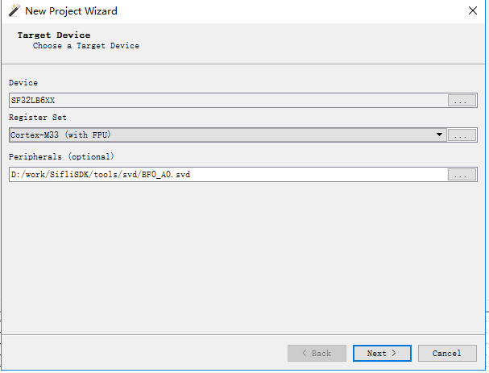
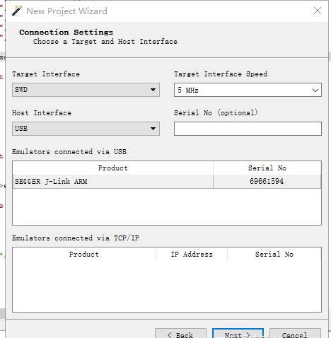
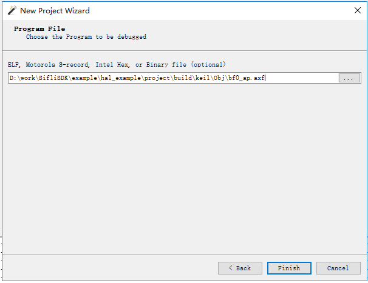
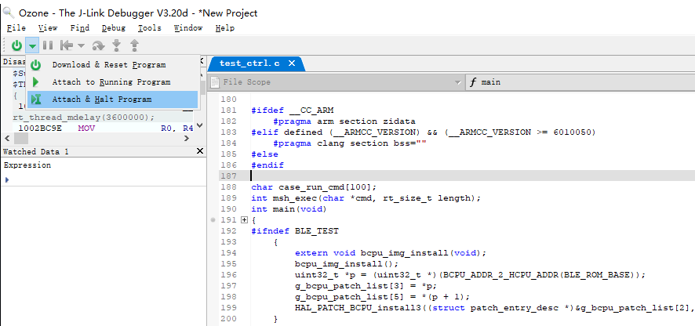
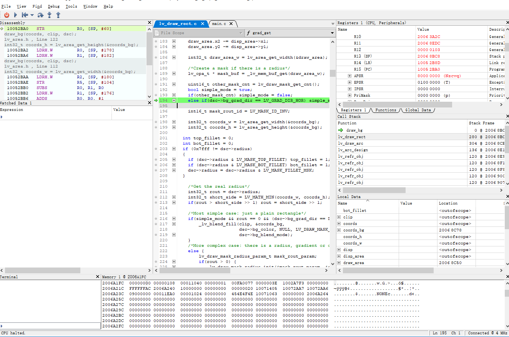
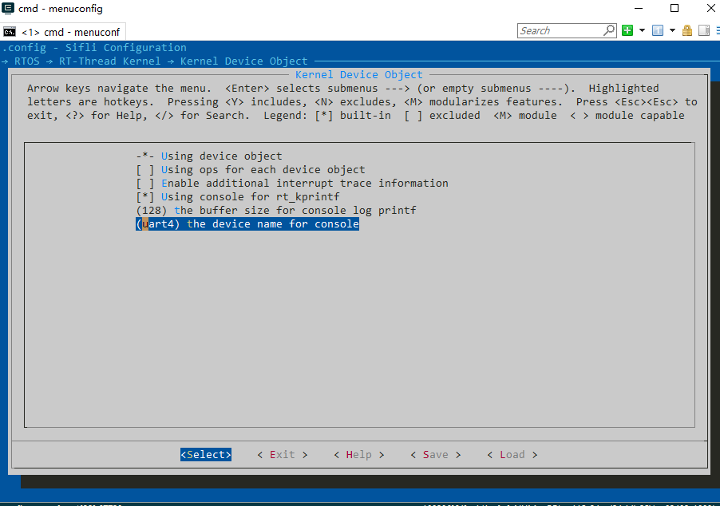
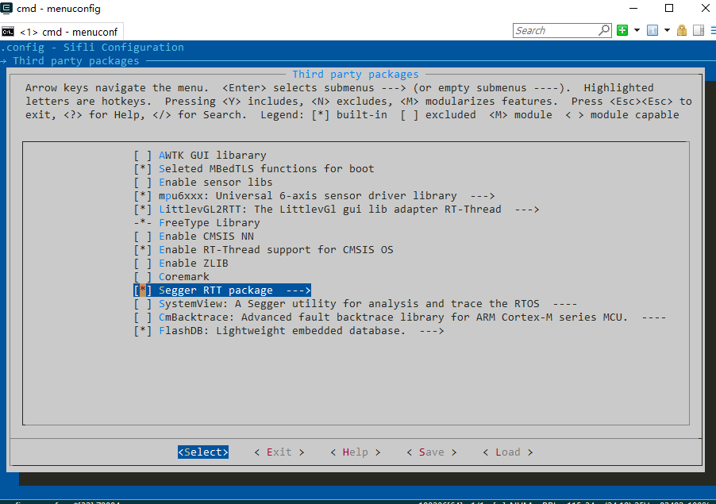
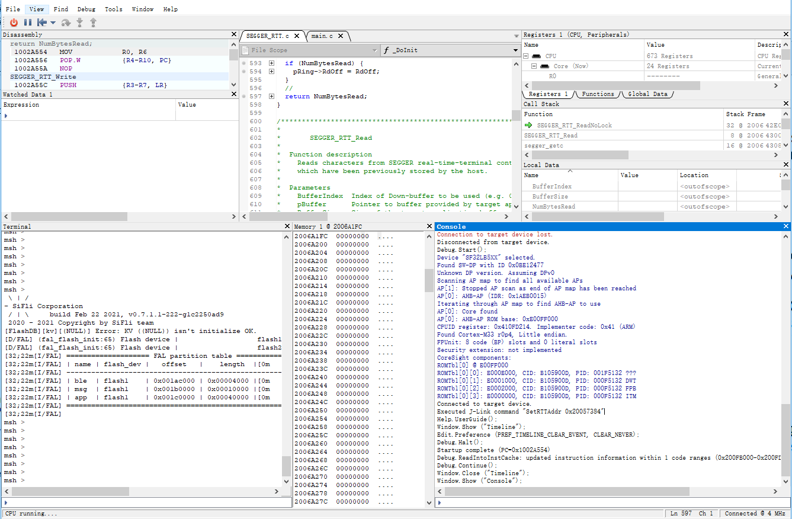
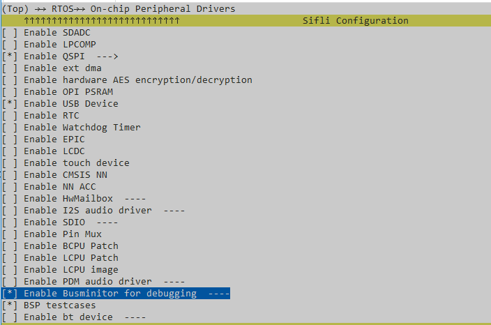

# app_watc 25 ready 0x00000100 0x00002800 26% 0x00000008 000 tshell 20 suspend 0x000000f4 0x00001000 13% 0x00000008 000 ble_app 15 suspend 0x000001b4 0x00000400 54% 0x00000007 000 mbox_th 10 suspend 0x00000110 0x00001000 51% 0x00000006 000 ds_proc 12 suspend 0x0000011c 0x00000800 24% 0x00000005 000 ds_mb 11 suspend 0x00000148 0x00000400 32% 0x0000000a 000 touch_th 10 suspend 0x000000ec 0x00000200 59% 0x00000006 000 test 15 suspend 0x0000011c 0x00000400 27% 0x0000000a 000 alarmsvc 8 suspend 0x00000074 0x00000200 22% 0x00000001 000 ulog_asy 30 ready 0x000000ec 0x00000400 36% 0x0000000b 000 tidle 31 ready 0x00000064 0x00000200 19% 0x00000008 000 timer 4 suspend 0x000000e0 0x00000400 23% 0x00000003 000 main 10 suspend 0x000000ec 0x00000800 31% 0x0000000c 000

## 1. Hardware Interfaces
The SF32FB55X utilizes the Serial Wire Debug (SWD) interface for debugging.
Users can switch between the HCPU and LCPU via configuration.

The system defaults to the HCPU upon power-up. To debug the LCPU, execute the
SDK tool _$SDK_ROOT/tools/segger/jlink_lcpu_a0.bat_ to switch the SWD connection
to the LCPU.

Conversely, if the SWD is currently connected to the LCPU, execute the SDK tool
_$SDK_ROOT/tools/segger/jlink_hcpu_a0.bat_ to switch the connection back to the
HCPU.

  ```{note} 
  1. Since SWD utilizes PB IOs, ensure that the LPSYS remains in either Active or Light Sleep state during debugging, regardless of whether the SWD is connected to the HCPU or LCPU.<br>
  2. Issuing a reset command via J-Link does not change the CPU currently selected by the SWD interface.<br>
  3. After the LPSYS wakes up from Standby mode, the SWD interface reverts to its default connection (HCPU).<br>
  ```
### LCPU Log Interface
During initialization, the System ROM uses UART3 (assigned to the LCPU) as the
console interface with a baud rate of 1,000,000 bps for logging and command
input. It is recommended to reserve this interface as the dedicated log port for
the LCPU.<br>

### HCPU Log Interface
The HCPU log interface can be assigned to UART1, UART2, or SWD. If LCPU-owned
peripherals (UART3/4/5) are used, ensure the LCPU remains in an awake state
during operation.

## 2. Debugging Methodologies
This section describes common analysis methods for Assertions and HardFaults, as
well as recovery procedures for system hangs using a J-Link debugger.

### Setting Breakpoints
By the time J-Link connects to the HCPU or LCPU, the system has typically
completed initialization. To debug early-stage processes such as cold boots or
wake-up from Standby, the CPU must be halted as early as possible. <br> It is
recommended that users modify the system startup sequence:
 - HCPU: <br>
   _$SDK_ROOT/drivers/cmsis/sf32lb55x/Templates/arm/startup_bf0_hcpu.S_ <br>
 - LCPU: <br>
   _$SDK_ROOT/drivers/cmsis/sf32lb55x/Templates/arm/startup_bf0_lcpu.S_ <br> In
   the Reset_Handler, uncomment the first instruction by removing the ';' to
   enable: <br> B . <br> This causes the CPU to loop on the first instruction
   upon startup. Once the J-Link connection is established, manually increment
   the Program Counter (PC) register (e.g., +2) and set the required breakpoints
   to debug the initialization sequence.

This technique can also be applied elsewhere to halt the system at specific
events. In C source files, inserting <br> __asm("B ."); <br> will trap the CPU
at that instruction. After connecting J-Link, the PC can be incremented (+2) to
resume execution for further debugging.
```{note} 
Do not use `while(1);` for this purpose, as the compiler may optimize out subsequent statements, making them unreachable.
```

### Assert/HardFault Error Analysis
When an error occurs, if the board is connected to a J-Link via SWD, use the
script _$SDK_ROOT/tools/crash_dump_analyser/script/save_ram_a0.bat_ to dump the
RAM, EPIC registers, and PSRAM contents to the current directory. This data is
critical for post-mortem analysis of system crashes.
```{note} 
Ensure the J-Link installation path (e.g., _C:/Program Files (x86)/SEGGER/JLink_v672b_) is added to the Windows PATH environment variable. The saved RAM dumps can subsequently be reloaded via J-Link to reconstruct the crash state.
```
#### Log Analysis
By default, the SDK outputs the assertion line and the final CPU register states
via the log interface during an Assert. Analyze the issue based on this output.
Note that if the log interface is configured for asynchronous output, the
information may be incomplete.
```
Assertion failed at function:app_exit, line number:704 ,(app_node-&gt;next != &amp;running_app_list)
===================
Thread Info        
===================
thread   pri  status      sp     stack size max used left tick  error
-------- ---  ------- ---------- ----------  ------  ---------- ---
app_watc  25  ready   0x00000100 0x00002800    26%   0x00000008 000
tshell    20  suspend 0x000000f4 0x00001000    13%   0x00000008 000
ble_app   15  suspend 0x000001b4 0x00000400    54%   0x00000007 000
mbox_th   10  suspend 0x00000110 0x00001000    51%   0x00000006 000
ds_proc   12  suspend 0x0000011c 0x00000800    24%   0x00000005 000
ds_mb     11  suspend 0x00000148 0x00000400    32%   0x0000000a 000
touch_th  10  suspend 0x000000ec 0x00000200    59%   0x00000006 000
test      15  suspend 0x0000011c 0x00000400    27%   0x0000000a 000
alarmsvc   8  suspend 0x00000074 0x00000200    22%   0x00000001 000
ulog_asy  30  ready   0x000000ec 0x00000400    36%   0x0000000b 000
tidle     31  ready   0x00000064 0x00000200    19%   0x00000008 000
timer      4  suspend 0x000000e0 0x00000400    23%   0x00000003 000
main      10  suspend 0x000000ec 0x00000800    31%   0x0000000c 000
===================
Mailbox Info       
===================
mailbox  entry size suspend thread
-------- ----  ---- --------------
g_bf0_si 0000  0016 0
ble_app  0000  0008 1:ble_app
===================
MessageQueue Info  
===================
msgqueue entry suspend thread
-------- ----  --------------
uisrv    0000  0
mq_guiap 0000  0
data_mb_ 0000  1:ds_mb
dserv    0000  1:ds_proc
test     0000  1:test
===================
Mutex Info         
===================
mutex      owner  hold suspend thread
-------- -------- ---- --------------
dserv    (NULL)   0000 0
tmalck   (NULL)   0000 0
alarmsvc (NULL)   0000 0
alm_mgr  (NULL)   0000 0
ulog loc (NULL)   0000 0
i2c_bus_ (NULL)   0000 0
i2c_bus_ (NULL)   0000 0
i2c_bus_ (NULL)   0000 0
i2c_bus_ (NULL)   0000 0
spi1     (NULL)   0000 0
===================
Semaphore Info     
===================
semaphore v   suspend thread
-------- --- --------------
app_tran 000 0
lv_data  001 0
lv_lcd   001 0
lv_epic  001 0
drv_lcd  000 0
fb_sem   000 0
lvlargef 001 0
lvlarge  001 0
btn      001 0
shrx     000 1:tshell
g_sifli_ 000 0
tma525b  000 1:touch_th
aw_tim   000 0
cons_be  000 0
ulog     150 0
heap     001 0
===================
Memory Info     
===================
total memory: 260784 used memory : 69096 maximum allocated memory: 96768
===================
MemoryHeap Info     
===================
memheap   pool size  max used size available size
-------- ---------- ------------- --------------
lvlargef 309172     301588        309124
lvlarge  2473392    2201700       2473344
=====================
 sp: 0x2006ec08
psr: 0x60000000
r00: 0x00000000
r01: 0x00000000
r02: 0x200bc8f8
r03: 0x0000002a
r12: 0x10069305
 lr: 0x100642e9
 pc: 0x10020bfa
=====================
fatal error on thread: app_watc?
```


#### Analyzing Crash State via Ozone
##### Configuration using J-Link (USB) connection
If the logs are insufficient for crash analysis, you can use Ozone, a debugging
tool provided by SEGGER. Compared to Keil, Ozone makes it easier to attach to a
chip via J-Link after a crash occurs (Keil's configuration often triggers a chip
reset, which destroys the crash context).

> Ozone can also be used to attach to a running board and perform single-step
> debugging, similar to Keil’s functionality. However, its stack unwinding
> capabilities may not be as robust as those in Keil.
- Create a new project and select the appropriate device driver (Cortex-M33).
  Set the Register Set to Cortex-M33 (with FPU) and select the peripheral SVD
  file (depending on the chip model, located in _$SDK_ROOT/tools/svd_external).



- In the next step, select the J-Link connection method and use the SWD
  interface.



- Select the ELF file of the target firmware to load symbol information.



- Once the project is created, attach Ozone to the crashed board via J-Link and
  halt the target.



- You can then use the menu functions to perform single-step debugging, inspect
  variables, and analyze the call stack, similar to the workflow in Keil.



##### Configuration using Serial (UART) connection
- Create a new project and select the appropriate device driver (Cortex-M33).
  Set the Register Set to Cortex-M33 (with FPU) and select the peripheral SVD
  file (depending on the chip model, located in _$SDK_ROOT/tools/svd_external).

- Open _SifliUsartServer.exe_ and click Connect. Ensure you select the target
  core to be debugged and its corresponding COM port.


- In OZone, select UART as the connection method. Set the Host Interface to IP
  and enter the UartServer IP address.


- Select the ELF file of the target firmware to load symbol information.


## 3. Log Interfaces

### UART Output
For details regarding UART pinmux configuration, please refer to
[](../hal/uart.md).

When using the RT-Thread RTOS, configure the UART pinmux and then select the
desired UART device via menuconfig as shown below:


Additionally, the SDK utilizes ULOG as the standard logging interface. For more
details, see [](../middleware/logger.md).

### J-Link RTT Output
If GPIO pins are limited, the J-Link RTT (Real Time Transfer) feature can be
used as the console. The configuration steps are as follows (Segger RTT is
already integrated into the SDK's RT-Thread RTOS):

1. Enable the Segger RTT function via menuconfig, which will automatically
   register an RT-Thread device named "segger":
   

2. Set the default RT-Thread console to the "segger" device:
   ![]../../assets/jlink_trace_config_step2.png)

3. Connect to the board using OZone. If an ELF file is specified, OZone will
   automatically locate the RTT control block; otherwise, it must be specified
   manually: 

## 4. Bus Monitor

The Bus Monitor tracks bus access and triggers an interrupt callback when
specified conditions are met. This is useful for monitoring specific memory
regions or peripheral accesses during debugging.

### Enabling the Bus Monitor
The Bus Monitor can be enabled via menuconfig as follows:


### Using the Bus Monitor

The following code snippet demonstrates how to implement specific functionality:
```c
void busmon_cbk()
{
    rt_kprintf("Busmon captured\n");        // Callback triggered upon specific bus access. Users can insert assertions here for further debugging and analysis.
}

...

    dbg_busmon_reg_callback(busmon_cbk);       // Register the callback
    dbg_busmon_read(0x20080000, 1);            // Trigger the bus monitor on the first read access to address 0x20080000

    // Reconfiguration
    dbg_busmon_reg_callback(busmon_cbk);       // Register the callback
    dbg_busmon_write(0x20080004, 3);           // Trigger the bus monitor on the third write access to address 0x20080004

    // Reconfiguration
    dbg_busmon_reg_callback(busmon_cbk);       // Register the callback
    dbg_busmon_write(0x20080008, 2);           // Trigger the bus monitor on the second access (either read or write) to address 0x20080008
```

