

## 1. Development Environment Setup
### Required Software
1. Sifli env and SiFli SDK (Download from WeDisk)
1. Keil V5.32 or higher, armcc V6 or higher. To enable script support, add the
   ARM and J-Link paths to the Windows PATH environment variable (e.g.,
   _C:\Keil_v5\ARM\ARMCLANG\bin_ and _C:\Program
   Files(x86)\SEGGER\JLink_v672b_).
1. SEGGER J-Link, V6.72b or higher [J-Link
   Download](https://www.segger.com/downloads/jlink/JLink_Windows.exe)
1. Visual Studio 2017 or higher

### Required Hardware
1. One Windows PC
1. ARM Emulator x1
```{note} 
Conflicts may occur between the emulator's power supply and the EVB. Ensure emulator power output is disabled. If connection fails, check the J-Link hardware power jumper. The figure below illustrates the power jumper on a common J-Link; it must be removed.
  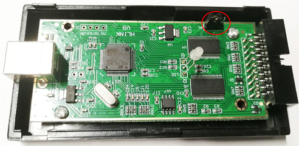
```
1. USB Type-C cable x1\
   Used for EVB power supply and for connecting the FTDI USB-to-UART bridge to
   capture serial data.
1. EVB Development Kit x1\
   Includes an interface baseboard (EI-LB55XXXX001), a CPU daughterboard
   (LB551), and a display daughterboard (models vary by display type).
> EVB Interface Overview 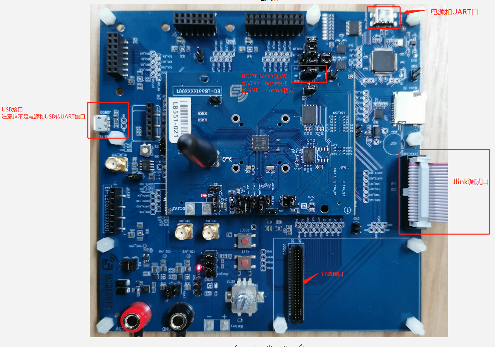

### Required Build Configurations
1. Extract 'env' to your PC (e.g., _c:\work\env_).
2. Navigate to the 'env' directory and run _env.exe_. If it fails to open, try
   _env.bat_.
3. Associate the "ConEmu Here" context menu with folders. 

### Add Keil Flash Programming Driver
Copy sf32lb55x.FLM from _tools/flash/keil_drv/sf32lb55x_ to
_C:\Keil_v5\ARM\Flash_ (Note: Adjust the path if Keil is installed in a
non-default directory).

## 2. Compiling the Sample Project

### Compiling the EVB Project (DSI Display)
1. 1. Navigate to the SifliSDK directory, right-click and select "ConEmu Here"
   to open the terminal. Execute the batch file `set_env.bat` to configure the
   necessary environment variables. (Environment variables only need to be set
   once per ConEmu session; if you open a new ConEmu window, you must run this
   command again.)
```{note} _set_env.bat_ 里面有设置Keil的安装目录(默认是 _C:/Keil_v5_ )，用户需要根据自己的安装目录进行修改。
2. Switch to the directory: _example/watch_demo/project/ec-lb551_
3. Run the command `scons --target=mdk5 –s` to generate the Keil project.
4. Open _project.uvprojx_ in Keil and proceed to compile.
```
The compilation process for the ec-lb555 project is similar.
```
### Compiling the Simulator Project
1. Navigate to the SifliSDK directory, right-click and select "ConEmu Here" to open the terminal, then execute _set_env.bat_.
2. Switch to the directory: _example\watch_demo\project\watch_simu_
3. Run the command `scons --target=vs2017 -s` to generate the Visual Studio project. Open _project.vcxproj_ in Visual Studio 2017 to compile and run.
```
If Visual Studio reports that _SDL2.DLL_ cannot be found at runtime, add the
path _env\tools\Python27_ to the PATH environment variable and restart Visual
Studio.
```

```
If using a different version of Visual Studio, you may need to update the
Windows SDK version as prompted when opening the project.
```
## 3. Programming the EVB

The SDK provides three methods for programming the EVB: one via the Keil environment and two using J-Link tools.
```
Under normal circumstances, the `boot_mode` jumper does not need to be adjusted.
If programming issues persist or the user application hangs, move the
`boot_mode` jumper to the VDD side and press the reset button to enter boot mode
before re-attempting flash programming. Once programming is complete, restore
the `boot_mode` jumper to the GND side and reset the device to resume normal
operation.
```
### 3.1 Programming the EVB via Keil
To program the EVB flash using Keil, you must first install the Keil Flash driver. Copy _sf32lb55x.FLM_ from the _tools\flash\keil_drv\sf32lb55x_ directory to _C:\Keil_v5\ARM\Flash_ (assuming the default Keil installation path; if installed elsewhere, use the corresponding folder).

At a minimum, two components must be programmed to the EVB:
- **Flash Table**: This only needs to be programmed once. The ROM reads the Flash Table after reset to determine the entry point for jumping to user code. For detailed usage, refer to [Secure Bootloader](../../bootloader.md). EVBs are shipped with a default flash table; unless the flash memory is corrupted, users can typically skip this step.
- **Project Code**

#### Programming the Flash Table
1. Open the project _example/flash_table/project.uvprojx_.
2. Select the Keil Flash driver as described in the final section.
3. Select "flash1" as the build target, then compile and program.
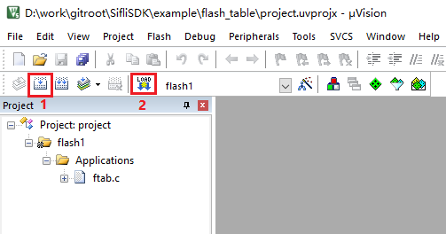

#### Programming Project Code
1. Open _example/hal_example/project/ec_lb551/project.uvprojx_.
2. Select the Keil Flash driver as described in the final section.
3. Compile and then program the flash.

#### Selecting the Keil Flash Driver
- Open the project options and select the Flash driver as shown below:
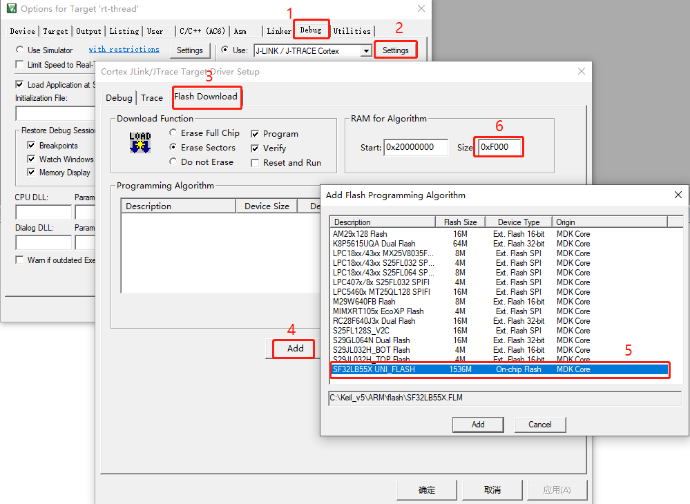


### 3.2 Programming the EVB via J-Link

This guide uses J-Link version v672b as an example, installed at _D:\Software\JLink_v672b_.
#### Adding the J-Link Flash Driver
1. Create a new directory named _SiFli_ within the J-Link device directory: _D:\Software\JLink_v672b\Devices_.
2. Copy the .elf files from _tools/flash/jlink_drv/sf32lb55x_ to the newly created "SiFli" directory (each .elf file corresponds to a specific flash driver).
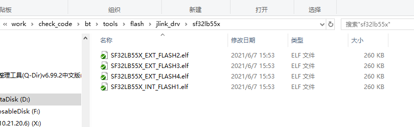
3. Update the J-Link registered device list to include the new file paths and execution parameters, as shown here:
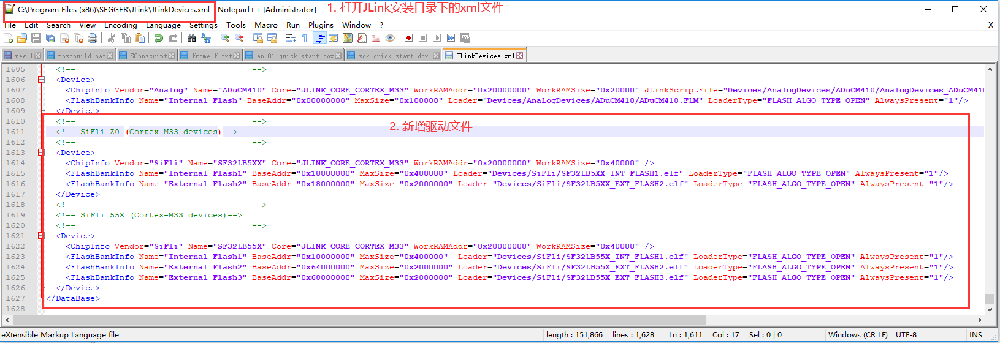

The XML content to be added is as follows:
```
  <!--                                    -->
  <!-- SiFli Z0(Cortex-M33 devices)-->
  <!--                                    -->
  <Device>
    <ChipInfo Vendor="SiFli" Name="SF32LB5XX" Core="JLINK_CORE_CORTEX_M33" WorkRAMAddr="0x20000000" WorkRAMSize="0x40000" />
    <FlashBankInfo Name="Internal Flash1" BaseAddr="0x10000000" MaxSize="0x400000" Loader="Devices/SiFli/SF32LB5XX_INT_FLASH1.elf" LoaderType="FLASH_ALGO_TYPE_OPEN" AlwaysPresent="1"/>
    <FlashBankInfo Name="External Flash2" BaseAddr="0x18000000" MaxSize="0x2000000" Loader="Devices/SiFli/SF32LB5XX_EXT_FLASH2.elf" LoaderType="FLASH_ALGO_TYPE_OPEN" AlwaysPresent="1"/>
  </Device>
  <!--                                    -->
  <!-- SiFli SF32LB55X(Cortex-M33 devices)-->
  <!--                                    -->
  <Device>
    <ChipInfo Vendor="SiFli" Name="SF32LB55X" Core="JLINK_CORE_CORTEX_M33" WorkRAMAddr="0x20000000" WorkRAMSize="0x40000" />
    <FlashBankInfo Name="Internal Flash1" BaseAddr="0x10000000" MaxSize="0x2000000" Loader="Devices/SiFli/SF32LB55X_INT_FLASH1.elf" LoaderType="FLASH_ALGO_TYPE_OPEN" AlwaysPresent="1"/>
    <FlashBankInfo Name="External Flash2" BaseAddr="0x64000000" MaxSize="0x2000000" Loader="Devices/SiFli/SF32LB55X_EXT_FLASH2.elf" LoaderType="FLASH_ALGO_TYPE_OPEN" AlwaysPresent="1"/>
    <FlashBankInfo Name="External Flash3" BaseAddr="0x68000000" MaxSize="0x2000000" Loader="Devices/SiFli/SF32LB55X_EXT_FLASH3.elf" LoaderType="FLASH_ALGO_TYPE_OPEN" AlwaysPresent="1"/>
    <FlashBankInfo Name="External Flash4" BaseAddr="0x12000000" MaxSize="0x2000000" Loader="Devices/SiFli/SF32LB55X_EXT_FLASH4.elf" LoaderType="FLASH_ALGO_TYPE_OPEN" AlwaysPresent="1"/>
  </Device>
```


#### Programming Bin/Hex Files to Flash
1. Open J-Link, connect, and select the SiFli device (note that SF32LB55X
   represents the EVB flash driver)
   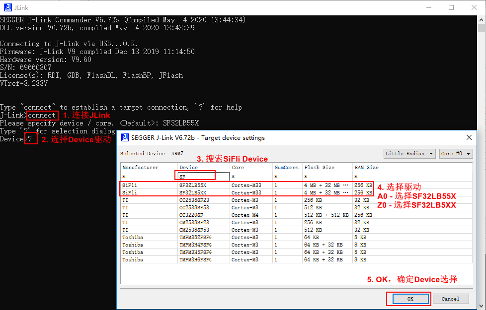

2. Select the SWD interface and configure the clock speed. Select the
   corresponding binary to flash to a specific address (ROM, RAM, or FLASH). The
   maximum J-Link speed depends on the hardware; it can typically be set to 4
   MHz or higher, while the chip supports up to 10 MHz.
   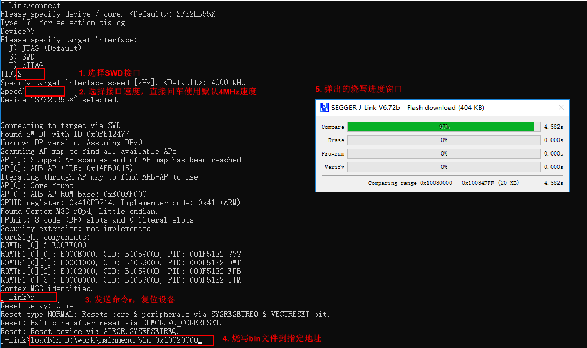

3. Programming results 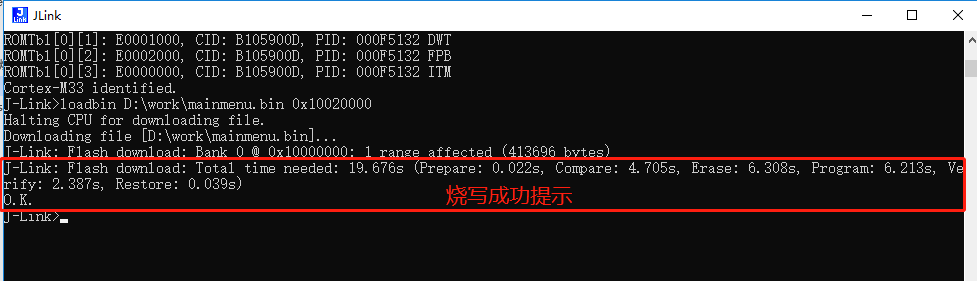

4. To program a Hex file, replace `loadbin` with `loadfile`.<b> Note that no
   target address is required for Hex files.</b>
   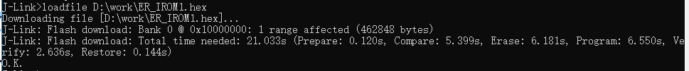

### 3.3 Windows Shell Integration: Right-Click to Program Hex Files
After installing the J-Link driver, you can integrate Hex file programming into
the Windows context menu for convenience. Note that only .hex files are
supported as they contain embedded address information; .bin files do not
include addresses and are therefore unsupported by this method.

1. Add to context menu
   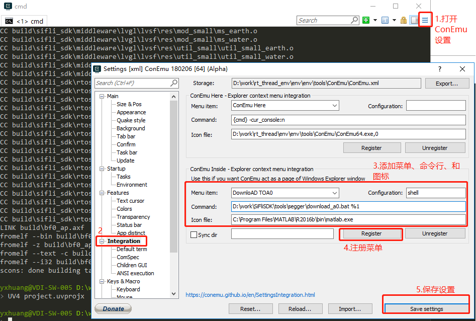

2. To program via the directory context menu: this action will rename files in
   the directory to have a .hex extension and program them sequentially.
   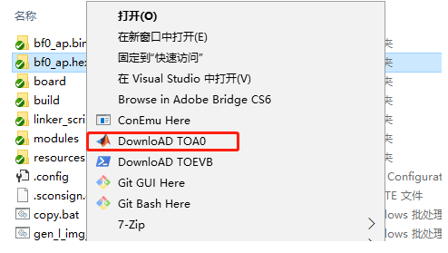

3. Alternatively, you can select and program a single .hex file (only files with
   the .hex extension are supported).
   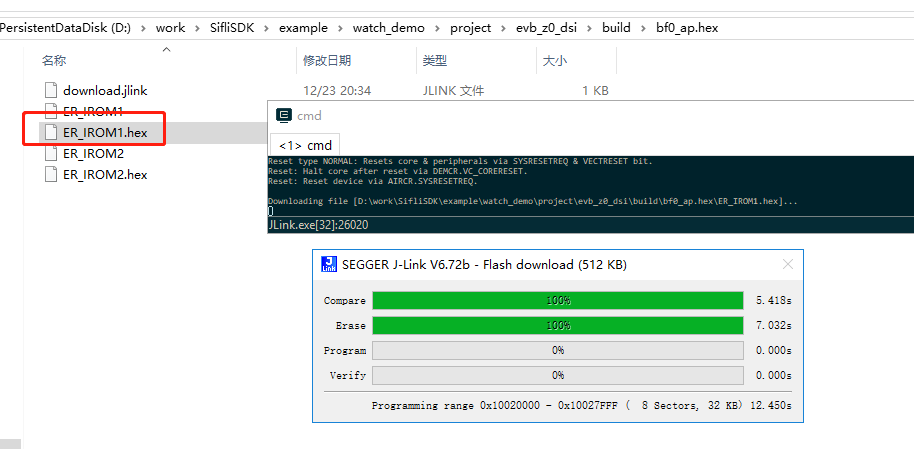

```{note} 为了使得BLE 应用运行正常，请在串口输入\
1. `nvds reset_all 1`
2. `nvds update addr 6 `
   Example: `nvds update addr 6 1234567890C8`. Note that the Bluetooth address must follow a specific format. It is recommended to keep `C8` unchanged; other values may be customized by the user.
Then, press reset to reboot.
```

```{warning}
For 56 and 58 series projects, _download.bat_ and _download.jlink_ files are generated in the build directory after compilation. Run _download.bat_ to execute the flash download. Do not use the right-click context menu to download HEX files. Doing so will modify the contents of _download.jlink_, leading to download failure. If this occurs, delete the modified download.jlink file, recompile the project, and use _download.bat_ for downloading.
```


## 4. Power-on Boot Sequence
| Stage                             | Function                    | File Path                                                               |
| --------------------------------- | --------------------------- | ----------------------------------------------------------------------- |
| Interrupt Vector Table            | ResetHandler                | SifliSDK\\drivers\\cmsis\\sf32lb55x\\Templates\\arm\\startup_bf0_hcpu.S |
| MPU configuration, BOOTMODE check | SystemInit()                | SifliSDK\\drivers\\cmsis\\sf32lb55x\\Templates\\system_bf0_ap.c         |
| RO/RW/ZI initialization           | __main()                    |                                                                         |
| RT-Thread main entry              | `$Sub$$main`                | SifliSDK\\rtos\\rtthread\\src\\components.c                             |
| ^                                 | rtthread_startup()          | SifliSDK\\rtos\\rtthread\\src\\components.c                             |
| Hardware initialization           | rt_hw_board_init()          |                                                                         |
|                                   | HAL_Init();                 |                                                                         |
| RCC configuration                 | HAL_PreInit()               | SifliSDK\\drivers\\boards\\ec-lb551XXX\\drv_io.c                        |
|                                   | HAL_MspInit()               |                                                                         |
| Pin configuration                 | BSP_IO_Init()               |                                                                         |
|                                   | rt_system_heap_init         |                                                                         |
| Log console initialization        | rt_console_set_device       |                                                                         |
| Driver initialization             | rt_components_board_init(); |                                                                         |
| High-level initialization         | rt_application_init()       | SifliSDK\\rtos\\rtthread\\src\\components.c                             |
|                                   | main_thread_entry           | SifliSDK\\rtos\\rtthread\\src\\components.c                             |
| High-level middleware             | rt_components_init          |                                                                         |
|                                   | Main()                      | Project main function                                                   |
| Start thread scheduler            | rt_system_scheduler_start() |                                                                         |

```{note} 
When the EVB is connected to a PC, the system enumerates four serial ports. The port with the lowest index serves as the Boot/LCPU terminal, while the second port is the HCPU terminal. Users are currently advised to monitor the HCPU UART output. The remaining two serial ports are currently unassigned.
```

