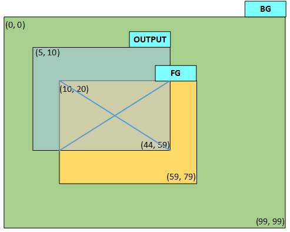
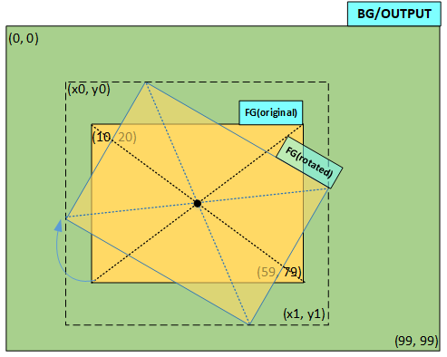

# EPIC

The HAL EPIC module provides abstract software interfaces for controlling the
hardware EPIC module. EPIC is a 2D graphics engine that supports the following
features:

## Key Features

- Alpha blending of two images with results saved to an output buffer.
- Rotation of a foreground image around an arbitrary center point, followed by
  blending with a background image and saving the output to a buffer.
- Scaling (shrinking or enlarging) of a foreground image, followed by blending
  with a background image and saving the output to a buffer.
- Integrated rotation followed by scaling in a single GPU operation, eliminating
  the need for intermediate buffers.
- Filling an assigned buffer with opaque or translucent colors.
- Support for both polling and interrupt modes for all graphics operations.
- Automatic color format conversion when source and destination formats differ.
- Blending of two images with different sizes and partial overlap, with the
  ability to specify a sub-region of the blended area for writing to the output
  buffer.
- Reusability of the same buffer for both the background image and the output
  (e.g., using the frame buffer for both).
- Support for EZIP input image format.
- Support for fractional coordinate blending (not supported by 55X).

## Input and Output Constraints
| Functionality        | Supported Formats                                                                                             | 55X                                                                                                                  | 58X                                                                                                                                                              | 56X         | 52X         |
| -------------------- | ------------------------------------------------------------------------------------------------------------- | -------------------------------------------------------------------------------------------------------------------- | ---------------------------------------------------------------------------------------------------------------------------------------------------------------- | ----------- | ----------- |
| Horizontal Scaling   | Color formats supported by all chips                                                                          | 3.8 format (downscaling by 8x, upscaling by 256x, with 1/256 precision)                                              | 10.16 format (downscaling by 1024x, upscaling by 65536x, with 1/65536 precision)                                                                                 | Same as 58X | Same as 58X |
| Vertical Scaling     | Color formats supported by all chips                                                                          | Fixed aspect ratio; horizontal and vertical scaling factors must be identical and cannot be configured independently | 10.16 format (downscaling by 1024x, upscaling by 65536x, with 1/65536 precision); <br> independent configuration from the horizontal scaling factor is supported | Same as 58X | Same as 58X |
| Rotation             | Supported for all formats except EZIP and YUV; <br> rotation is also unsupported when A4/A8 are used as masks | [0 ~ 3600], in units of 0.1 degrees                                                                                  | Same as 55X                                                                                                                                                      | Same as 55X | Same as 55X |
| Horizontal Mirroring | Color formats supported by all chips                                                                          | Supported                                                                                                            | Supported                                                                                                                                                        | Supported   | Supported   |
| Vertical Mirroring   | Supported for all formats except EZIP                                                                         | Unsupported                                                                                                          | Unsupported                                                                                                                                                      | Unsupported | Supported   |


```{note}
- Simultaneous rotation and scaling are supported using a common, arbitrary anchor point.
- Mirroring supports arbitrary anchor points but cannot be performed simultaneously with rotation or scaling.
- The union of the foreground, background, and output regions must not exceed 1024 * 1024 pixels. (The foreground refers to the image area after transformation around an arbitrary anchor point, including the anchor point and the original image area).
&gt; For example, if a foreground image is rotated and scaled around an external anchor point, the union of its transformed area with the background and output regions must not exceed 1024 pixels in either dimension.


```

## Supported Color Formats
| Supported Input Color Formats   | 55X | 58X | 56X | 52X |
| ------------------------------- | --- | --- | --- | --- |
| RGB565/ARGB8565/RGB888/ARGB8888 | Y   | Y   | Y   | Y   |
| L8                              | N   | Y   | Y   | Y   |
| A4/A8 (Mask, Overwrite, Fill)   | N   | Y   | Y   | Y   |
| YUV (YUYV/UYVY/iYUV)            | N   | N   | Y   | Y   |
| A2 (Fill)                       | N   | N   | N   | Y   |


| Supported Output Color Formats  | 55X | 58X | 56X | 52X |
| ------------------------------- | --- | --- | --- | --- |
| RGB565/ARGB8565/RGB888/ARGB8888 | Y   | Y   | Y   | Y   |


## Recommendations for Image-Related Issues
- Add a border of transparent pixels (or pixels matching the background color)
  around images intended for rotation or scaling to prevent edge clipping during
  scaling and aliasing during rotation.
- To prevent discontinuities during continuous scaling, the difference between
  scaling factors must exceed 1/256 (i.e., the scaling precision must be coarser
  than 1/256).
- While rotation and scaling can be performed simultaneously, it is recommended
  to execute only one transformation at a time to ensure optimal output image
  quality.
- It is recommended to use the upper-left corner of the image as the anchor
  point during magnification to prevent anchor jitter.
- Images in EZIP format do not support rotation.

For detailed API specifications, please refer to [EPIC](#hal-epic).


## Color storage format in SRAM

|          | Bits [31:24] | Bits [23:16] | Bits [15:8]      | bits 7–0         |
| -------- | ------------ | ------------ | ---------------- | ---------------- |
| RGB565   | /            | /            | R4~R0G5~G3       | G2~G0B4~B0       |
| ARGB8565 | /            | A7 ~ A0      | R4~R0G5~G3       | G2~G0B4~B0       |
| RGB888   | /            | R7 ~ R0      | G7 ~ G0          | B7 ~ B0          |
| ARGB8888 | A7 ~ A0      | R7 ~ R0      | G7 ~ G0          | B7 ~ B0          |
| A8       | D7 ~ D0      | C7 ~ C0      | B7 ~ B0          | A7 ~ A0          |
| A4       | /            | /            | D3~D0C3~C0       | B3~B0A3~A0       |
| A2       | /            | /            | H1H0G1G0F1F0E1E0 | D1D0C1C0B1B0A1A0 |

```{note}
Color data is stored contiguously. In A2, A4, and A8 formats, the letters A through H represent individual pixels (displayed from left to right).
```

## Using HAL EPIC

First, call {c:func}`HAL_EPIC_Init` to initialize the HAL EPIC. You must specify
the EPIC instance (the designated EPIC hardware module) within the
{c:type}`EPIC_HandleTypeDef` structure. The SoC contains a single EPIC instance,
{c:macro}`hwp_epic`. Once initialized, various graphical operation interfaces
become available for data processing.

Example:
```c
static EPIC_HandleTypeDef epic_handle;

void init_epic(void) 
{ 	// Initialize driver and enable EPIC IRQ
	HAL_NVIC_SetPriority(EPIC_IRQn, 3, 0);
	HAL_NVIC_EnableIRQ(EPIC_IRQn);

	epic_handle.Instance = hwp_epic;
	HAL_EPIC_Init(&amp;epic_handle);
}

/* EPIC IRQ Handler */
void EPIC_IRQHandler(void)
{
    HAL_EPIC_IRQHandler(&amp;epic_handle);
}
```

The {c:func}`HAL_EPIC_BlendStartEx_IT` function is used for interrupt-driven
fill, blending, rotation, and scaling operations. The
{c:func}`HAL_EPIC_IRQHandler` must be called within the Interrupt Service
Routine (ISR) to handle the resulting interrupts.


### Blending Example
Figure 1 and the following `blend_img` example demonstrate overlaying a portion
of an image onto a background:
1. The foreground image is located at coordinates (10, 20) to (59, 79), the
   background image spans (0, 0) to (99, 99), and the blending region is defined
   from (5, 10) to (44, 59). All coordinates are specified within a single
   coordinate system.
2. The foreground image is blended with the background at an opacity of 100.

After blending, color values for the (5, 10) to (44, 59) region are written
sequentially to the background buffer. Within this region, the area overlapping
the foreground (marked with an 'X', specifically from [10, 20] to [44, 59])
reflects the blended color, while non-overlapping areas retain the original
background colors.

Note that all data buffers refer to the storage address of the top-left pixel of
the corresponding region. For instance, p_fg_img->data points to the pixel at
(10, 20) of the foreground image, and output_img.data points to the top-left
pixel of the output region, which is (5, 10). Regarding the configuration of
output_img.width and output_img.total_width: output_img.width represents the
width of the output region (44 - 5 + 1 = 40), whereas output_img.total_width
represents the width of the entire output buffer. Since the output buffer
corresponds to a 100x100 graphic, output_img.total_width should be set to 100.
This ensures that after the EPIC writes 40 pixels for one row, it skips the
remaining 60 pixels before updating the next row. The width and total_width
parameters for fg_img and bg_img follow the same logic.





```c
void epic_cplt_callback(EPIC_HandleTypeDef *epic)
{
    /* release the semaphore to indicate epic operation done */
    sema_release(epic_sema);
}

/* blend the foreground with background image using 100 opacity (0 is transparent, 255 is opaque)
 * output buffer is same as background image buffer, usually they're both frame buffer.
 * 
 */
void blend_img(void)
{
    EPIC_LayerConfigTypeDef layers[2];

    EPIC_LayerConfigTypeDef *p_bg_img = &amp;layers[0];
    EPIC_LayerConfigTypeDef *p_fg_img = &amp;layers[1];
    EPIC_LayerConfigTypeDef output_img;
    HAL_StatusTypeDef ret;         
    uint32_t buffer_start_offset;    

    /* foreground image, its coordinate (10,20)~(59,79), buffer size is 50*60 */
    HAL_EPIC_LayerConfigInit(p_fg_img);
    p_fg_img-&gt;data = fg_img_buf;
    p_fg_img-&gt;x_offset = 10;
    p_fg_img-&gt;y_offset = 20;
    p_fg_img-&gt;width = 50;
    p_fg_img-&gt;height = 60;
    p_fg_img-&gt;total_width = 50;
    p_fg_img-&gt;color_mode = EPIC_COLOR_RGB565;
    p_fg_img-&gt;alpha = 100;

    /* background image, its coordinate (0,0)~(99,99), buffer size is 100*100 */
    HAL_EPIC_LayerConfigInit(p_bg_img);
    p_bg_img-&gt;data = bg_img_buf;
    p_bg_img-&gt;x_offset = 0;
    p_bg_img-&gt;y_offset = 0;
    p_bg_img-&gt;width = 100;
    p_bg_img-&gt;height = 100;
    p_bg_img-&gt;total_width = 100;
    p_bg_img-&gt;color_mode = EPIC_COLOR_RGB565;

    /* output image, share the same buffer as bg_img_buf,
       output area is (5,10)~(44,59), buffer size is 100*100 */
    HAL_EPIC_LayerConfigInit(&amp;output_img);
    /* topleft pixel is (5, 10), skip (10*100+5) pixels */
    buffer_start_offset = (10 - 0) * 100 * 2 + (5 - 0) * 2;
    output_img.data = (uint8_t *)((uint32_t)bg_img_buf + buffer_start_offset);
    /* output area topleft coordinate */
    output_img.x_offset = 5;
    output_img.y_offset = 10;
    /* output area width */
    output_img.width = 40;
    /* output area height */
    output_img.height = 50;
    /* output buffer width, it's different from output_img.width */
    output_img.total_width = 100;
    output_img.color_mode = EPIC_COLOR_RGB565;

    /* set complete callback, and start EPIC */
    epic_handle.XferCpltCallback = epic_cplt_callback;
    ret = HAL_EPIC_BlendStartEx_IT(&amp;epic_handle, &amp;layers, 2, &amp;output_img);
    /* check ret value if any error happens */
    ...
    /* wait for completion */
    sema_take(epic_sema);
}
```


### Rotation Example

As shown in Figure 2, the rotate_img example rotates a foreground image, located
at (10, 20) to (59, 79), by 30 degrees clockwise around its center. After
blending with the background, the color at the corresponding position in the
background buffer is updated. Pixels falling outside the rotated image boundary
retain their original background color. Since the bounding box of the graphic
expands after rotation (defining a new area [x0, y0] to [x1, y1]), the output
region can be set to the maximum size to ensure the rotated graphic is fully
displayed. The HAL will automatically calculate the final bounding box. When the
background buffer is also used as the output buffer, only the pixels covered by
the rotated region are updated.



```c
/* rotate the foreground image by 30 degree (clockwisely) and blend it with background using 100 opacity (0 is transparent, 255 is opaque)
 * output data is written back to background image buffer, it can also output to another buffer like blend_img_1.
 * 
 */
void rotate_img(void)
{
    EPIC_LayerConfigTypeDef layers[2];

    EPIC_LayerConfigTypeDef *p_bg_img = &amp;layers[0];
    EPIC_LayerConfigTypeDef *p_fg_img = &amp;layers[1];

    EPIC_LayerConfigTypeDef output_img;
    HAL_StatusTypeDef ret;

    /* foreground image, its coordinate (10,20)~(59,79) before rotation, buffer size is 50*60 */
    HAL_EPIC_LayerConfigInit(p_fg_img);
    p_fg_img-&gt;data = fg_img_buf;
    p_fg_img-&gt;x_offset = 10;
    p_fg_img-&gt;y_offset = 20;
    p_fg_img-&gt;width = 50;
    p_fg_img-&gt;height = 60;
    p_fg_img-&gt;total_width = 50;
    p_fg_img-&gt;color_mode = EPIC_COLOR_RGB565;
    p_fg_img-&gt;alpha = 100;
    /* foreground image is rotated by 30 degree around its center */
    p_fg_img-&gt;transform_cfg.angle = 300;
    p_fg_img-&gt;transform_cfg.pivot_x = p_fg_img-&gt;width / 2;
    p_fg_img-&gt;transform_cfg.pivot_y = p_fg_img-&gt;height / 2;
    p_fg_img-&gt;transform_cfg.scale_x = EPIC_INPUT_SCALE_NONE;
    p_fg_img-&gt;transform_cfg.scale_y = EPIC_INPUT_SCALE_NONE;    


    /* background image, its coordinate (0,0)~(99,99), buffer size is 100*100 */
    HAL_EPIC_LayerConfigInit(p_bg_img);
    p_bg_img-&gt;data = bg_img_buf;
    p_bg_img-&gt;x_offset = 0;
    p_bg_img-&gt;y_offset = 0;
    p_bg_img-&gt;width = 100;
    p_bg_img-&gt;height = 100;
    p_bg_img-&gt;total_width = 100;
    p_bg_img-&gt;color_mode = EPIC_COLOR_RGB565;

    /* output image, its coordinate (0,0)~(99,99), share same buffer as background image */
    HAL_EPIC_LayerConfigInit(&amp;output_img);
    output_img.data = bg_img_buf;
    output_img.x_offset = 0;
    output_img.y_offset = 0;
    output_img.width = 100;
    output_img.height = 100;
    output_img.total_width = 100;
    output_img.color_mode = EPIC_COLOR_RGB565;


    /* set complete callback, and start EPIC */
    epic_handle.XferCpltCallback = epic_cplt_callback;
    ret = HAL_EPIC_BlendStartEx_IT(&amp;epic_handle, &amp;layers, 2, &amp;output_img);
    /* check ret value if any error happens */
    ...
    /* wait for completion */
    sema_take(epic_sema);
}
```

### Scaling Example

As shown in Figure 3, the scale_down_img example scales a foreground image at
(10, 20) to (59, 79) down to 71%% of its original size both horizontally and
vertically, while keeping the center point fixed. Similar to rotation, the
output region can be set to maximum; if the output buffer reuses the background
buffer, the HAL will only update color values within the scaled area ([x0, y0]
to [x1, y1]).


```c
/* scale down the foreground image by 1.4 and blend it with background using 100 opacity (0 is transparent, 255 is opaque)
 * output data is written back to background image buffer, it can also output to another buffer like blend_img_1.
 * 
 */
void scale_down_img(void)
{
    EPIC_LayerConfigTypeDef layers[2];

    EPIC_LayerConfigTypeDef *p_bg_img = &amp;layers[0];
    EPIC_LayerConfigTypeDef *p_fg_img = &amp;layers[1];

    EPIC_LayerConfigTypeDef output_img;
    HAL_StatusTypeDef ret;

    /* foreground image, its coordinate (10,20)~(59,79) before scaling */
    HAL_EPIC_LayerConfigInit(p_fg_img);
    p_fg_img-&gt;data = fg_img_buf;
    p_fg_img-&gt;x_offset = 10;
    p_fg_img-&gt;y_offset = 20;
    p_fg_img-&gt;width = 50;
    p_fg_img-&gt;height = 60;
    p_fg_img-&gt;total_width = 50;
    p_fg_img-&gt;color_mode = EPIC_COLOR_RGB565;
    p_fg_img-&gt;alpha = 100;
    /* no rotation, both X and Y direction are scaled down by 1.4, 
       the image center is in the same position after scaling */
    p_fg_img-&gt;transform_cfg.pivot_x = p_fg_img-&gt;width / 2;
    p_fg_img-&gt;transform_cfg.pivot_y = p_fg_img-&gt;height / 2;
    p_fg_img-&gt;transform_cfg.scale_x = (EPIC_INPUT_SCALE_NONE*14)/10;
    p_fg_img-&gt;transform_cfg.scale_y = p_fg_img-&gt;transform_cfg.scale_x;       


    /* background image, its coordinate (0,0)~(99,99) */
    HAL_EPIC_LayerConfigInit(p_bg_img);
    p_bg_img-&gt;data = bg_img_buf;
    p_bg_img-&gt;x_offset = 0;
    p_bg_img-&gt;y_offset = 0;
    p_bg_img-&gt;width = 100;
    p_bg_img-&gt;height = 100;
    p_bg_img-&gt;total_width = 100;
    p_bg_img-&gt;color_mode = EPIC_COLOR_RGB565;

    /* output image, its coordinate (0,0)~(99,99), share same buffer as background image */
    HAL_EPIC_LayerConfigInit(&amp;output_img);
    output_img.data = bg_img_buf;
    output_img.x_offset = 0;
    output_img.y_offset = 0;
    output_img.width = 100;
    output_img.height = 100;
    output_img.total_width = 100;
    output_img.color_mode = EPIC_COLOR_RGB565;


    /* set complete callback, and start EPIC */
    epic_handle.XferCpltCallback = epic_cplt_callback;
    ret = HAL_EPIC_BlendStartEx_IT(&amp;epic_handle, &amp;layers, 2, &amp;output_img);
    /* check ret value if any error happens */
    ...
    /* wait for completion */
    sema_take(epic_sema);
}
```

### Solid Color Fill Example
A buffer of size 100x90 is filled with the color RGB(99, 107, 123) in the region
(20, 10) to (39, 49). The source color is configured in RGB888 format, while the
resulting fill uses RGB565 format; the hardware performs the color format
conversion automatically. Opacity is set to 100, where 255 is fully opaque and 0
is transparent. Because the first filled pixel is at (20, 10) and is offset from
the buffer's start address, the configured start address must account for this
offset. The total_width is the full buffer width (100), and width is the filling
region width (39 - 20 + 1 = 20). After filling a row of 20 pixels, the hardware
skips the remaining 80 pixels and moves to the next row until the specified
number of rows is completed.
```c
void fill_color(void)
{
    EPIC_FillingCfgTypeDef param;
    uint32_t start_offset;
    HAL_StatusTypeDef ret; 

    HAL_EPIC_FillDataInit(¶m);
    /* topleft pixel offset in the output buffer */
    start_offset = 2 * (10 * 100 + 20);
    param.start = (uint8_t *)((uint32_t)output_buf + start_offset);
    /* filled color format RGB565 */
    param.color_mode = EPIC_COLOR_RGB565;
    /* filling area width */
    param.width = 20;
    /* filling area height */
    param.height = 40;
    /* filling buffer total width */
    param.total_width = 100;
    /* red part of RGB888 */
    param.color_r = 99;
    /* green part of RGB888 */
    param.color_g = 107;
    /* blue part of RGB888 */
    param.color_b = 123;
    /* opacity is 100 */
    param.alpha = 100;


    /* check ret if any error happens */
    /* set complete callback, and start EPIC */
    epic_handle.XferCpltCallback = epic_cplt_callback;
    ret = HAL_EPIC_FillStart_IT(&amp;epic_handle, ¶m);
    /* check ret value if any error happens */
    ...
    /* wait for completion */
    sema_take(epic_sema);
}
```

### Gradient Color Fill
Gradient color filling allows color settings for the four corners followed by
uniform interpolation using the `HAL_EPIC_FillGrad_IT` interface.

### Continuous Blending
The continuous blending interface is typically used to composite small images
with identical rendering attributes, such as rendering a sequence of characters
where color and format remain constant while coordinates, dimensions, and data
addresses vary. This interface is characterized by its streamlined functionality
and minimal code footprint, operating exclusively in CPU polling mode.

The functions must be called in the following sequence:
1. `HAL_EPIC_ContBlendStart` -- Initializes the first continuous blending
   operation.
2. `HAL_EPIC_ContBlendRepeat` -- Executes subsequent blending operations after
   the initial start.
3. `HAL_EPIC_ContBlendStop` -- Terminates continuous blending mode.

### Special Transformation Functions
In scenarios requiring foreground parameter updates for each blended sub-region,
the `HAL_EPIC_TransStart` interface provides a helper function. It utilizes
three parameters—`hor_path`, `ver_path`, and `user_data`—to control output
region stepping while enabling dynamic modification of foreground image
parameters.


## API Reference
[]
