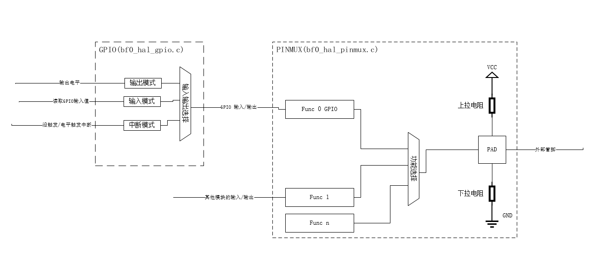

# PINMUX

HAL PINMUX provides abstract software interfaces to operate the hardware PINMUX module, setting pin functions and pull-up/pull-down attributes.
The chip has two PINMUX instances: PINMUX1 (`hwp_pinmux1`) in the HPSYS domain and PINMUX2 (`hwp_pinmux2`) in the LPSYS domain.
All pins are defined uniformly in the enum type `pin_pad`, no longer distinguishing between HCPU and LCPU; the functions available for a pin are defined uniformly in the enum type `pin_function`.
For the SF32LB57X series, the functions supported by dedicated pads can be found in the master table `pad_fsel_func_tbls`. `pin_function` contains both arbitrary pin functions and dedicated pad functions: enum values between 16 and 255 are arbitrarily mappable functions (matrix functions, starting from `PIN_MATRIX_FUNC_START = 16`), while enum values less than 16 are dedicated pad functions.

Starting from 56x series chips (excluding 55x, 58x), any GPIO in the pinmux functionality can serve as an I/O pin for any I2C/UART/PWM in the current system.

For detailed API documentation, refer to [](#hal-pinmux)

## Difference Between GPIO and PINMUX Modules
Physically, GPIO needs to connect to the external world through the pinmux module, as shown in the figure:


## Using HAL PINMUX

```c
void pin_func_set_example(void)
{
    /* set HCPU PA10 and PA14 for I2C */
    HAL_PIN_Set(PAD_PA10, I2C1_SCL, PIN_PULLUP, 1);
    HAL_PIN_Set(PAD_PA14, I2C1_SDA, PIN_PULLUP, 1);
    
    /* set LCPU PB12 and PB14 for UART4 */
    HAL_PIN_Set(PAD_PB12, USART4_TXD, PIN_PULLUP, 0);
    HAL_PIN_Set(PAD_PB14, USART4_RXD, PIN_PULLUP, 0);
}
```

## API Reference
[](#hal-pinmux)