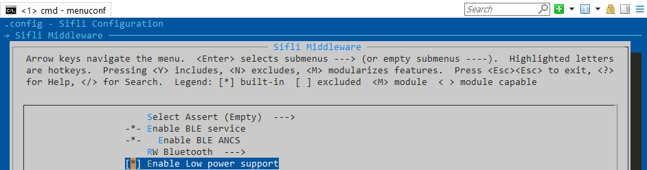

# Power Management

The Power Management module is developed based on the RT-Thread power management
framework. It helps minimize the effort required for users to implement
low-power functionality. In addition to the RT-Thread power management API,
users can also use this module to implement their own low-power designs.
Butterfli includes three subsystems (power domains): HPSYS (HCPU internal),
LPSYS (LCPU internal), and BLESYS (BCPU internal). Each subsystem can
independently enter its own low-power mode.

Currently, four low-power modes are supported. IDLE is the lowest power mode,
while STANDBY is the highest low-power mode. Starting from the LIGHT mode,
subsystems are inaccessible in low-power mode.
- `PM_SLEEP_MODE_IDLE`: CPU executes the WFE instruction, waiting for events or
  IRQ.
- `PM_SLEEP_MODE_LIGHT`: Subsystem enters light sleep mode.
- `PM_SLEEP_MODE_DEEP`: Subsystem enters deep sleep mode.
- `PM_SLEEP_MODE_STANDBY`: Subsystem enters standby mode.

When entering the idle loop, the RT-Thread power management framework selects
the appropriate low-power mode based on how long the CPU has been idle. The
default power mode selection method uses the pm policy table to decide the
low-power mode. The default pm policy table can be overridden. Additionally, the
default power mode selection method can be replaced by a user-defined algorithm.
Users can block the system from entering low-power modes higher than
`PM_SLEEP_MODE_IDLE` by calling `rt_pm_request`, even if the CPU has been idle
for a long time, such as when DMA transfer is ongoing or a thread is suspended
waiting for a completion signal. If `PM_SLEEP_MODE_IDLE` or `PM_SLEEP_MODE_NONE`
is requested, the system will stay in `PM_SLEEP_MODE_IDLE` after entering the
idle loop. If `PM_SLEEP_MODE_LIGHT`, `PM_SLEEP_MODE_DEEP`, or
`PM_SLEEP_MODE_STANDBY` is requested, it will not affect the low-power mode
selection result. Below is the timing diagram of the idle loop.

## pm_request Example
The following example demonstrates how to prevent the system from entering
higher low-power modes, even when sleep time conditions are met.
```c
rt_device_t uart_device;
rt_err_t tx_done(rt_device_t dev, void *buffer)
{
    rt_sem_release(sema);
}

void init(void)
{
    uart_device = rt_device_find("uart1");
    rt_device_set_tx_complete(uart_device, tx_done);
    rt_device_open(uart_device, RT_DEVICE_OFLAG_RDWR | RT_DEVICE_FLAG_DMA_TX | RT_DEVICE_FLAG_DMA_RX);
}

void start_tx(void)
{
    rt_pm_request(PM_SLEEP_MODE_IDLE);
    /* start UART transmission in DMA mode */
    rt_device_write(uart_device, 0, buf, len);
    /* wait for transmission complete 
     * though sleep time is very long (larger than the threshold of STANDBY mode), system will stay in IDLE mode 
     */
    rt_sem_take(sema, RT_WAITING_FOREVER);
    /* IDLE mode is released, then system has a chance to enter a higher low-power mode */
    rt_pm_release(PM_SLEEP_MODE_IDLE);
};
```

## Default PM Policy Table

Following is default PM Policy Table. The threshold for sleep time is used to
determine the highest power mode for low-power selection. The sleep time is
calculated based on the operating system timer, i.e., the most recent timer
timeout tick is compared with the current tick (using
`rt_timer_next_timeout_tick()` and `rt_tick_get()`). For example, if the sleep
time is 20ms, which is greater than 15ms (threshold for `PM_SLEEP_MODE_LIGHT`)
but less than 25ms (threshold for `PM_SLEEP_MODE_DEEP`), `PM_SLEEP_MODE_LIGHT`
is selected as the low-power mode. If the sleep time is 50ms, exceeding both
15ms and 25ms, the system enters `PM_SLEEP_MODE_DEEP`.
```c
const static pm_policy_t default_pm_policy[] =
{
    {15, PM_SLEEP_MODE_LIGHT},
    {25, PM_SLEEP_MODE_DEEP},    
    {10000, PM_SLEEP_MODE_STANDBY},
};

/** pm policy item structure */
typedef struct
{
    uint32_t    thresh;      /**< sleep time threshold in millisecond */
    uint8_t     mode;        /**< power mode chosen if sleep time threshold is satisfied */
} pm_policy_t;
```


RT-Thread Power Management APIs for Customization
- `rt_pm_policy_register`: Registers a user-defined policy to override the
  default implementation.
- `rt_pm_override_mode_select`: Registers a user-defined power mode selection
  method to override the default mechanism.
- `rt_pm_request/rt_pm_release`: Prevents the system from entering LIGHT, DEEP,
  or STANDBY modes.
- `rt_application_get_power_on_mode`: Retrieves the system boot mode (e.g.,
  determining whether the code started from a cold boot or woke up from
  standby).

PM Module APIs
- `pm_enable_pin_wakeup/pm_disable_pin_wakeup`: Designates a specific pin to
  wake up the subsystem.
- `pm_get_power_mode`: Retrieves the previous low-power mode.
- `pm_get_wakeup_src`: Retrieves the previous wakeup source.
- `aon_irq_handler_hook`: A hook for the AON_IRQHandler. Users can implement
  this hook to perform custom operations.
- pm_shutdown: Shuts down the system.

## Custom RT-Thread Power Management API
If a subsystem is in LIGHT, DEEP, or STANDBY low-power mode, it becomes
inaccessible to other subsystems. Any illegal access will trigger a HardFault
exception. <br> To access resources belonging to another subsystem in low-power
mode, that subsystem must be awakened first. The hardware Mailbox can
automatically wake up the target subsystem, and its driver implementation is
designed with low-power characteristics in mind. When using the hardware Mailbox
driver for inter-processor communication, the driver ensures that memory
accesses only occur when the accessed subsystem is in ACTIVE or IDLE mode. The
sender driver writes data to its own buffer and notifies the receiver. The
sending subsystem will not enter any low-power mode (except IDLE) until the
receiver consumes the data and the sender's ring buffer is empty.

## Inter-Subsystem Access
If a subsystem is in LIGHT, DEEP, or STANDBY low-power mode, other subsystems
cannot access it. If an illegal access occurs, a hard fault exception is
triggered. To access resources from another subsystem in a low-power mode, the
target subsystem must be awakened first. The hardware mailbox can automatically
wake up the target subsystem. Its driver implementation takes low-power features
into account. When using the hardware mailbox driver for inter-processor
communication, the driver ensures memory access when the accessed subsystem is
in ACTIVE or IDLE mode. The sending driver writes data to its buffer and
notifies the receiver. The sending subsystem will not enter any low-power mode
other than idle until the receiving subsystem consumes the data, i.e., the
sender’s ring buffer is empty.
```c
#define BSP_USING_PM
#define RT_USING_PM
```




## Configuration
This module can be enabled in the SiFli Middleware menu, which automatically
enables RT_USING_PM.
