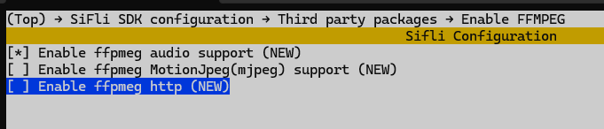

# Video Document
video use ffmpeg，see exernal/ffmpeg/Kconfig，use software decode only, no harware
accelerator，video should convert codec to h264 or mjpeg, and should use baseline
profile。 and support ezip encoder for this chip，Use hardware decoding for ezip.
Ezip does not support inter-frame compression, meaning each image is compressed
with ezip individually. Combined with audio, it still uses MP4 packaging, and
the external interface remains unchanged.
## memory footprint
code size: 310K bytes global var size: 1K bytes malloc: 3.3M byte 240 * 320 (3
frame cache).
## performance
- The maximum playback size around 240 * 320 can reach 30fps. If it’s larger,
  the frame rate needs to be reduced. It also depends on the complexity of the
  image details; if the details are too complex, the compression rate is low and
  decoding slowly.
- The previous software required the width of the converted video to be a
  multiple of 16. (Otherwise, there will be display artifacts, because after
  decoding with ffmpeg, each line is padded to align to a multiple of 16, which
  reduces performance as data has to be copied line by line from ffmpeg to
  display correctly)
## suupored codec
 - H.264
 - H.263
 - MP3
 - AAC
 - MJPEG
 - ezip
 - Opus
 - Vorbis
## Supported audio and video container formats
 - OGG
 - MP4
## menuconfig
You need to enable PKG_USING_FFMPEG in menuconfig to support ffmpeg. To support
audio in mp4 files, you also need to enable PKG_USING_FFMPEG_AUDIO. To support
online videos, you need to enable PKG_USING_FFMPEG_HTTP. To support mjpeg,
enable PKG_USING_FFMPEG_MJPEG (hardware decoding is only available on the 58x
chip platform; software decoding is not recommended).


## toolchain
Video files are usually large and the formats can be quite complex, so they need
to be converted before they can be played.
### ffmpeg toolchain
https://ffmpeg.org
  * Video conversion, trimming, and scaling tool ffmpeg.exe
  * probe tool ffprobe.exe
  * player tools ffplay.exe\
    This is generally used for local debugging, an example ![]{1} high means
    High-quality encoding format, this software cannot support decoding it and
    needs to be converted to baseline. example：

use ffprobe.exe to probe，use ffplay.exe to play

The "high" profile indicates a high-quality encoding format that is not
supported; it must be converted to the "baseline" profile. Use the following
local conversion command:
```python
#
ffmpeg -i input.mp4 -profile:v baseline -level 1.0 -r 30 -acodec mp3 -ar 44100 -ac 2 output.mp4
# -profile:v baseline -level 1.0 to baseline
# -r 30 30fps, Can be appropriately reduced based on the image size to lower CPU usage.
# -acodec mp3 mp3，or use "-acodec aac" for aac
# -ar 44100 audio samplerate
# -ac 2 stereo，-ac 1 mono
# The output file extension in the command must be mp4, otherwise it may not convert properly.
```
```
# to mjpeg
ffmpeg -i input.mp4 -c:v mjpeg -c:a copy -vf "colorspace=bt709:iall=bt470bg:range=pc" video_example.mp4
```

After conversion, use ffprobe.exe to verify the file format or ffplay.exe to
test playback.

### Sifli toolchain
An image conversion tool built on the official FFmpeg toolchain. Instructions
for use are provided in the documentation under the tool. GraphicsTool
https://wiki.sifli.com/tools/index.html If you want to convert to the ezip image
encoding format, you can only use this tool. EZIP format cannot be played with
ffplay.exe; it can only be played on the board.

## Viedo convert
- Video conversion can use the official ffmpeg tool mentioned above (does not
  support ezip) or the Sifli toolchain. For using the official tool, you can
  check the help with ffmpeg -h or ffmpeg -h full, or you can search online for
  commonly used ffmpeg commands.
- The required converted width is a multiple of 16, and the encoding format is
  baseline.

## Example
- local file player： It turns out that the disk directory contains an empty
  file, which needs to be replaced with the converted baseline format MP4 file.\
  https://gitee.com/SiFli/sifli-sdk/tree/main/example/multimedia/lvgl/lvgl_v8_media

- network URL example： You need to turn on your phone's BT PAN and share the
  network and hotspot.
  https://gitee.com/SiFli/sifli-sdk/tree/main/example/multimedia/lvgl/streaming_media

## API

```c
/**
 * @brief open a media URL to play
 *
 * @param return_hanlde return the handle
 * @param cfg configure for media info @see ffmpeg_config_t
 * @param user_data The user data that will be passed to notify() in ffmpeg_config_t
 *
 * @return 0 if successful, negative errno code if failure.
 */
 int ffmpeg_open(ffmpeg_handle *return_hanlde, ffmpeg_config_t *cfg, uint32_t user_data);
/**
 * @brief stop ffmpeg playing
 *
 * do not call this in callback functioin notify()
 *
 * @param hanlde the handle got by ffmpeg_open()
 *
 */
void ffmpeg_close(ffmpeg_handle hanlde);
/**
 * @brief pause ffmpeg playing
 *
 * do not call this in callback functioin notify()
 *
 * @param hanlde the handle got by ffmpeg_open()
 *
 */
void ffmpeg_pause(ffmpeg_handle hanlde);
/**
 * @brief resume ffmpeg playing
 *
 * do not call this in callback functioin notify()
 *
 * @param hanlde the handle got by ffmpeg_open()
 *
 */
void ffmpeg_resume(ffmpeg_handle hanlde);
/**
 * @brief seek ffmpeg playing
 *
 * do not call this in callback functioin notify()
 *
 * @param hanlde the handle got by ffmpeg_open()
 * @param second seek to seconds from beginning
 *
 */
void ffmpeg_seek(ffmpeg_handle hanlde, uint32_t second);
/**
 * @brief mute/unmute audio
 *
 * @param hanlde the handle got by ffmpeg_open()
 * @param is_mute mute or unmute audio. 1--mute, 0-- unmute
 *
 */
void ffmpeg_audio_mute(ffmpeg_handle hanlde, bool is_mute);
/**
 * @brief release memory alloced by ffmpeg_eizp_release() or ffmpeg_get_first_ezip_in_nand()
 *
 * @param ezip alloced memory address by ffmpeg_eizp_release() or ffmpeg_get_first_ezip_in_nand()
 */
void ffmpeg_eizp_release(uint8_t *ezip);
/**
 * @brief get first ezip in local disk media file
 *
 * @param filename the file name in local disk
 * @param[out] w return picture width
 * @param[out] h return picture height
 * @param[out] psize return picture size in bytes
 * @return non-NULL poiner in memory for first picure, should release by ffmpeg_eizp_release(), return NULL if error
 */
uint8_t *ffmpeg_get_first_ezip(const char *filename, uint32_t *w, uint32_t *h, uint32_t *psize);
/**
 * @brief get first ezip nand
 *
 * @param nand_address media address in nand
 * @param nand_size media size in nand
 * @param[out] w return picture width
 * @param[out] h return picture height
 * @param[out] psize return picture size in bytes
 * @return non-NULL poiner in memory for first picure, should release by ffmpeg_eizp_release(), return NULL if error
 */
uint8_t *ffmpeg_get_first_ezip_in_nand(const char *nand_address, uint32_t nand_size,
                                       uint32_t *w, uint32_t *h, uint32_t *psize);
/**
 * @brief get video infomation
 *
 * @param hanlde the handle got by ffmpeg_open()
 * @param[out] video_width return picture width
 * @param[out] video_heightreturn picture height
 * @param[out] info picture format
 * @return 0 if successful, negative errno code if failure.
 */
int ffmpeg_get_video_info(ffmpeg_handle hanlde, uint32_t *video_width, uint32_t *video_height, video_info_t *info);
/**
 * @brief get new frame in ffmepg cache, should call ffmpeg_is_video_available() first, call this if new video frame available
 *
 * @param hanlde the handle got by ffmpeg_open()
 * @param data get the new frame data, diffrent format has diffrent means in *data, @see sifli_gpu_fmt_t
 *             format is return by ffmpeg_get_video_info()
 *             1. if format is e_sifli_fmt_ezip
 *                data[0] -- data addr
 *                data[1] -- data size
 *                data[2] -- IMG_DESC_FMT_EZIP
 *             2. if format e_sifli_fmt_mjpeg
 *                data[0] -- data addr
 *                data[1] -- unused
 *                data[2] -- unused
 *             3. if format e_sifli_fmt_yuv420p, app can use yuv directly for 52x/56x/57x chip
 *                data[0] -- y address
 *                data[1] -- u address
 *                data[2] -- v address
 * @return true if new frame decoded in ffmpeg cache, false no new frame decoded
 */
int ffmpeg_next_video_frame(ffmpeg_handle hanlde, uint8_t *data);
/**
 * @brief check video cache if a new frame is decoded to display
 *
 * @param hanlde the handle got by ffmpeg_open()
 *
 * @return true if new frame decoded in ffmpeg cache, false no new frame decoded
 */
bool ffmpeg_is_video_available(ffmpeg_handle hanlde);
/**
 * @brief check if there is a ffmpeg handle is playing
 *
 * not thread safe, maybe return a handle, the the handle was close by its user
 *
 * @return ffmpeg handle if exist, NULL if not exist
 */
ffmpeg_handle ffmpeg_player_status_get(void);
```

## Interface Description
API Reference: media_dec.h

1. int ffmpeg_open(ffmpeg_handle *return_hanlde, ffmpeg_config_t *cfg, uint32_t
   user_data);
```
Description:
    Opens a file or network URL for playback.
Parameters:
    return_hanlde: Returns a handle to the media session.
    cfg: Media configuration information; see ffmpeg_config_t.
    user_data: User-defined data passed to the notify() callback specified in the cfg.
Return Value:
    Returns 0 on success; otherwise, returns a non-zero error code.
```
2. void ffmpeg_close(ffmpeg_handle hanlde);

```
Description:
    Stops playback. This function must not be called from within the notify() callback.
Parameters:
    hanlde: The handle obtained via ffmpeg_open().
```
3. void ffmpeg_pause(ffmpeg_handle hanlde);
```
Description:
    Pauses playback. This function must not be called from within the notify() callback.
Parameters:
    handle: Handle obtained via ffmpeg_open().
```
4. void ffmpeg_resume(ffmpeg_handle hanlde);
```
Description:
    Resumes playback. This function must not be called from within the notify() callback.
Parameters:
    handle: Handle obtained via ffmpeg_open().
```
5. void ffmpeg_seek(ffmpeg_handle hanlde, uint32_t second);
```
Description:
    Seeks to a specific timestamp for playback. This function must not be called from within the notify() callback.
Parameters:
    handle: Handle obtained via ffmpeg_open().
    second: Offset in seconds from the start of the video.
```
6. void ffmpeg_audio_mute(ffmpeg_handle hanlde, bool is_mute);
```
Description:
    Mutes or unmutes the audio. This function must not be called from within the notify() callback.
Parameters:
    handle: Handle obtained via ffmpeg_open().
    is_mute: 1 to mute, 0 to unmute.
```
7. uint8_t *ffmpeg_get_first_ezip(const char *filename, uint32_t *w, uint32_t
   *h, uint32_t *psize);
```
Description:
    Retrieves the first frame of a video if the video is EZIP-encoded and stored as a local file. The allocated memory must be released using ffmpeg_eizp_release() after use.
Parameters:
    filename: Path to the file.
    w: Returns the width.
    h: Returns the height.
    psize: Returns the memory size.
Return Value:
    Pointer to the image memory. The memory must be released using ffmpeg_eizp_release() after use.
```
8. uint8_t *ffmpeg_get_first_ezip_in_nand(const char *nand_address, uint32_t
   nand_size, uint32_t *w, uint32_t *h, uint32_t *psize);
```
Description:
    Retrieves the first frame of a video if the video is EZIP-encoded and stored directly in NAND flash.
Parameters:
    nand_address: Starting address of the video in NAND.
    nand_size: Size of the video.
    w: Returns the width.
    h: Returns the height.
    psize: Returns the memory size.
Return Value:
    Pointer to the image memory. The memory must be released using ffmpeg_eizp_release() after use.
```
9. void ffmpeg_eizp_release(uint8_t *ezip);
```
Description:
    Releases the memory allocated when retrieving the first frame.
Parameters:
    ezip: Memory pointer returned by ffmpeg_get_first_ezip() or ffmpeg_get_first_ezip_in_nand().
```
10. int ffmpeg_get_video_info(ffmpeg_handle hanlde, uint32_t *video_width,
    uint32_t *video_height, video_info_t *info);

```
Description:
    Retrieves video metadata.
Parameters:
    handle: Handle obtained via ffmpeg_open().
    video_width: Returns the width.
    video_height: Returns the height.
    info: Detailed image format information required for display. If gpu_pic_fmt within info is EZIP, the application should record this and use the EZIP data directly for display.
Return Value:
    0 for success; non-zero value for failure.
```

11. bool ffmpeg_is_video_available(ffmpeg_handle hanlde);
```
Description:
    Checks if a new frame is available in the decoding buffer. This should be called before attempting to retrieve a frame.
Parameters:
    handle: Handle obtained via ffmpeg_open().
Return Value:
    true if a frame is available; false otherwise.
```

12. int ffmpeg_next_video_frame(ffmpeg_handle hanlde, uint8_t *data);
```
Description:
    Retrieves the next frame from the decoding buffer.
Parameters:
    handle: Handle obtained via ffmpeg_open().
    data: Pointer used to return image information. Although defined as uint8_t *data, it is treated as uint8_t **data to return three pointers. The assignments for these pointers vary by format (refer to info in ffmpeg_get_video_info()):
           A. format is e_sifli_fmt_ezip:
                data[0] -- data address
                data[1] -- data size
                data[2] -- IMG_DESC_FMT_EZIP
           C. format is e_sifli_fmt_yuv420p (YUV can be used directly for 52x/56x/57x chips):
                data[0] -- Y plane address
                data[1] -- U plane address
                data[2] -- V plane address
           D. others:
                data[0] -- data address
                data[1] -- unused
                data[2] -- unused

Return Value:
    0 for success (frame ready for display); non-zero value for failure.
```
13. ffmpeg_handle ffmpeg_player_status_get(void);

```
Description:
    Checks whether a video is currently playing. Note that this function is not thread-safe; the playback state may change immediately after the function returns.
Parameters:
    void
Return Value:
    Returns the handle of the video currently being played, or NULL if no video is playing.
```
## Image Display
The `fmt` field in `ffmpeg_config_t` specifies the display format for the UI. If
the video is H.264/H.263 encoded, the internal decoder outputs YUV format. The
internal `media_video_convert()` function then converts this YUV data into the
format specified by `fmt`. If the video is EZIP encoded, the internal decoder
simply extracts the EZIP data, which the UI displays directly. If the video is
MJPEG encoded, the internal decoder outputs in `IMG_DESC_FMT_ARGB8888`.

When creating an image control, the application must use the macros defined in
`media_dec.h`. Since supported formats vary across platforms, refer to the
provided examples for configuration.

IMG_DESC_FMT IMG_PIXEL_SIZE IMG_LV_FMT

## Debugging
The decoder currently buffers only three frames, prioritizing audio playback. If
"drop" appears in the logs, it indicates that frame dropping has occurred.
