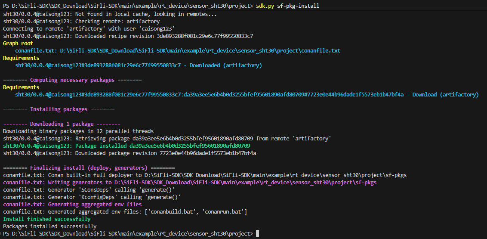

# Using SiFli Package Registry in Your Project

The following steps explain how to install and use SiFli Package Registry dependencies in an existing project.

```{note}
Some screenshots on this page were captured with the old CLI format. If a screenshot differs from the text, follow the current `sdk.py sf-pkg ...` commands in the document.
```

## Initialize Dependencies (sf-pkg init)

```bash
sdk.py sf-pkg init
```

Upon successful execution, a `sf-pkg.yaml` declaration file will be generated in the `project` directory (YAML, comment-friendly). For example:

```yaml
# Project level fixed dependencies: each entry is <package>/<version>@<username>,
# version ranges are allowed
requires:
  - sht30/0.0.4@caisong123
  # - battery_calculator/[^1.2]@sifli

# Optional: SDK version range this project supports (npm semver, e.g. ^2.4)
# support_sdk_version: "^2.4"
```

An empty `requires` means no dependencies. Add packages as `<package>/<version>@<username>`, e.g. the SHT30 sensor driver: `sht30/0.0.4@caisong123`.

```{note}
Older SDK versions declared dependencies through `conanfile.py`. If a project root contains a `conanfile.py` but no `sf-pkg.yaml`, `sf-pkg install` treats it as "advanced mode" and runs `conan install` on that file directly (legacy behavior, without module-level dependency aggregation). New projects are encouraged to use `sf-pkg.yaml`.
```

### sf-pkg.yaml Field Reference

`sf-pkg.yaml` is used both at the project root and by SDK built-in modules:

- `requires` (list, optional): external components needed by this project/module. Each entry is `<package>/<version>@<username>`; version ranges are allowed, e.g. `sht30/0.0.4@caisong123` or `battery_calculator/[^1.2]@sifli`. Empty/absent means no dependencies.
- `support_sdk_version` (string, optional): required SDK version range in npm-style semver (e.g. `^2.4`, `~2.4.1`, `>=2.4,<3`); unchecked when absent. During install/build it is validated against the `SIFLI_SDK_VERSION` environment variable and fails before any network access, naming the source file. The project root and each module declare and are checked separately.
- `enable` (list, optional, **module manifests only**): the module's Kconfig enable symbols. If **any** of them is `y`, the module is considered to participate in the build and its `requires` are pulled; otherwise they are not. These are the real symbol names as defined in Kconfig (kconfig only prepends a `CONFIG_` prefix when writing `.config`; if a symbol's own name already starts with `CONFIG_`, write it as is). When absent/empty the module is treated as "always participating", which is only suitable for fixed modules without a switch.

`enable` has no effect at the project root: the root is a fixed dependency and only `requires` (and optionally `support_sdk_version`) belong there.

### Module Level External Dependencies

SDK built-in modules (e.g. `middleware/*`, board drivers, ...) can each carry a `sf-pkg.yaml` declaring external components that are only fetched when that module participates in the build:

```yaml
# middleware/<module>/sf-pkg.yaml
# Must live in the same directory as the Kconfig that defines the module's
# enable symbols
enable:
  - BLE_STACK            # Kconfig enable symbol; any 'y' means "participates"
requires:
  - mesh-lib/1.3.0@acme  # conan reference, same format as the project root
support_sdk_version: "^2.4"   # optional, same meaning as the project root
```

- The manifest must sit **next to the module's Kconfig**, and that Kconfig must be parsed in the current board's config tree; otherwise the manifest is not discovered (no participation, no fetching).
- When a module is enabled, also `select` the package's enable symbol declared in `Kconfig.conandeps` from the module's own Kconfig so the package actually links into the build.
- See the [module level dependencies design](design/module_deps.md) for the full mechanism and conventions.

## Search for Available Packages

If you are unsure about the package name or version, you can search for it:

```bash
sdk.py sf-pkg search <package_name>
```

Example:

```bash
sdk.py sf-pkg search sht30
```
You can also search directly on the official website of the SiFli Package Registry: Click here to visit [SiFli Package Registry](https://packages.sifli.com/)


## Install Dependencies (sf-pkg install)

Execute the following command in the `project` directory of your project:

```bash
sdk.py sf-pkg install
```

- Without `--board`: installs only the project root `sf-pkg.yaml` `requires`; module-level dependencies are not merged.
- With `--board <board>`: additionally merges the external components declared by the modules enabled in that board configuration. The board config is resolved automatically from `board.conf` + `proj.conf` (generating `kconfiglist`/`.config` in the build dir), so no prior compilation is needed.
- With `--board-search-path <dir>`: adds a board search directory on top of the SDK `customer/boards` (same as scons `--board_search_path`; the `SIFLI_SDK_BOARD_SEARCH_PATH` environment variable works too).



After successful installation, an `sf-pkgs` folder will be generated in the `project` directory, containing the installed packages.

### Automatic Installation During Build

As long as the project root has an `sf-pkg.yaml`, running `scons --board=<b>` automatically detects whether the aggregated dependency set of the modules enabled for that board changed and, if so, installs it before continuing to compile (idempotent; skipped when unchanged). To disable automatic installation:

```bash
SIFLI_SF_PKG_OFFLINE=1 scons --board=<b>     # or: scons --no-sf-pkg
```

## Using the Driver

Once installation is complete, you can use the driver directly:

- You can compile immediately
- When including header files, there is no need to specify absolute paths—Conan will automatically handle path configuration

### Kconfig Configuration Notes

- `menuconfig` will automatically integrate all `Kconfig` files under the `sf-pkgs` folder
- These configuration options will appear in the **SiFli External Components** menu within `menuconfig`
