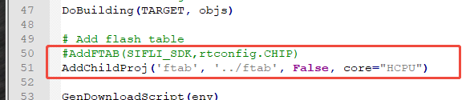
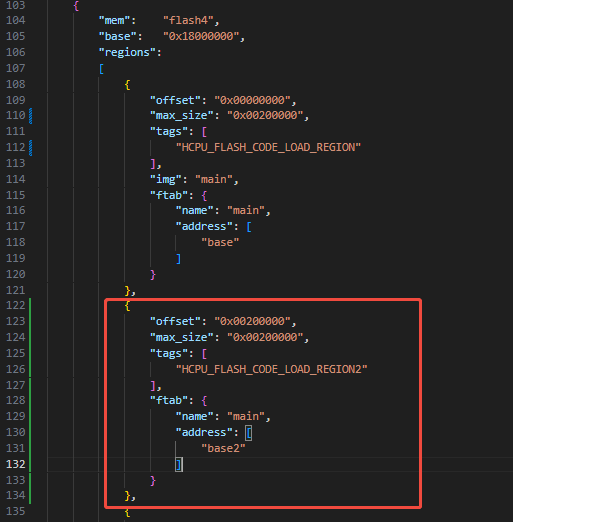
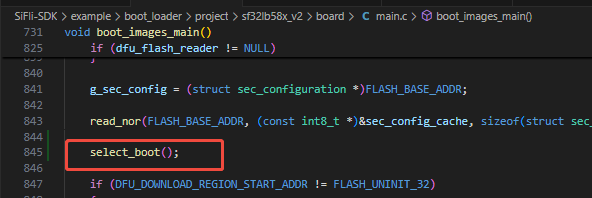
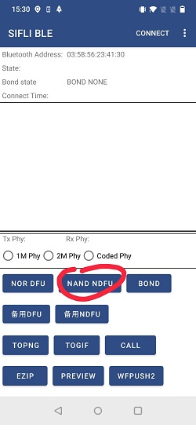
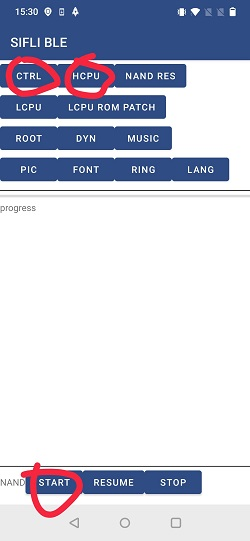

# BLE Central and Peripheral with Pingpong OTA Example

Source Code Path: example/ble/central_and_peripheral_with_pingpong_ota
(Platform_cen_peri)=

(Platform_cen_peri)=
## Supported Platforms
<!-- 支持哪些板子和芯片平台 -->
Projects with flash table programmed in mpi5

## Overview
<!-- 例程简介 -->
This example demonstrates how the platform can function as both GAP central and
peripheral, as well as GATT client and server simultaneously. It also shows how
to upgrade the project using the pingpong method


## Example Usage
<!-- 说明如何使用例程，比如连接哪些硬件管脚观察波形，编译和烧写可以引用相关文档。
对于rt_device的例程，还需要把本例程用到的配置开关列出来，比如PWM例程用到了PWM1，需要在onchip菜单里使能PWM1 -->
1. The Finsh commands for this example can be printed by entering 'diss help' to
   show command usage.
2. When acting as a peripheral device, it will start advertising on boot with a
   name formatted as SIFLI_APP-xx-xx-xx-xx-xx-xx, where xx represents the
   device's Bluetooth address. You can connect using a mobile BLE APP.
3. When acting as a central device, you can search for other peripheral devices
   through finsh commands and initiate connections.
4. When acting as a GATT server, you can perform write and read operations on
   the mobile terminal, or enable CCCD, and the device will update the
   characteristic value every second.
5. When acting as a GATT client, you can search and display the server's
   database through finsh commands, and perform read or write operations on
   characteristic values.
6. Connect the board through the SIFLE BLE APP, select a file, and perform the
   upgrade

### Hardware Requirements
Before running this example, you need to prepare:
+ A development board supported by this example ([Supported
  Platforms](#Platform_cen_peri)).
+ A mobile device.

### menuconfig Configuration
1. Enable Bluetooth(`BLUETOOTH`):
    - Path: Sifli middleware → Bluetooth
    - Enable: Enable bluetooth
         - Macro switch: `CONFIG_BLUETOOTH`
         - Description: Enable Bluetooth functionality
2. Enable GAP, GATT Client, BLE connection manager:
    - Path: Sifli middleware → Bluetooth → Bluetooth service → BLE service
    - Enable: Enable BLE GAP central role
         - Macro switch: `CONFIG_BLE_GAP_CENTRAL`
         - Description: Switch for BLE CENTRAL (central device). When enabled,
           provides scanning and active connection initiation with peripherals.
    - Enable: Enable BLE GATT client
         - Macro switch: `CONFIG_BLE_GATT_CLIENT`
         - Description: Switch for GATT CLIENT. When enabled, allows active
           service discovery, data reading/writing, and notification reception.
    - Enable: Enable BLE connection manager
         - Macro switch: `CONFIG_BSP_BLE_CONNECTION_MANAGER`
         - Description: Provides BLE connection control management, including
           multi-connection management, BLE pairing, and link connection
           parameter updates.
3. Enable NVDS:
    - Path: Sifli middleware → Bluetooth → Bluetooth service → Common service
    - Enable: Enable NVDS synchronous
        - Macro switch: `CONFIG_BSP_BLE_NVDS_SYNC`
        - Description: Bluetooth NVDS synchronization. When Bluetooth is
          configured to HCPU, BLE NVDS can be accessed synchronously, so enable
          this option; when Bluetooth is configured to LCPU, this option needs
          to be disabled.
4. Enable pingpong OTA related features:
    - Path: Sifli middleware → Device firmware update support functions
    - Enable: Device firmware using compress
        - Macro switch: `CONFIG_BSP_USING_DFU_COMPRESS`
        - Description: Enable DFU compression functionality
    - Enable: NAND flash OTA
        - Macro switch: `CONFIG_OTA_56X_NAND`
        - Description: Enable pingpong OTA architecture. Although the macro name
          includes 56X, it is not limited to specific chipset types.
5. Enable solution OTA macro:
    - Path: Home page
    - Enable: using solution dfu protocol
        - Macro switch: `CONFIG_SOL_DFU`
        - Description: Enable solution dfu protocol.

### Other Access Related Notes
1. SConstruct FTAB needs to be added via addchildproj:
   

2. ptab.json Need to allocate a main and base2 region with the same size as
   HCPU_FLASH_CODE_LOAD_REGION as the pong region: 

3. Boot loader Need to add jump logic, please refer to the implementation of
   this example for details: 

4. Generation Command
```shell
.\imgtoolv37.exe gen_dfu --img_para main 0 0 --key=s01 --sigkey=sig --dfu_id=1 --hw_ver=51 --sdk_ver=7001 --fw_ver=1001001 --com_type=0 --bksize=2048 --align=0
```
main is the name of the bin to be upgraded. If it's hcpu.bin, just fill in hcpu.
The first parameter after the bin name is for compression, 16 means using
compression, 0 means no compression. Only no compression can be selected. The
second parameter after the bin name represents the image id, hcpu is 0, and
multiple bins can be generated simultaneously. Then you need to implement
whether the subsequent bins are stored in the backup area and installed finally,
or directly overwrite the target address. 5. Mobile Operation The operation is
shown in the following figure: search for the board's BLE broadcast, click on
the corresponding device, then select nand dfu, first select the ctrl file, then
select hcpu as the outmain.bin generated刚才制作的outmain.bin, and finally click the
start button. ![app1]{1}![app2]{2} ![app3]{3}![app2]{4}

5. **Smartphone Operation** \
   \
   Follow the steps illustrated below: Scan for the board's BLE broadcast and
   select the corresponding device. Navigate to **nand dfu**, select the
   **ctrl** file, and then designate the previously generated `outmain.bin` as
   the **hcpu**. Finally, tap **start**.\
   \
   
   

### Compilation and Flashing
Switch to the example project directory and run the scons command to compile:
```c
&gt; scons --board=sf32lb58-lcd_n16r64n4 -j8
```
Switch to the example `project/build_xx` directory, run `uart_download.bat`, and
select the port as prompted to download:
```c
$ ./uart_download.bat
     Uart Download
please input the serial port num:5
```
For detailed steps on compilation and downloading, please refer to the relevant
introduction in [Quick Start](/quickstart/get-started.md).

## Expected Results
<!-- 说明例程运行结果，比如哪几个灯会亮，会打印哪些log，以便用户判断例程是否正常运行，运行结果可以结合代码分步骤说明 -->
After the example starts:
1. It can be discovered and connected by the mobile BLE APP, allowing
   corresponding GATT characteristic read/write operations.
2. It can search for other BLE devices, connect and search the connected
   device's GATT database, and perform GATT read/write operations.
3. It can be upgraded using the APP

## Troubleshooting


## Reference Documentation
<!-- 对于rt_device的示例，rt-thread官网文档提供的较详细说明，可以在这里添加网页链接，例如，参考RT-Thread的[RTC文档](https://www.rt-thread.org/document/site/#/rt-thread-version/rt-thread-standard/programming-manual/device/rtc/rtc) -->

## Update History
| Version | Date    | Release Notes   |
| ------- | ------- | --------------- |
| 0.0.1   | 07/2025 | Initial version |
|         |         |                 |
|         |         |                 |
