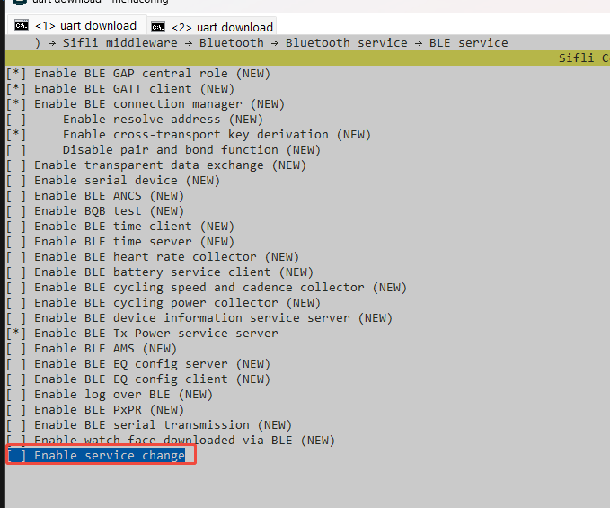
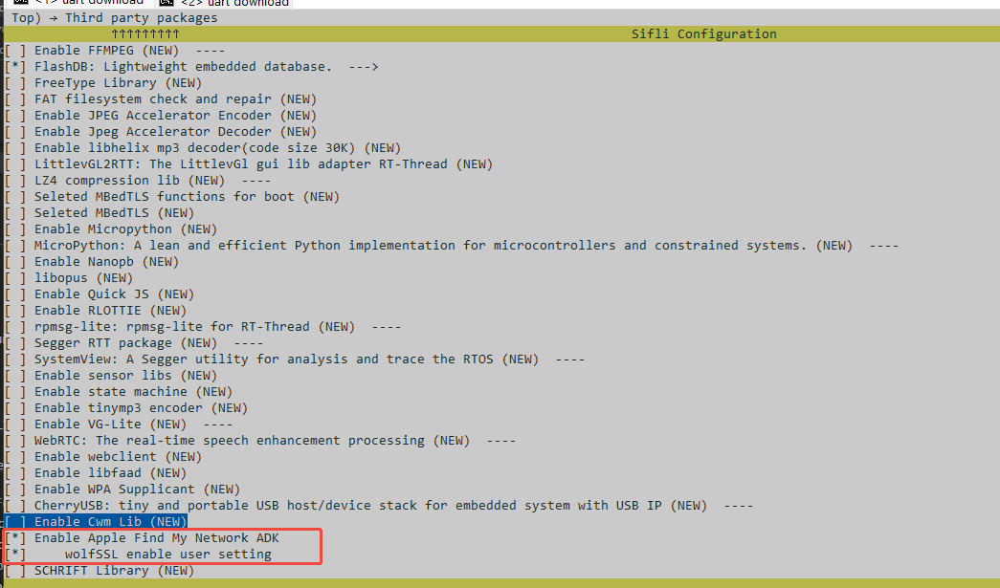
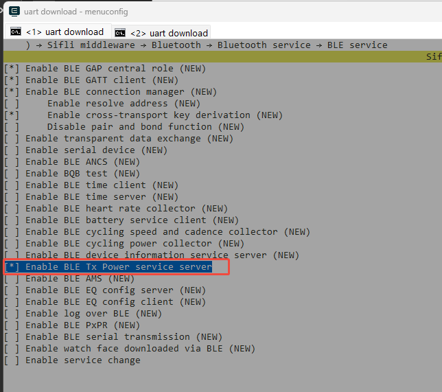
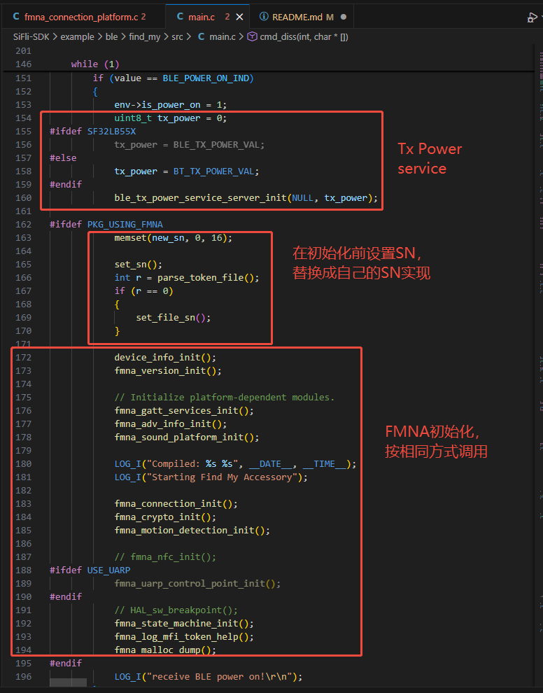

# Apple Find My network examples说明

## 支持的平台
所有平台

## 概述
<!-- 例程简介 -->
本例程展示了如何集成Apple Findmy network ADK，使设备成为Findmy accessory，可以和iOS设备上的查找APP进行配对，然后查看设备的位置信息，播放查找声音，取消配对等。

## 例程的使用
1. 需要自行申请MFi Find My network product plan
2. 自行下载，编译加密库wolfSSL，并将编译得到的wolfSSL.lib(keil)或者libwolfssl.a(GCC)，放到external\findmy目录下
3. 配置fmna的相关参数，包括设备的UUID、产品ID、产品密钥等，具体配置方法见后续章节。
4. 编译并烧录本工程
5. 打开iPhone手机或者iPad的查找app，进入物品页面，点击添加物品，点击添加其他物品，搜索到开发板后，点击连接，为配件命名，同意协议，最后点击完成。
6. 查找app会显示配件的位置信息，可以点击查看位置信息，播放查找声音，取消配对等。

## 编译和烧录
切换到例程project目录，运行scons命令执行编译：
```c
> scons --board=eh-lb561 -j8
```
切换到例程`project/build_xx`目录，运行`uart_download.bat`，按提示选择端口即可进行下载：
```c
$ ./uart_download.bat

     Uart Download

please input the serial port num:5
```
关于编译、下载的详细步骤，请参考[快速入门](/quickstart/get-started.md)的相关介绍。

## menuconfig配置
本工程已配置完毕，其他工程如果要开启findmy，需要做如下修改
1. 关闭svc change\

2. 打开Find My和wolfSSL user settings\

3. 打开Tx Power service


## 配置FMNA参数
### product data
在fmna_constans.h中，修改PRODUCT_DATA_VAL

### category
在fmna_constans.h中，修改ACCESSORY_CATEGORY

### Serial number
1. 设备的序列号是唯一的，不能有重复。
2. 每一个序列号和一组TOKEN也是唯一对应关系，FINDMY配对之后，序列号不能修改。
3. 序列号的长度为16字节，需要在fmna初始化之前，在fmna_connection_platform.c中调用fmna_connection_platform_set_serial_number

### Token
1. 在fmna_connection_platform.c中，调用fmna_connection_update_token
2. 仅在第一次开机时，将原始token通过该接口写入，后续使用find my时，token会自动更新，不能再调用该接口更新token。
3. find my使用后，后续不论是重启，重置，都不能再调用此接口更新token，否则会导致find my配对失败且无法恢复。

### UUID
1. 在fmna_connection_platform.c中，调用fmna_connection_update_uuid。
2. 仅在第一次开机时，更新token对应的UUID，后续使用中，UUID始终不变，也没有必要再调用该接口。

### firmware version
在fmna_version.h中修改，主要用于展示设备的固件版本。

### 播放声音
在fmna_sound_platform.c中，实现播放查找声音的初始化，播放声音，停止播放等内容。

### 动作检测
在fmna_motion_detection_platform.c中，实现动作检测的相关内容，检测到动作后，触发相关逻辑。

## 调用示例

在main.c中
1. 初始化Tx Power service
2. 初始化find my之前，设置serial number。
3. 初始化find my，结束后find my自动打开，会根据当前是否已配对，自动进入pair或者separated状态。
4. find my开启后，可以调用fmna_state_machine_disable, 关闭find my功能，
5. 调用fmna_state_machine_disable关闭后，可以调用fmna_state_machine_enable开启find my功能，该接口仅仅在调用fmna_state_machine_disable后才有效。

## 注意
1. FMNA的一些内容需要保存，目前是保存到了BLE NVDS中，即使恢复出厂设置，TOKEN也需要保留。所以如果使用find my功能，恢复出厂时不能清空BLE NVDS。
2. 如果有清空BLE NVDS的需求，或者其他需求，需要修改保存信息的方式，代码在fmna_connection_platform.c中，所有调用sifli_nvds_read的地方就是从BLE NVDS中读取，调用sifli_nvds_write是写到BLE NVDS中，替换成其他的读写方式即可。

## 参考文档
<!-- 对于rt_device的示例，rt-thread官网文档提供的较详细说明，可以在这里添加网页链接，例如，参考RT-Thread的[RTC文档](https://www.rt-thread.org/document/site/#/rt-thread-version/rt-thread-standard/programming-manual/device/rtc/rtc) -->
[Find My Network Accessory Specification]https://mfi.apple.com/account/


## 更新记录
|版本 |日期   |发布说明 |
|:---|:---|:---|
|0.0.1 |02/2026 |初始版本|

