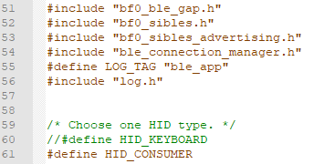
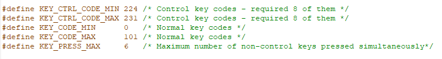
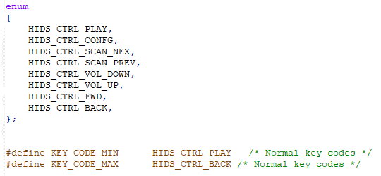

# BLE HID Example

Source Code Path: example/ble/hid

(Platform_hid)=
## Supported Platforms
<!-- 支持哪些板子和芯片平台 -->
All platforms

## Overview
<!-- 例程简介 -->
1. This example demonstrates how to implement BLE HID on this platform.
2. The example implements two types of HID: HID_KEYBOARD and HID_CONSUMER.
    1) By default, main.c defines HID_KEYBOARD. You can switch the supported
       type by undefining HID_KEYBOARD and defining HID_CONSUMER.
       

## Usage Instructions
<!-- 说明如何使用例程，比如连接哪些硬件管脚观察波形，编译和烧写可以引用相关文档。
对于rt_device的例程，还需要把本例程用到的配置开关列出来，比如PWM例程用到了PWM1，需要在onchip菜单里使能PWM1 -->
1. This example starts broadcasting on boot with the name
   SIFLI_APP-xx-xx-xx-xx-xx-xx, where xx represents the device's Bluetooth
   address. It can be directly connected via Windows or Mac Bluetooth.
2. After compiling and flashing, it can be found and connected on the PC. Once
   connected successfully, you can input via the development board's buttons,
   and the PC will show the corresponding output: pressing briefly outputs 'a',
   and long pressing continuously outputs 'aaaaaa...'
* If the PC has a serial tool, you can send the Finsh command "test_hids 4 p" to
  output 'a' on the PC, and "test_hids 4 r" to stop output.
* You can change the keyboard function, for example, changing 'a' to 'b' by
  modifying 0x04 to 0x05 in the code (you can find the relevant HID key mapping
  table online). Note: After modifying the code, recompiling, and flashing, you
  need to delete the previously connected device on the PC and reconnect.
```c
static key_mapping_t key_mapping_table[1] = {
    {0x01, 0x04}        // HID keycode for 'a'
};
```
* You can increase the number of buttons, each corresponding to different
  functions. Add a mapping table and modify the button initialization function
  as shown below.
```c
static key_mapping_t key_mapping_table[2] = {
    {0x01, 0x04},        // HID keycode for 'a'
    {0x01, 0x05}        // HID keycode for 'b'
    //
};

static void key_button_handler(int pin, button_action_t action)
{
    uint8_t hid_code = 0;
    uint8_t key_idx = 0;

    if (pin == BSP_KEY1_PIN) {
        key_idx = 0;  
    } else if (pin == BSP_KEY2_PIN) {
        key_idx = 1;  
    } else {
        LOG_W("Unknown button pin: %d", pin);
        return;
    }
    hid_code = key_mapping_table[key_idx].hid_code;
    switch (action)
    {
    case BUTTON_PRESSED:
        HID_KEY_SET(hid_code);
        HID_KEY_SEND();
        break;
    case BUTTON_RELEASED:
        HID_KEY_CLEAR(hid_code);
        HID_KEY_SEND();
        break;
    default:
        break;
    }
}
static void key_button_init(void)
{
    button_cfg_t key1_cfg = {
        .pin = BSP_KEY1_PIN,
        .mode = PIN_MODE_INPUT_PULLUP,
        .active_state = BUTTON_ACTIVE_HIGH,
        .button_handler = key_button_handler,
    };
    int key1_id = button_init(&amp;key1_cfg);
    if (key1_id &gt;= 0)button_enable(key1_id);

    button_cfg_t key2_cfg = {
        .pin = BSP_KEY2_PIN,
        .mode = PIN_MODE_INPUT_PULLUP,
        .active_state = BUTTON_ACTIVE_HIGH,
        .button_handler = key_button_handler,
    };
    int key2_id = button_init(&amp;key2_cfg);
    if (key2_id &gt;= 0)button_enable(key2_id);
}
```
3. After connecting to the PC device, send the finsh command "test_hids [key]
   [p|r]" via the serial assistant to initiate control commands to the PC. Here,
   p|r represents press|release and need to be used in pairs; the key value
   varies depending on whether the HID type is keyboard or consumer:
    1) Keyboard type key value range:
       
    2) Consumer type key value range:
       
    3) For example, in consumer type, entering "test_hids 0 p" represents the
       press operation for the key value corresponding to PLAY.
### Hardware Requirements
Before running this example, you need to prepare:
+ A development board supported by this example ([Supported
  Platforms](#Platform_hid)).
+ A mobile phone device.

### menuconfig Configuration
1. Enable Bluetooth (`BLUETOOTH`):
    - Path: Sifli middleware → Bluetooth
    - Enable: Enable bluetooth
        - Macro switch: `CONFIG_BLUETOOTH`
        - Description: Enable Bluetooth functionality
2. Enable GAP, GATT Client, BLE connection manager:
    - Path: Sifli middleware → Bluetooth → Bluetooth service → BLE service
    - Enable: Enable BLE GAP central role
        - Macro switch: `CONFIG_BLE_GAP_CENTRAL`
        - Description: Switch for BLE CENTRAL (central device). When enabled, it
          provides scanning and active connection initiation with peripherals.
    - Enable: Enable BLE GATT client
        - Macro switch: `CONFIG_BLE_GATT_CLIENT`
        - Description: Switch for GATT CLIENT. When enabled, it can actively
          search and discover services, read/write data, and receive
          notifications.
    - Enable: Enable BLE connection manager
        - Macro switch: `CONFIG_BSP_BLE_CONNECTION_MANAGER`
        - Description: Provides BLE connection control management, including
          multi-connection management, BLE pairing, link connection parameter
          updates, etc.
3. Enable NVDS:
    - Path: Sifli middleware → Bluetooth → Bluetooth service → Common service
    - Enable: Enable NVDS synchronous
        - Macro switch: `CONFIG_BSP_BLE_NVDS_SYNC`
        - Description: Bluetooth NVDS synchronization. When Bluetooth is
          configured to HCPU, BLE NVDS can be accessed synchronously, so enable
          this option; when Bluetooth is configured to LCPU, this option needs
          to be disabled.
4. Enable buttons:
    - Path: Sifli middleware
    - Enable: Enable button library
        - Macro switch: `CONFIG_USING_BUTTON_LIB`
        - Description: Enable button library

### Compilation and Programming
Switch to the example project directory and run the scons command to compile:
```c
&gt; scons --board=eh-lb525 -j32
```
Switch to the example `project/build_xx` directory and run `uart_download.bat`,
select the port as prompted to download:
```c
$ ./uart_download.bat

     UART Download

Please input the serial port number: 5
```
For detailed steps on compilation and downloading, please refer to the relevant
introduction in [Quick Start](/quickstart/get-started.md).

## Expected Results
<!-- 说明例程运行结果，比如哪几个灯会亮，会打印哪些log，以便用户判断例程是否正常运行，运行结果可以结合代码分步骤说明 -->
After starting the example:
1. It can be discovered and connected by the phone's BLE APP.
2. The phone can be controlled via finsh commands.

## Exception Diagnosis


## Reference Documents
<!-- 对于rt_device的示例，rt-thread官网文档提供的较详细说明，可以在这里添加网页链接，例如，参考RT-Thread的[RTC文档](https://www.rt-thread.org/document/site/#/rt-thread-version/rt-thread-standard/programming-manual/device/rtc/rtc) -->

## Update History
| Version | Date    | Release Notes   |
| ------- | ------- | --------------- |
| 0.0.1   | 01/2025 | Initial version |
|         |         |                 |
|         |         |                 |
