# peripheral_with_ota Example Description and SDK DFU Integration
Source path: example/ble/peripheral_with_ota

## Supported Platforms
All platforms

## Overview
<!-- 例程简介 -->
This example demonstrates adding DFU functionality based on a BLE peripheral
project as the main project.
1.  The minimum upgrade unit is the .bin file generated by project compilation.
    The files to be upgraded can be one or multiple files, which are compressed
    and packaged into an upgrade package through specific scripts.
2.  You can use the mobile APP provided by Sifli or integrate the mobile SDK to
    download in the system's main project (also referred to as hcpu.bin),
    transfer the upgrade package to the system's upgrade backup area, or choose
    to transfer it yourself and then call the installation interface.
3.  After calling the installation interface, the system will first check if the
    upgrade package contains dfu.bin. If it does, dfu.bin will be updated first.
4.  After updating dfu.bin or if dfu.bin is not included, the system will
    restart and run the content of dfu.bin.
5.  In dfu.bin, all bins except dfu.bin in the upgrade package will be extracted
    and installed to the corresponding areas. After installation is complete, it
    will restart again, enter hcpu.bin after restart, and the upgrade is
    complete.

## Example Usage
1. The main project of this example is the same as BLE peripheral. For usage of
   this project, please refer to the example/ble/peripheral project.
2. The tools for creating upgrade packages (ezip.exe, img_toolv37.exe) are in
   the tool/secureboot directory, and key-related content is in the
   tool/secureboot/sifli02 directory. Put the above files in the same directory
   and create the upgrade package according to the package creation section
   below.
3. Download the upgrade package through BLE APP, or download to the
   DFU_DOWNLOAD_REGION area via uart/jlink.
4. If using Sifli BLE app for download, it will automatically install and
   restart. If downloading manually, you need to call
   dfu_offline_install_set_v2, then call HAL_PMU_ReBoot to restart.
5. After restart, the main program in the upgrade package will run.

### menuconfig Configuration
See Integration Method - Main Project

### Compilation and Flashing
Navigate to the example project directory and run the scons command to compile:
```c
&gt; scons --board=eh-lb561 -j8
```
Navigate to the example's `project/build_xx` directory, run `uart_download.bat`,
and select the port as prompted to download:
```c
$ ./uart_download.bat

     UART Download

Please input the serial port number: 5
```
For detailed steps on compilation and downloading, please refer to the relevant
section in the [Quick Start Guide](/quickstart/get-started.md).

## Integration Method
This project has already been configured with the following content. If you need
to integrate DFU sub project into your own project, you need to check as
follows:
### ptab.json
Need to configure DFU_FLASH_CODE and DFU_DOWNLOAD_REGION areas. DFU_FLASH_CODE
is the area for dfu.bin, recommended size is 384KB DFU_DOWNLOAD_REGION is the
space for storing downloaded files, need to reserve space of all files' size *
0.7 for one upgrade 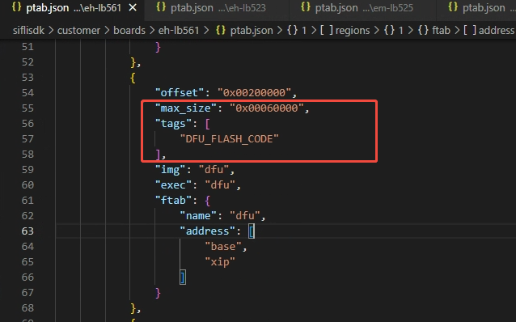

For NAND projects, the following additional modifications are needed when
modifying ptab:
1. Move the HCPU_FLASH_CODE macro to the hcpu tags in flash2
2. Add DFU_DOWNLOAD_REGION
3. Additionally add a DFU_INFO_REGION, 128KB 
4. Add xip information for dfu partition
5. In psram1_cbus HCPU area, change HCPU_FLASH_CODE in tags to HCPU_PSRAM_CODE
6. Add DFU area to psram1_cbus, fill in DFU_PSRAM_CODE for tags
   
### Bootloader
Check if the corresponding boot loader's main.c has the logic for selecting
running_imgs[CORE_HCPU]. If not, add it manually ![boot1]{1}

Also, in the void dfu_boot_img_in_flash(int flashid) function in main.c, both
places that check core id need to be OR'd with CORE_LCPU
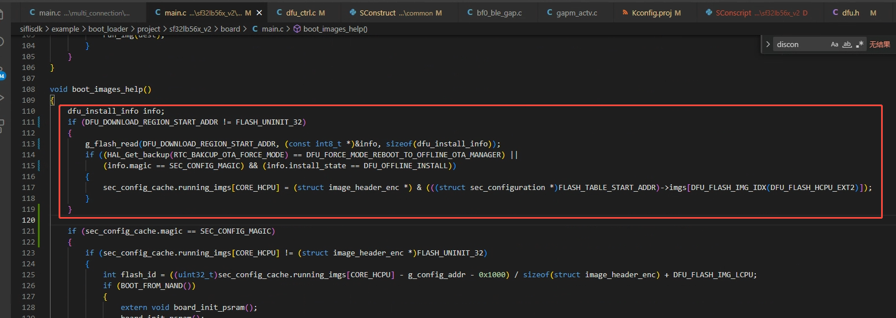


In addition, both instances of the core ID check within the `void
dfu_boot_img_in_flash(int flashid)` function in `main.c` must be bitwise ORed
with `CORE_LCPU`. 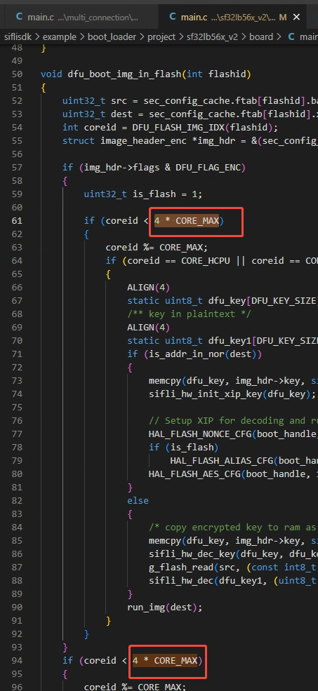


### Main Project
Kconfig.proj Add DFU switch 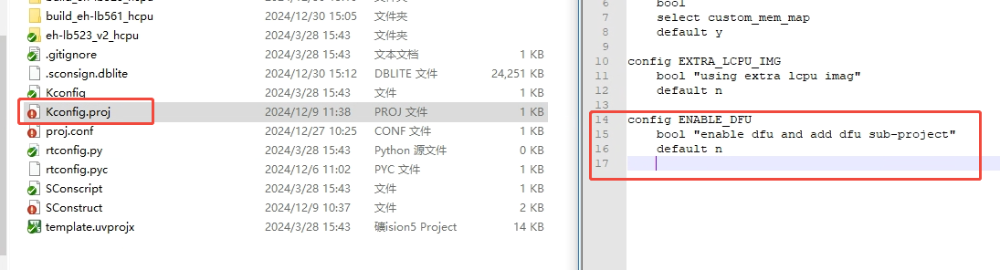


proj.conf Enable DFU-related code and DFU switch
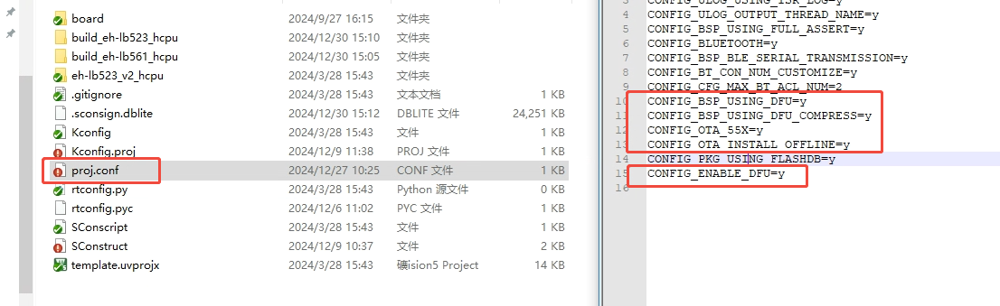


Sconstruct Add DFU sub-project Note: Need to add before AddFTAB
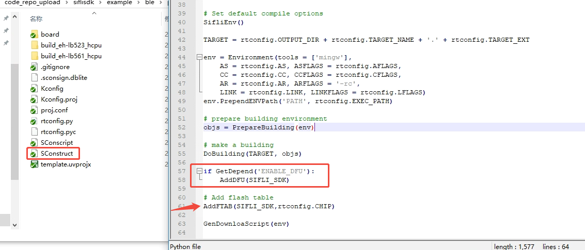

### DFU Project
Usually no modification needed

## Transmission
If transmitting manually, you need to download the packaged file to
DFU_DOWNLOAD_REGION

If using the mobile transmission lib provided by Sifli to transmit this upgrade
package, you need to enable the following options in the main project
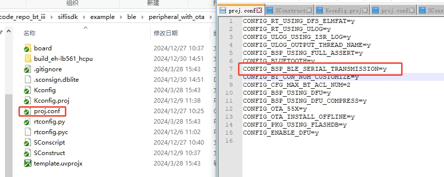

Add the following content in the code
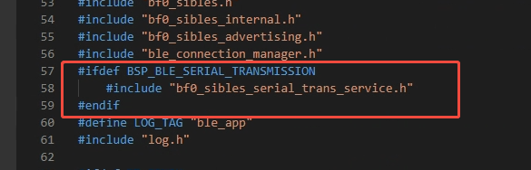
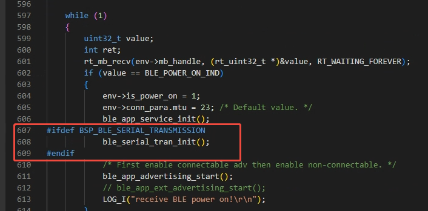


## Creating Upgrade Package
```c
.\imgtoolv37.exe gen_dfu --img_para hcpu 16 0 dfu 16 6 --com_type=0 --offline_img=2
```

.\imgtoolv37.exe gen_dfu --img_para hcpu 16 0 dfu 16 6 --com_type=0
--offline_img=2
```c
.\imgtoolv37.exe gen_dfu --img_para hcpu 16 0 dfu 16 6 --com_type=0 --offline_img=2 --ezip_path=ezip.exe
```

Put all files and the upgrade files to be created in the same directory The
command above creates both hcpu and dfu simultaneously, where hcpu represents
creating hcpu.bin, dfu represents creating dfu.bin The first parameter after the
bin name is for compression, 16 means use compression, 0 means no compression
The second parameter after the bin name represents image id, hcpu is 0, dfu is
6.


The number of files to be created can be adjusted arbitrarily. You can upgrade
only HCPU, or create multiple bins simultaneously. If dfu.bin is created, the
DFU installer will be updated before upgrading.

After creation, only offline_install.bin needs to be transmitted

If you need to upgrade bins other than HCPU and DFU, you need to specify the
flash address corresponding to the image id. In dfu_get_download_addr_by_id in
dfu_flash.c, add the new ID, then return the address defined in ptab.c. The
address under the flag&DFU_FLAG_COMPRESS condition does not need to be
implemented. 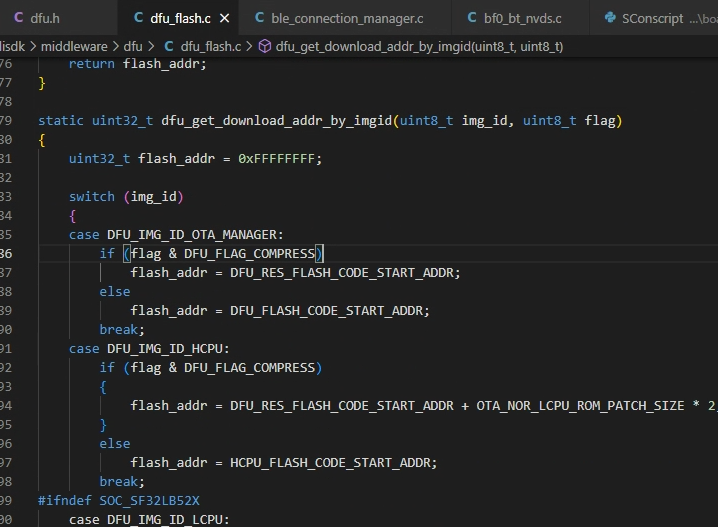

## Mobile App and Demo Project Access
| OFFSET | LENGTH | CONTENT                                                                           |
| ------ | ------ | --------------------------------------------------------------------------------- |
| 0      | 4      | DFU Magic (0x46, 0x43, 0x45, 0x53)                                                |
| 4      | 1      | Protocol version of the installation package                                      |
| 5      | 1      | Installation flag, 0xFF                                                           |
| 6      | 2      | Image count                                                                       |
| 8      | 4      | The CRC32MPEG2 result calculated across all image content (image1 + image2 + ...) |
| 12     | 1      | First image ID                                                                    |
| 13     | 1      | First image flags                                                                 |
| 14     | 4      | First image length                                                                |
| 18     | 1      | Second image ID                                                                   |
| 19     | 1      | Second image flags                                                                |
| 20     | 4      | Second image length                                                               |
|        |        | ...                                                                               |
|        |        | ImageX                                                                            |
|        |        | ImageY                                                                            |
|        |        | ...                                                                               |

### Android SiFli BLE App Download Link
https://www.pgyer.com/gurSBc
1. Verify the MAGIC field and calculate the CRC (refer to the installation
   package structure) to validate the integrity and authenticity of the
   installation package.
2. Install the OTA manager if it is present in the installation package.
3. Erase the original OTA Manager.
4. For uncompressed binaries, directly copy the contents of the image in the DFU
   installation package to the target region.
5. For compressed binaries, decompress the data before writing it to the
   corresponding region.
6. Update DFU non-volatile (NV) parameters.
7. Update the RTC registers and reboot.

### Android Demo Project
https://github.com/OpenSiFli/SiFli_OTA_APP\
Relevant sections are under "3. SiFli-SDK OTA"
1. Verify the MAGIC field and calculate the CRC (based on the package structure)
   to validate the integrity and legitimacy of the installation package.
2. Install all binaries except for the OTA Manager, following the same
   installation procedure as used in the HCPU.
3. Update DFU non-volatile (NV) parameters.
4. Update the RTC registers and reboot.

### iOS Demo Project
https://github.com/OpenSiFli/SiFli_OTA_APP_IOS\
Relevant sections are under "SiFli-SDK OTA (Nor Offline)"

When generating a compressed binary, an 8-byte header is prepended, consisting
of a 4-byte original length and a 4-byte chunk length (typically 10240 bytes).

The original data is then divided into chunks based on the specified chunk
length. Each chunk is compressed using either EZIP hardware GZIP or software
ZLIB (the former is currently the standard). The compressed data for each chunk
is prefixed with its compressed length, and all compressed chunks are then
concatenated. Finally, this payload is combined with the previously mentioned
header to form a complete compressed binary.


## Mobile App Usage
### Download link for Android SiFli BLE App.
https://www.pgyer.com/gurSBc

### Android demo project.
https://github.com/OpenSiFli/SiFli_OTA_APP\
Refer to section "3. SiFli-SDK OTA".

### iOS Demo Project
https://github.com/OpenSiFli/SiFli_OTA_APP_IOS\
Refer to section "SiFli-SDK OTA (Nor Offline)".

## Troubleshooting
Operation procedure as illustrated: Search for the board's BLE broadcast, select
the corresponding device, choose "nor dfu," and finally select "offline." There
is no need to click the "start" button at the bottom.\
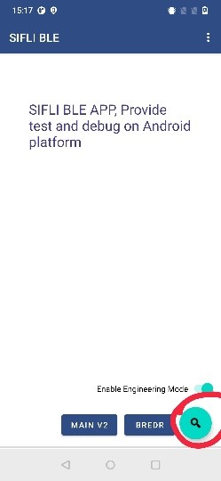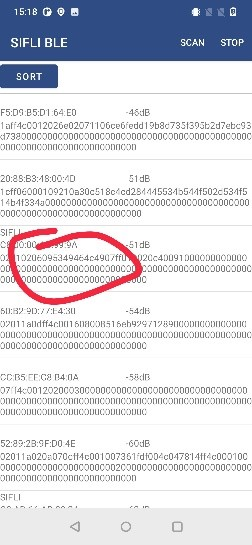
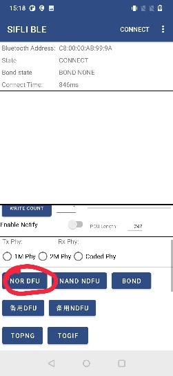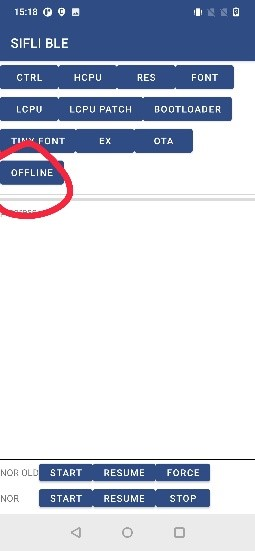


## Reference Documentation
1.  Insufficient space warnings during DFU project compilation: The DFU project
    compiles features enabled in `board.conf`, which may include unnecessary
    modules and cause the binary size to exceed `DFU_FLASH_CODE` in `ptab.json`.
    To exclude components defined in `board.conf` from the DFU build, modify the
    `proj.conf` within the DFU project directory and set the corresponding items
    to `n`. 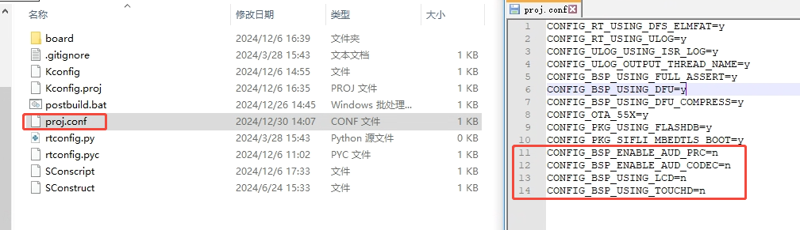


2.  Notes on DFU_DOWNLOAD_REGION sizing: Since image resources are already
    compressed, the DFU script cannot significantly reduce their size;
    therefore, they should be calculated with a * 1.0 factor. For example, if
    the maximum upgrade scenario involves simultaneously updating `hcpu.bin`,
    `res.bin` (image resources), and `dfu.bin`, the reserved space must be:
    (size of `hcpu.bin` * 0.7) + size of `res.bin` + (size of `dfu.bin` * 0.7).

## Update History
<!-- 对于rt_device的示例，rt-thread官网文档提供的较详细说明，可以在这里添加网页链接，例如，参考RT-Thread的[RTC文档](https://www.rt-thread.org/document/site/#/rt-thread-version/rt-thread-standard/programming-manual/device/rtc/rtc) -->

## Revision History
| Version | Date    | Release Notes                                                                                          |
| ------- | ------- | ------------------------------------------------------------------------------------------------------ |
| 0.0.1   | 01/2025 | Initial release                                                                                        |
| 0.0.2   | 03/2025 | Added support for NAND flash DFU, updated build commands and scripts, and removed obsolete parameters. |
| 0.0.3   | 03/2025 | Added support for 58x series.                                                                          |
| 0.0.4   | 04/2025 | Added HTTP download examples and adjusted directory structure and macro switches.                      |
| 0.0.5   | 11/2025 | Added update adaptation for 55x series.                                                                |
| 0.0.6   | 11/2025 | Updated deprecated content.                                                                            |
| 0.0.7   | 01/2026 | Updated build tools and resolved path issues in the ezip utility.                                      |
| 0.0.8   | 01/2026 | Added installation instructions.                                                                       |
