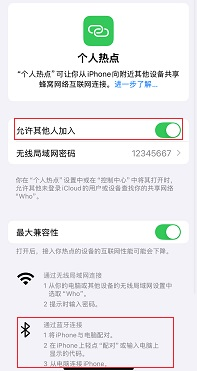
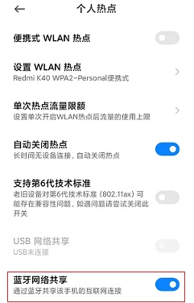
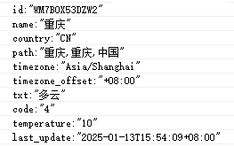

# BT PAN Example

Source code path: example/bt/pan

(Platform_pan)=
## Supported Platforms
<!-- 支持哪些板子和芯片平台 -->
+ eh-lb52x
+ eh-lb56x
+ eh-lb58x
+ sf32lb52-lcd series
+ sf32lb56-lcd series
+ sf32lb58-lcd series

## Overview
<!-- 例程简介 -->
This example demonstrates connecting to a phone's PAN protocol via Bluetooth,
then using Finsh commands to retrieve current weather information from a
specific website.

## Adding CA Certificates
1. Storing Root Certificates of Signing Authorities
- `external/mbedtls_288/certs/default` The directory stores the commonly used CA
  certificate files.
- `certs` The directory stores the CA certificate files added by the users.

If the required CA root certificate is not present in the `certs/default`
directory,<br> users must copy their PEM-format CA certificate to the root
`certs` directory. (Only PEM format is supported; DER format is not
accepted).<br> Added certificates should be placed alongside
`DigiCert_Global_Root_CA2.crt` in this directory. 

2. Certificate Format Specifications
- `PEM` format Certificates

  **PEM certificates** typically use the **.pem** or **.cer** file extensions.

  When opened with a text editor, the content begins with `-----BEGIN
  CERTIFICATE-----` and ends with `-----END CERTIFICATE-----`.
- `DERformat Certificates`

  **The DER format certificate** is a binary file type.<br>

3. Checking Configuration Verify in `proj.conf`: If
   `PKG_USING_MBEDTLS_USER_CERTS` is enabled, all files in the root certs
   directory will be merged into `ports/src/tls_certificate.c` during
   compilation. ![alt text]{1}

**PEM format certificate** use **.pem** or **.cer** file with suffixes at the
end.

## Example Usage
<!-- 说明如何使用例程，比如连接哪些硬件管脚观察波形，编译和烧写可以引用相关文档。
对于rt_device的例程，还需要把本例程用到的配置开关列出来，比如PWM例程用到了PWM1，需要在onchip菜单里使能PWM1 -->
1. Before connecting, it's best to ensure the phone has already enabled network
   sharing. If network sharing is enabled after BT connection, you can reconnect
   to PAN using the finsh command "pan_cmd conn_pan" to connect to the network.
    1) iOS enables network sharing. iOS needs to ensure a SIM card is installed,
       then enable Personal Hotspot:\
       
    2) Different Android devices have different paths to enable network sharing,
       but all can be found in Personal Hotspot sharing to find Bluetooth
       network sharing and enable it. Android can enable Bluetooth network
       sharing based on WiFi connection:\
       
2. The example will enable Bluetooth Inquiry scan and page scan at startup,
   allowing phones and other devices to discover and connect to this device. The
   default Bluetooth name is sifli_pan.
3. With the phone's network sharing enabled, the PAN protocol will connect
   successfully, and you can find "pan connect successed" in the log. With the
   phone itself having internet access, input the finsh command "weather" to get
   current weather information. Successful output is shown below:\
   
4. By default, this example has OTA functionality enabled. Input the finsh
   command "pan_cmd ota_pan" to download and install the image specified by the
   URL in main.c via BT PAN. For OTA introduction, see the peripheral_with_ota
   project.
5. This example has added an autoconnect flag. You can enable it by entering the
   finsh command: pan_cmd set_retry_flag 1 / You can disable it by entering the
   command: pan_cmd set_retry_flag 0
6. This example has added the number of autoconnect retries. You can set the
   maximum retry count by entering the finsh command: pan_cmd set_retry_time 5
   (number of retries)
7. Ensure that the phone has enabled network sharing. After the phone
   disconnects from pan, if you want to automatically reconnect, you can enter
   the finsh command: pan_cmd autoconnect

## Expected Results
- Failed to retrieve weather data. Verify the validity of the local Bluetooth
  MAC address OUI: the first three bytes (OUI) must be a valid value assigned by
  the IEEE. Using an unauthorized OUI may cause network issues; the address can
  be modified manually.
- Command format to get the address: nvds get_mac (Invalid address example:
  xxxxxx52FD11)
- Command format to set the Bluetooth MAC: nvds update addr 6 xxxxxxYYYYYY
  (where YYYYYY is the byte-reversed OUI, and xxxxxx represents the user-defined
  last 3 bytes. Note: The OUI must be reversed. Valid address example:
  xxxxxx52FD5C)
- Example: A valid OUI E8:6A:64 is reversed as 646AE8.
- Enabling CONFIG_NVDS_AUTO_UPDATE_MAC_ADDRESS will override manual address
  modifications (nvds update addr 6 xxxxxxYYYYYY).
- If the MAC address is not updated as expected after a device reboot via the
  "nvds get_mac" command, verify whether "CONFIG_NVDS_AUTO_UPDATE_MAC_ADDRESS"
  is enabled. If so, disable this macro, recompile, flash the firmware, and then
  attempt to set the MAC address manually.

### Hardware Requirements
Prerequisites:
+ A development board supported by this example ([Supported
  Platforms](#Platform_pan)).
+ Mobile phone.
+ A URL to retrieve weather data (defaults to api.seniverse.com).

### menuconfig Configuration
1. Enable Bluetooth (`BLUETOOTH`):
    - Path: Sifli middleware → Bluetooth
    - To enable: Enable bluetooth
        - Macro: `CONFIG_BLUETOOTH`
        - Description: Enables Bluetooth functionality.
2. Enable PAN and A2DP (A2DP is required as iOS does not support standalone PAN
   connections):
    - Path: Sifli middleware → Bluetooth → Bluetooth service → Classic BT
      service
    - To enable: Enable BT finsh (Optional)
        - Macro: `CONFIG_BT_FINSH`
        - Description: Enables the FinSH command-line interface for Bluetooth
          control.
    - To enable: Manually select profiles
        - Macro: `CONFIG_BT_PROFILE_CUSTOMIZE`
        - Description: Allows manual selection of enabled Bluetooth profiles.
    - To enable: Enable PAN
        - Macro: `CONFIG_CFG_PAN`
        - Description: Enables the PAN protocol.
3. Enable BT Connection Manager:
    - Path: Sifli middleware → Bluetooth → Bluetooth service → Classic BT
      service
    - To enable: Enable BT connection manager
        - Macro: `CONFIG_BSP_BT_CONNECTION_MANAGER`
        - Description: Utilizes the Connection Manager module to manage
          Bluetooth connections.
4. Enable NVDS:
    - Path: Sifli middleware → Bluetooth → Bluetooth service → Common service
    - Enable: Enable NVDS synchronous
        - Macro: `CONFIG_BSP_BLE_NVDS_SYNC`
        - Description: Enables synchronous access to Bluetooth Non-Volatile Data
          Storage (NVDS). This option must be enabled when Bluetooth is
          configured on the HCPU and disabled when it is configured on the LCPU.
5. Menuconfig settings for Bluetooth auto-connection:
    - Path: Sifli middleware → Bluetooth → Bluetooth service → Classic BT
      service
    - Enable: Enabling "Enable BT connection manager" will automatically enable
      "Re-connect to last device if connection timeout happened or system power
      on" by default.
        - Macro: `CONFIG_BT_AUTO_CONNECT_LAST_DEVICE`
        - Description: Enables automatic reconnection to the last connected
          device.
    - Path: Third party packages
    - Enable: FlashDB: Lightweight embedded database (typically enabled by
      default)
        - Macro: `CONFIG_PKG_USING_FLASHDB`
        - Description: Enables the FlashDB database to ensure critical data
          persistence across power cycles or system reboots.

### Compilation and Flashing
Navigate to the project directory and run the `scons` command to compile:
```c
&gt; scons --board=eh-lb525 -j32
```
Navigate to the `project/build_xx` directory and execute `uart_download.bat`.
Follow the prompts to select the appropriate port for downloading:
```c
$ ./uart_download.bat

     UART Download

Please input the serial port number: 5
```
For detailed compilation and download procedures, please refer to the [Quick
Start Guide](/quickstart/get-started.md).

## Troubleshooting
<!-- 说明例程运行结果，比如哪几个灯会亮，会打印哪些log，以便用户判断例程是否正常运行，运行结果可以结合代码分步骤说明 -->
This example retrieves weather information from a specified URL by connecting to
a smartphone via the Personal Area Networking (PAN) profile.

## Reference Documentation
1. If a compilation error occurs because the selected chip type lacks a
   configured `ptab.json` for OTA, the DFU function can be disabled as shown
   below:  

## Update History
<!-- 对于rt_device的示例，rt-thread官网文档提供的较详细说明，可以在这里添加网页链接，例如，参考RT-Thread的[RTC文档](https://www.rt-thread.org/document/site/#/rt-thread-version/rt-thread-standard/programming-manual/device/rtc/rtc) -->

## Revision History
| Version | Date    | Release Notes        |
| ------- | ------- | -------------------- |
| 0.0.1   | 01/2025 | Initial release      |
| 0.0.2   | 04/2025 | Added OTA support    |
| 0.0.3   | 07/2025 | Added CA certificate |
|         |         |                      |
