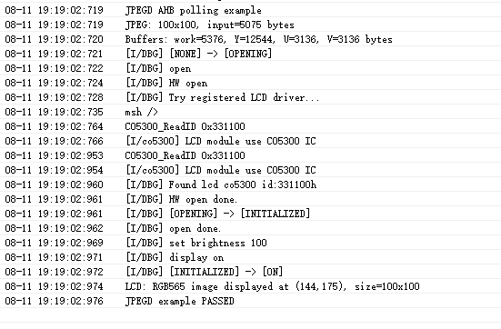

# JPEGD HAL Example

Source path: `example/hal/jpegd`

## Overview

This example directly calls `HAL_JPEGD` on the SF32LB57X HCPU. It decodes the built-in 100x100 JPEG in AHB output mode and draws the decoded image in the center of the LCD device.

## Supported Boards

* sf32lb57 series

## Usage

### Build and Flash

Switch to the example `project` directory and run the SCons build command (`board` is the board name):

```shell
scons --board=spi-hdk_lb573ub7n6 -j11
```

Run `build_spi-hdk_lb573ub7n6_hcpu\uart_download.bat` and follow the prompt to select the serial port for downloading:

```shell
build_spi-hdk_lb573ub7n6_hcpu\uart_download.bat

Uart Download

please input the serial port num:5
```

For detailed build and download steps, refer to the related sections in [Get Started](/quickstart/get-started.md).

### Example Output

The serial console prints logs as shown below:



If `CONFIG_JPEGD_USING_LCD` is enabled, the decoded image is also displayed on the LCD.

## Execution Flow

1. Read the actual width and height from the built-in JPEG header.
2. Initialize and configure the JPEGD handle.
3. Query the actual sizes of the work buffer and the three output planes, then check the static buffer capacities.
4. Call `HAL_JPEGD_Decode` to decode the JPEG.
5. When LCD display is enabled, convert only the actual 100x100 region from YUV420 to RGB565 and display it.
6. Deinitialize JPEGD and print `JPEGD example PASSED`.

## Revision History

| Version | Date | Release Notes |
|:---|:---|:---|
| 0.0.1 | 08/2026 | Initial version |
| | | |
