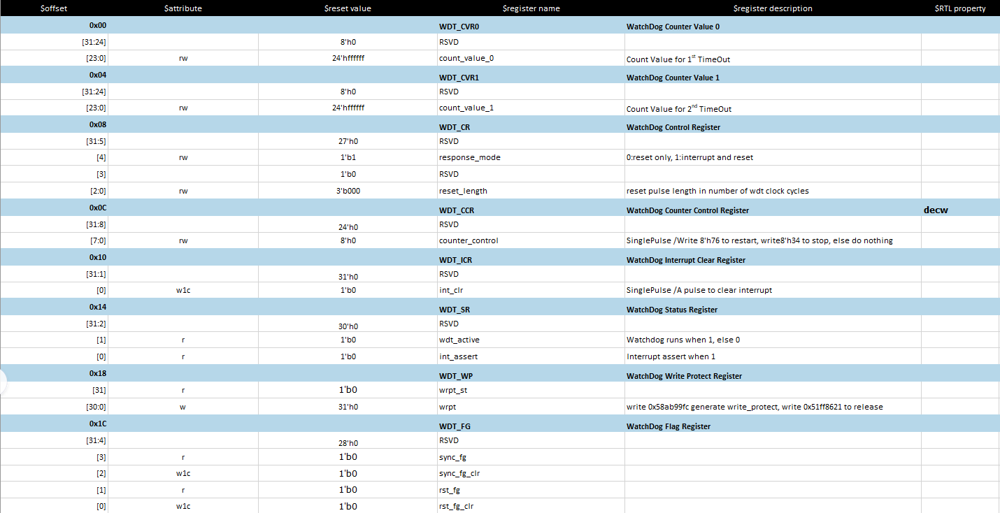

# IWDT Example

Source code path: example/hal/wdt/iwdt

## Supported Platforms
<!-- 支持哪些板子和芯片平台 -->
+ sf32lb52-lcd series
+ sf32lb56-lcd series
+ sf32lb58-lcd series

## Overview
<!-- 例程简介 -->
This example demonstrates IWDT usage, including:
+ IWDT configuration and enabling.
+ IWDT feeding.
+ IWDT timeout response.

## Example Usage
<!-- 说明如何使用例程，比如连接哪些硬件管脚观察波形，编译和烧写可以引用相关文档。
对于rt_device的例程，还需要把本例程用到的配置开关列出来，比如PWM例程用到了PWM1，需要在onchip菜单里使能PWM1 -->

### Hardware Requirements
Before running this example, prepare a development board supported by this
example

### menuconfig Configuration


### Compilation and Programming
Switch to the example project directory and run the scons command to execute
compilation:
```
scons --board=sf32lb52-lcd_n16r8 -j32
```
Run `build_sf32lb52-lcd_n16r8_hcpu\uart_download.bat`, select the port as
prompted for download:
```

```
$ ./uart_download.bat

    UART Download

Please enter the serial port number: 5
```
For detailed steps on compilation and download, please refer to the relevant introduction in [](/quickstart/get-started.md).

## Expected Results of Example
<!-- Explain example running results, such as which LEDs will light up, which logs will be printed, to help users judge whether the example is running normally, running results can be explained step by step combined with code -->
After the example starts, the serial port outputs as follows:
1. IWDT initialization configuration and enabling successful:
```
10-28 23:44:00:340 WDT Example: 10-28 23:44:00:342 IWDT initialization
successful. Timeout: 10(s) 10-28 23:44:00:343 WDT_CVR0:0x50000 WDT_CVR1:0x0
```

```
IWDT cannot generate interrupts. Here the working mode (`respond mode`) is
configured as `reset only`, counting only one round, with timeout set to 10
seconds.
```
2. Feeding the dog (every 5 seconds):
```
10-28 23:44:05:270 Feeding watchdog. 10-28 23:44:10:298 Feeding watchdog. 10-28
23:44:15:262 Feeding watchdog. 10-28 23:44:20:291 Feeding watchdog. 10-28
23:44:25:280 Feeding watchdog. 10-28 23:44:31:132 Feeding watchdog. 10-28
23:44:35:300 Feeding watchdog. 10-28 23:44:40:301 Feeding watchdog. 10-28
23:44:45:304 Feeding watchdog. 10-28 23:44:50:320 Feeding watchdog.
```
3. After stopping feeding the dog, the first round of counting ends (10s), directly resetting the system:
```
10-28 23:44:50:320 Feeding watchdog. 10-28 23:45:03:215 SFBL 10-28 23:45:04:945
Serial:c2, Chip:4, Package:3, Rev:2 Reason:00000020

10-28 23:45:04:950 NAND ID 0x7070cd 10-28 23:45:04:957 Detecting BBM table with
1, 1, 2
```
## Exception Diagnosis

1. Confirm WDT configuration status (enable status, count configuration, working mode) through WDT registers:


2. After WDT is configured correctly, WDT timeout cannot reset the system:  
Need to confirm whether `reboot cause` is correctly configured, `HAL_PMU_SetWdt()` can be used to add the corresponding WDT's `reboot cause`:
    ```c
    /* Add reboot cause for watchdog. */
    HAL_PMU_SetWdt((uint32_t)hwdt.Instance);
    ```

## Reference Documents
<!-- For rt_device examples, RT-Thread official website documentation provides detailed explanations, web links can be added here, for example, refer to RT-Thread's [RTC documentation](https://www.rt-thread.org/document/site/#/rt-thread-version/rt-thread-standard/programming-manual/device/rtc/rtc) -->

## Update History
|Version |Date   |Release Notes |
|:---|:---|:---|
|0.0.1 |10/2024 |Initial version |
| | | |
| | | |
```
