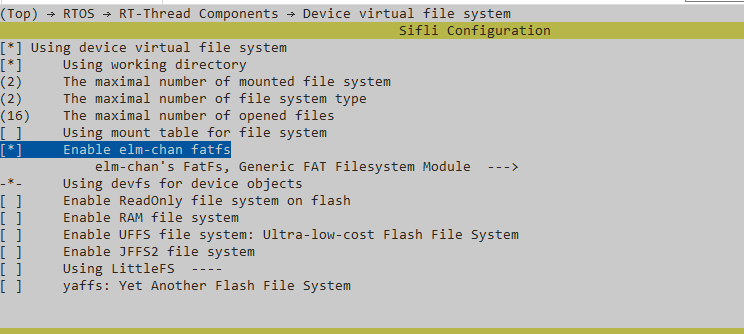
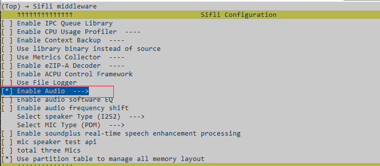
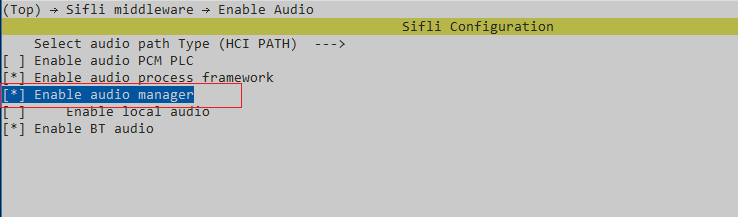
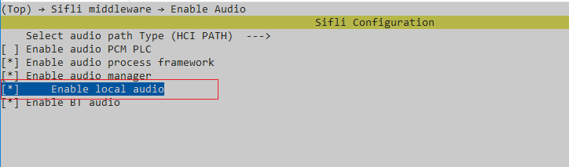

# Local Music Example

Source code path: example/multimedia/audio/local_music

## Supported Platforms
<!-- 支持哪些板子和芯片平台 -->
+ eh-lb525
+ sf32lb52-lcd series
+ sf32lb56-lcd series
+ sf32lb58-lcd series

## Overview
<!-- 例程简介 -->
This example demonstrates local music playback, including:
+ Preset a wav audio file in the root partition.
+ Play the preset wav file.

## Example Usage
<!-- 说明如何使用例程，比如连接哪些硬件管脚观察波形，编译和烧写可以引用相关文档。
对于rt_device的例程，还需要把本例程用到的配置开关列出来，比如PWM例程用到了PWM1，需要在onchip菜单里使能PWM1 -->

### Hardware Requirements
Before running this example, prepare:
+ A development board supported by this example ([Supported
  Platforms](quick_start)).
+ Speaker.

### menuconfig Configuration

1. This example needs to read and write files, so it needs to use a file system.
   Configure the `FAT` file system: 

     ```{tip}
     Mount root partition in mnt_init.
     ```
2. Enable AUDIO CODEC and AUDIO PROC: 
3. Enable AUDIO(`AUDIO`): 
4. Enable AUDIO MANAGER.(`AUDIO_USING_MANAGER`)
   
5. (`AUDIO_LOCAL_MUSIC`) 
6. Preset audio files (also supports MP3), place them in the \disk\ directory
   below for preset download:
* Audio files are under multimedia/audio/local_music/disk
### Compilation and Programming
Switch to the example project directory and run the scons command to execute
compilation:
```c
&gt; scons --board=eh-lb525 -j32
```
Switch to the example `project/build_xx` directory and run `uart_download.bat`,
select the port as prompted for download:
```c
$ ./uart_download.bat

     UART Download

Please input the serial port number: 5
```
For detailed steps on compilation and download, please refer to the relevant
introduction in [Quick Start](quick_start).

## Expected Results of Example
<!-- 说明例程运行结果，比如哪几个灯会亮，会打印哪些log，以便用户判断例程是否正常运行，运行结果可以结合代码分步骤说明 -->
After the example starts: Play the preset 16k.wav audio file once. Expected to
complete normal playback.

```{tip}
If you need to play MP3 files, you can preset an MP3 file (note whether the audio file size exceeds the file system capacity) and configure the playback path:
```
#define MUSIC_FILE_PATH "/Cloudy_Day.mp3"
```

```

## Exception Diagnosis


## Reference Documents
<!-- 对于rt_device的示例，rt-thread官网文档提供的较详细说明，可以在这里添加网页链接，例如，参考RT-Thread的[RTC文档](https://www.rt-thread.org/document/site/#/rt-thread-version/rt-thread-standard/programming-manual/device/rtc/rtc) -->

## Update History
| Version | Date    | Release Notes   |
| ------- | ------- | --------------- |
| 0.0.1   | 10/2024 | Initial version |
|         |         |                 |
|         |         |                 |
