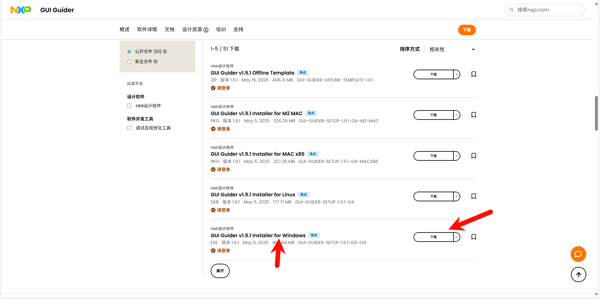
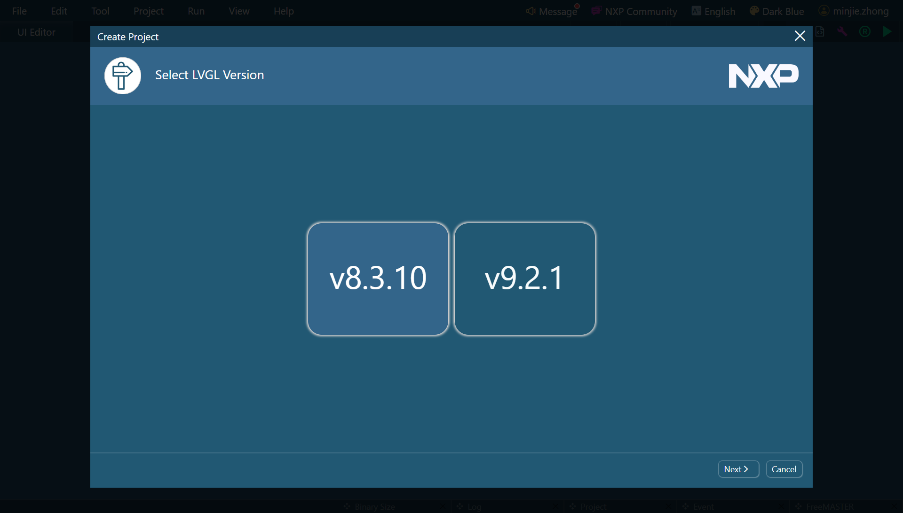
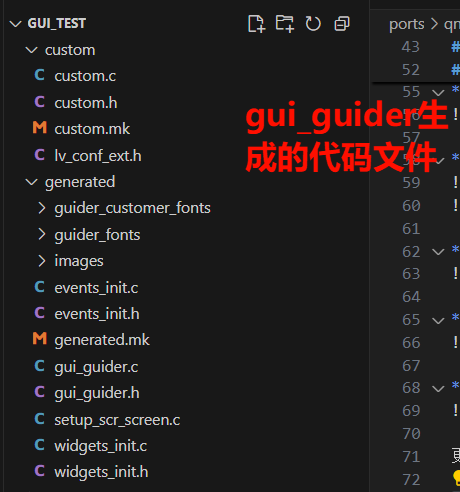
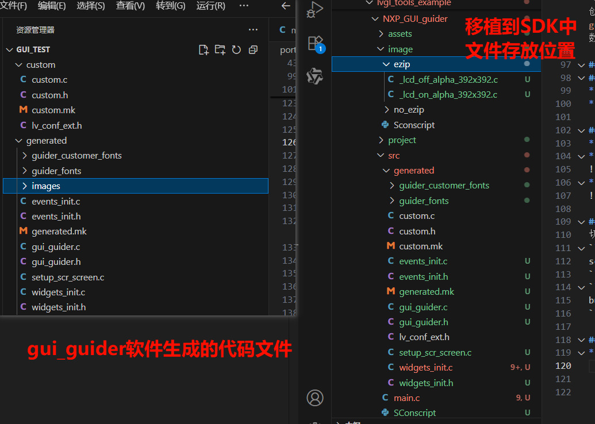
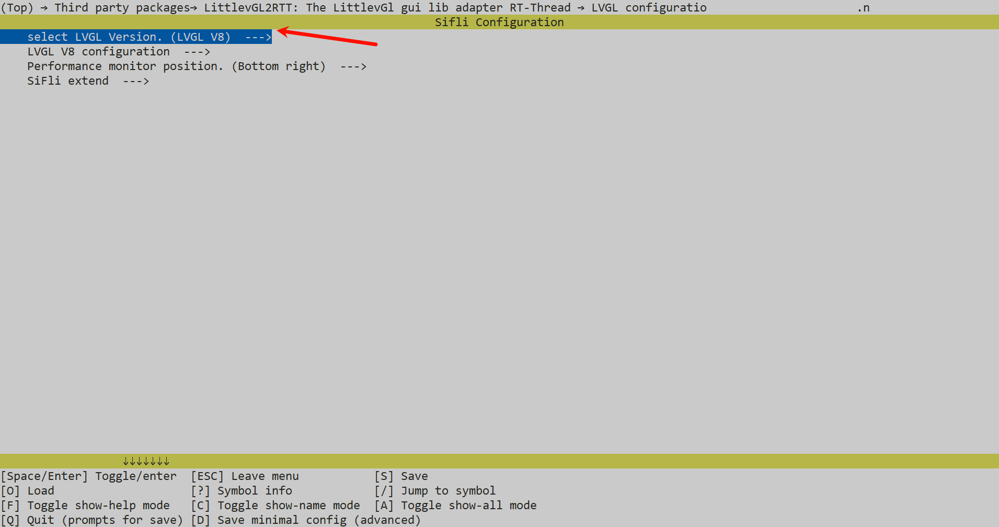
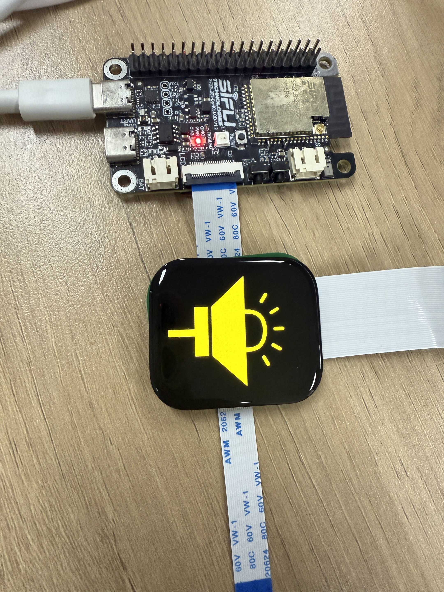

# SquareLine Example (RT-Thread)
Source path: example/multimedia/lvgl/lvgl_tools_example/NXP_GUI_guider

## Supported Platforms
<!-- 支持哪些板子和芯片平台 -->
- Any board (including [pc]{1})

## Example Overview
This example creates two screens, each containing other controls, and implements
mutual switching between the two screens through button controls. The document
details how to adapt and run the generated code in the current SDK environment.

## Using Squareline Software
Squareline software download address: [SquareLine
Download](https://www.nxp.com.cn/design/design-center/software/development-software/gui-guider:GUI-GUIDER).
After entering the page, you need to register an account first before
downloading and installing.
* After downloading and installing, open the SquareLine software, enter your
  registered email and password, click `LOG_IN` to log in, and check the
  obtained license 

* After successful login, select Create to create a multi-platform UI project,
  configure the project information, and click `Create` 

* The following demonstrates adding controls, where you can modify layout,
  events, set styles and other properties 

* After completion, compile to generate .c files 

* Once the UI interface design is complete, you can use the simulator to compile
  and run the project to verify that the results meet expectations. 

* After verification, you can export the generated files. 

 ![alt test]{2}

## Squareline Generated Project Files

* components: This directory contains part of the embedded graphical interface
  development project, including component definitions, initialization and event
  handling code for the UI interface. If events and components are used in the
  software, they will be created in this directory.

* images: This directory contains generated image resource .c files for
  displaying PNG format images in the LVGL graphical interface

* screens/ui_Screen1.c, ui_Screen1.h: ui_Screen1.c is the specific
  implementation file of the (UI interface), containing the creation and
  destruction logic of the screen and its components. ui_Screen1.h declares
  screen-related variables and function interfaces for reference by other files.
  If multiple screens are created in Squareline software, multiple .c files will
  be generated, each corresponding to one screen with filenames consistent with
  screen names.

* CMakeLists.txt: This is a CMake build configuration file used to define and
  manage compilation rules for the entire UI project's source files.

* filelist.txt: Manages and compiles the entire LVGL user interface project,
  defining source file lists and creating static libraries

* ui_events.h: Event handling header file used to declare and manage UI
  component event callback functions. When event handling is added, this file
  will contain similar callback function declarations. Currently the file is
  almost empty, only containing basic header file protection structure.

* ui_helpers.c/ui_helpers.h: Common auxiliary function collection in the
  generated UI project, used to simplify common operations such as UI component
  property setting, animation control, and screen switching. They are the core
  utility function library of Squareline Studio generated code.

* ui.c/ui.h: The ui.c file implements UI interface functions, including UI
  initialization and screen destruction. The ui.h file defines public interfaces
  of the UI module for main program and other modules to call.

* widgets_init.c/.h: Provides a unified entry point for widget initialization.

## Porting Squareline Generated Project Files

* The SDK employs the ezip utility to further compress generated image assets,
  thereby reducing the storage footprint. During porting, users can choose
  whether to apply ezip compression. Before proceeding, create a folder named
  `image` within the `gui_guider` directory, and then create two subdirectories
  named `ezip` and `no_ezip` within it. Place image assets that require
  compression into the `ezip` folder, and assets that do not require or cannot
  support compression into the `no_ezip` folder. The build script will
  automatically determine whether to apply compression during the compilation
  process based on the file location. For details, refer to the build script:
  [SConscript](image/SConscript).

*  After completing the steps above, add the following content under `# Add
   application source code ` in the project's SConscript file; otherwise, the
   ezip functionality will not be enabled during compilation:

```python
objs.extend(SConscript(cwd+'/../image/SConscript', variant_dir="image", duplicate=0))
```
### Pre-porting Preparation

* "Since the SDK uses ezip software to further compress generated image
  resources to reduce space occupation, before porting we need to create a
  folder named image_ezip under the Square_Line directory, and then create
  another folder named ezip under this directory." The ezip folder is used to
  store image resources that need compression. Finally, a SConscript file needs
  to be created under the image_ezip folder for ezip hardware acceleration
  during compilation. If compression is not needed, images can be moved to the
  image directory, and the script will automatically decide whether compression
  is needed based on file location during compilation. The compilation linking
  script can refer to: [SConscript]{1}. ![alt test]{2}

* After completing the above operations, add the following content in the
  SConscript in the project directory under `# Add application source code`,
  otherwise the ezip function will not be available during compilation.
* Step 3: Include the header files `#include "generated/events_init.h"` and
  `#include "generated/gui_guider.h"` in the `main.c` file. Declare `lv_ui
  guider_ui;` in this file, and within the `main` function, call the UI startup
  interface functions `setup_ui(&amp;guider_ui);` and
  `events_init(&amp;guider_ui);`.

## Using the Example
### Hardware Requirements
* A board that supports this example
* A USB data cable

### menuconfig Configuration Process
* LVGL is enabled by default, no configuration needed
* Enable LittlevGL2RTT adaptation layer in menuconfig 
* Select LVGL version in menuconfig 

### Compilation and Flashing
Switch to the example project directory and run the scons command to compile:
```
scons --board=sf32lb52-lcd_n16r8 -j32
```
```
build_sf32lb52-lcd_n16r8_hcpu\uart_download.bat
```

### Running Results
* The screen will first run screen1, as shown in the figure below. 

* By clicking the button in screen1, you can switch to screen2 for display, as
  shown in the figure below. 

* Clicking the button in screen2 can return to screen1 for display.
