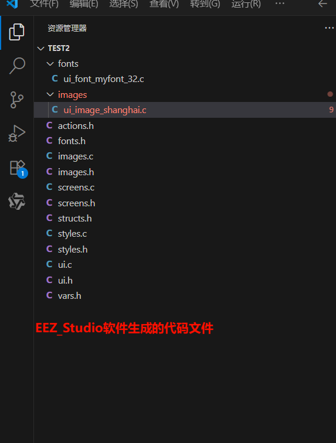
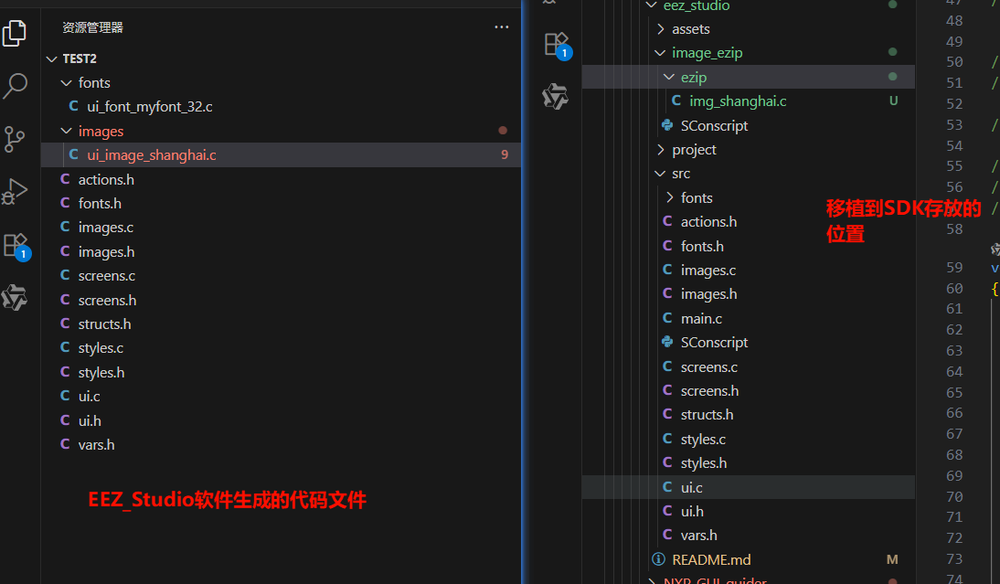
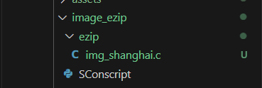
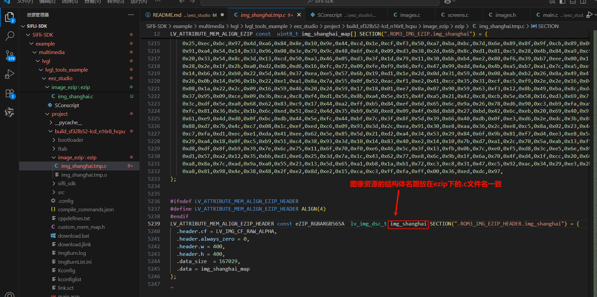
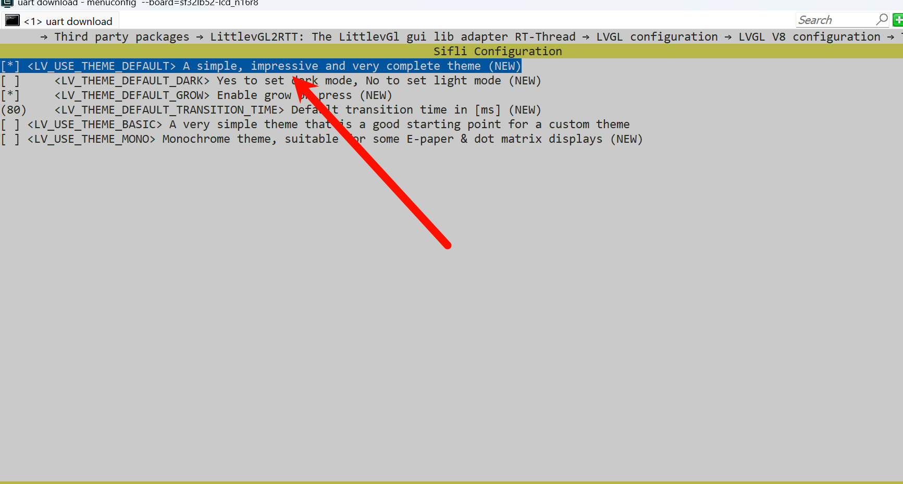

# EEZ Studio Example (RT-Thread)
Source path: example/multimedia/lvgl/lvgl_tools_example/eez_studio

## Supported Platforms
<!-- 支持哪些板子和芯片平台 -->
- Any board (including `pc`)

## Example Overview
Using the EEZ Studio tool, convert PNG images into image arrays and LVGL image
structures, and generate C files. Place the generated .c files into the project,
modify and compile (due to interface differences in the generated structures),
and use SDK's LVGL interface to display images on the screen.

## Using EEZ Studio Software
EEZ Studio software download link: [EEZ Studio
Download](https://github.com/eez-open/studio/releases), select the .exe file to
download

* After downloading and installing, open EEZ Studio and create a project on the
  home page 

* After creating the project, add items as shown in the figures  

* Interface usage: you can set project size, layout, styles, flags, widgets,
  events, actions, etc. 

* The following demonstrates adding an image control 

* After completion, compile to generate .c files 

For more detailed operations, please refer to: [EEZ Studio
Tutorial](https://www.bilibili.com/video/BV1vkp2egERj)

## Modifications to Generated Code



* Due to slight differences between the generated code and the SDK's header file
  references, it cannot be fully used directly and requires modification.
  (However, most of the code can be reused)

* For generated code, we can refer to the ui_image_xxx.c file, which stores our
  image data and interfaces. There is also a screens file

* We need to make some modifications to use it in our SDK, mainly header file
  issues, requiring the operations shown in the figure ![alt test]{1}

* Next is creating the LVGL interface. The generated code is stored in the
  screens.c file, which also has some differences in writing style, so
  adjustments are needed (but most of the code can be reused) ![alt test]{1}

* images.c/images.h: These files manage image resources within the UI,
  containing image resource declarations and definitions for image resource
  descriptor structures.

* screens.c/screens.h: These files implement the logic for UI screen creation,
  widget layout, and event binding (including the entry function for UI
  creation).

* structs.h: This is the core module for data structure modeling. Although
  currently empty, it is an essential component for bridging UI and Flow logic.
  It is recommended to define structures here according to project requirements
  to enhance code maintainability and scalability.

* styles.c/styles.h: styles.c implements style definitions (such as initializing
  objects and setting attributes like color, font, and borders). styles.h
  declares style resources and provides global style interfaces for UI creation.
  Style-related code generated during the EEZ Studio layout process is stored in
  these files.

* ui.c/ui.h: ui.c implements the core logic of the UI interface, including
  initialization, screen loading, periodic updates, and the management of
  objects and image resources. ui.h defines the public interfaces and
  initialization functions for the UI module, declaring functions for UI
  initialization, periodic refreshing, and screen loading for use by the main
  program and other modules.

* vars.h: This header file is used for declaring and managing global variables
  within the UI architecture, providing interface declarations for global state
  management.

## Example Usage

### Hardware Requirements
* A board that supports this example

```python
# for module compiling
import os
from building import *


cwd = GetCurrentDir()

src = []

cwd = GetCurrentDir()  # get current dir path
objs_no_ezip = []
objs_ezip = []
objs_no_ezip += Glob('*.png')
objs_ezip += Glob('ezip/*.c')

if 16 == GetConfigValue('LV_COLOR_DEPTH'):
    img_flags = '-rgb565'
else:
    img_flags = '-rgb888'

src = Env.ImgResource(objs_ezip, img_flags+' -cfile 2 -pal_support')

group = DefineGroup('image_ezip', src, depend = ['PKG_USING_LITTLEVGL2RTT'])  

Return ('group')
```


*  A USB data cable

```python
objs.extend(SConscript(cwd+'/../image_ezip/SConscript', variant_dir="image_ezip", duplicate=0))
```

* Step 1: After completing the preparations, copy the generated file from
  images/ui_image_shanghai.c to the image_ezip/ezip folder in the SDK. Rename
  the file to match the image resource array name in images.c. This is necessary
  because the ezip software performs compression based on the filename and
  replaces the compressed image resource variable name with the .c filename.
  Renaming ensures minimal code modifications during porting.  

* Step 2: Copy all folders except for the image folder ported in the previous
  step into the src directory.

* Step 3: Call `ui_init(); and ui_tick();` in the main function of main.c to
  invoke the UI entry functions.
## Usage Instructions
### Hardware Requirements
* A development board supported by this example
* A USB data cable

### menuconfig configuration process
* LVGL is enabled by default and requires no additional configuration.
* Enable the LittlevGL2RTT adaptation layer in menuconfig. 
* Select the LVGL version in menuconfig. 
* Enable the default theme in menuconfig to support the default theme code
  generated by EEZ Studio. 

### Compilation and Flashing
Navigate to the project directory and run the `scons` command to compile:
```
scons --board=sf32lb52-lcd_n16r8 -j32
```
```
build_sf32lb52-lcd_n16r8_hcpu\uart_download.bat
```

### Execution Results
* The image will be displayed on the screen. 
