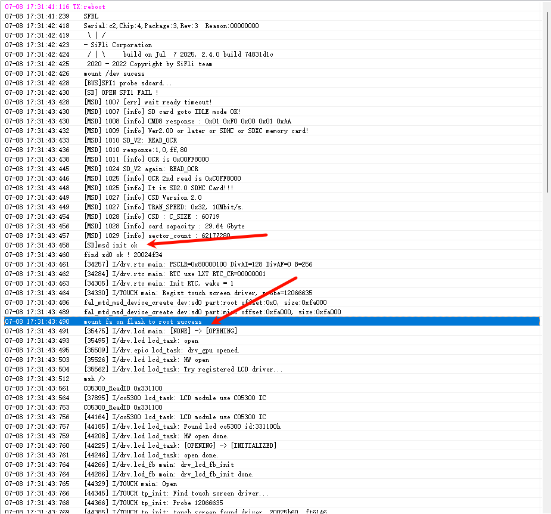
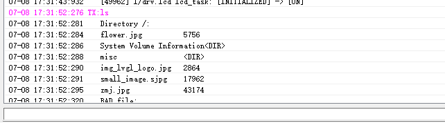
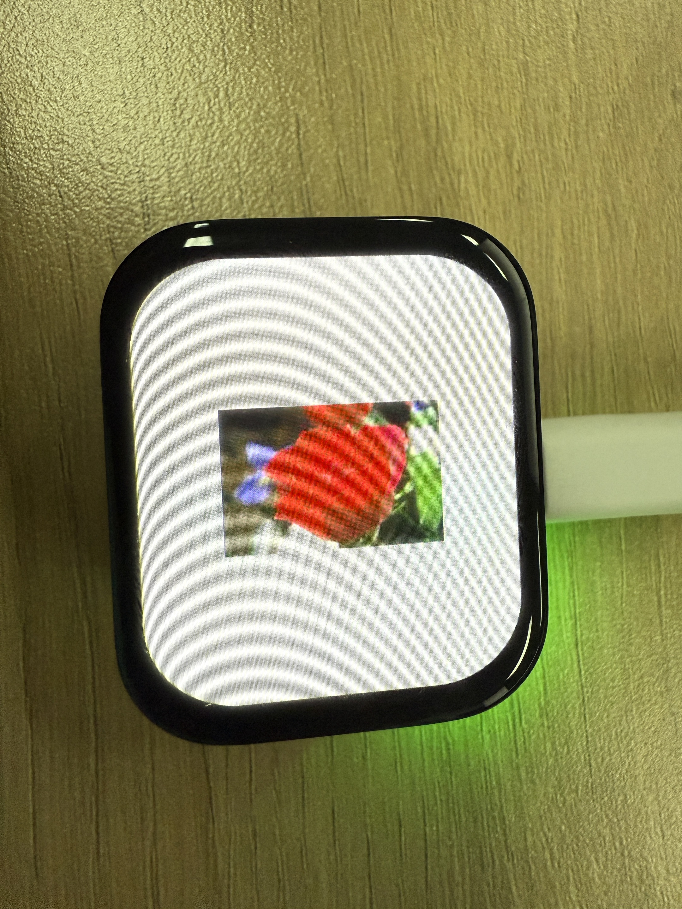
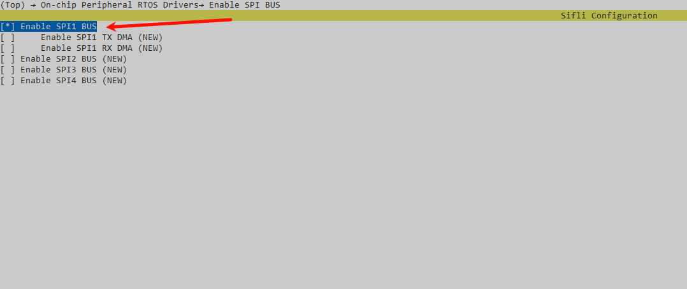
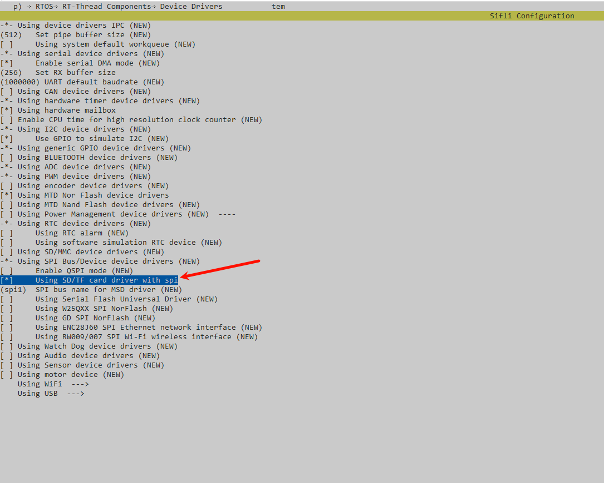
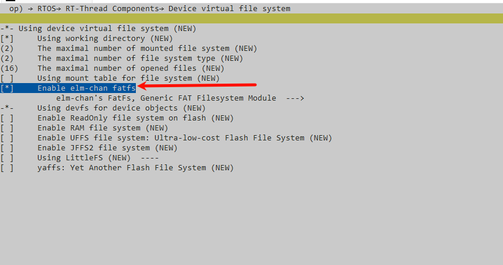
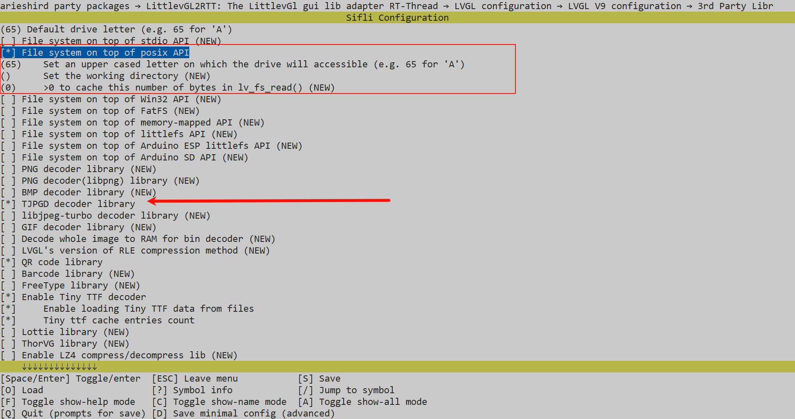
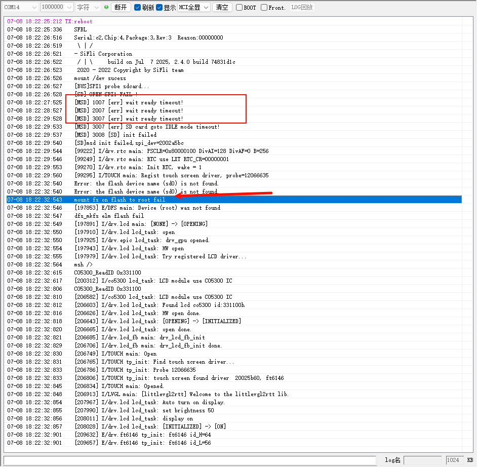

# LVGL v9 Official Examples
## Introduction
This example is used to test the LVGL v9 APIs using the official examples
provided. You can replace the `lv_example_scroll_1()` function in `src/main.c`
(or `simulator/applications/application.c` for the simulator) to evaluate other
APIs. For a complete list of available API functions, refer to the definitions
in `src/examples/lv_examples.h`.

## Project Compilation and Programming:
Projects located in the `project` directory can be compiled for a specific
target by specifying the `board` parameter.
- For example, to compile a project for the HDK 563, execute `scons
  --board=eh-lb563` to generate the project files.
- Firmware can be programmed using the `download.bat` script located in the
  `build` directory. To flash the 563 project generated in the previous step,
  run `.\build_eh-lb563\download.bat` to perform the download via J-Link.
- Note: For the SF32LB52x and SF32LB56x series, an additional
  `uart_download.bat` script is generated. Execute this script and enter the
  UART port number to perform the download. The simulator project is located in
  the `simulator` directory.
- To compile using Scons, ensure that the `SiFli-SDK/msvc_setup.bat` file is
  modified to match your local MSVC configuration.
- Alternatively, you can generate an MSVC project (`project.vcxproj`) by running
  `scons --target=vs2017` and then compile it using Visual Studio.

```{note}
Note: If you are using a version other than VS2017 (e.g., VS2022), Visual Studio will prompt you to upgrade the MSVC SDK upon loading the project. The project will be ready for use after the upgrade.
```

## Using Tjpgd
Source Path: `SiFli-SDK\example\multimedia\lvgl\lvgl_v9_examples`
### Supported Platforms
This example is compatible with the following development boards:
+ sf32lb52-lchspi-ulp
+ SF32LB52-LCD Series
+ sf32lb56-lcd series
+ sf32lb58-lcd series

### Overview
* Mount the file system via an SD card, read a .jpg image from the card, and
  display it on the screen.

### Hardware Requirements
* HS-PI development board or a 52x series development board
* A USB data cable with data transfer capabilities
* A TF card and a TF card reader

### Usage Instructions
#### Compilation and Flashing
By default, the demo code displays the image: ``` flower.jpg ```

Navigate to the project directory and run the `scons` command to compile:

```
scons --board=sf32lb52-lchspi-ulp -j8
```

Execute the flash command
```
build_sf32lb52-lchspi-ulp_hcpu\uart_download.bat
```

Select the port as prompted to begin the download:

```none
Please enter the serial port number: 5
```

#### Sample output:
* Upon inserting the SD card, the file system mounts and the image is read. If
  the log displays `mount fs on flash to root success `, the file system has
  mounted successfully.



* Enter the "ls" command to view the image files within the file system.



### Demo results


#### Routine Configuration
* By default, the SPI interface for mounting the TF card filesystem is disabled.
  If required, follow the configuration steps below.
* First, use a TF card reader to write image files to the TF card, then insert
  the card into the board.
* Configure the settings via `menuconfig` as follows:
``` c
menuconfig --board=sf32lb52-lchspi-ulp
```
* Enable the SPI bus.



* Mount the SD/TF device on the SPI bus.



* Configure the file path.



* Enable the LVGL filesystem interface, configure the drive letter, and enable
  the decoder.



### TJPGD (Extension)

### Overview
* Use the TJPGD decoder to decode `LV_IMAGE_SRC_VARIABLE` types.

### Image Format Conversion
* First, convert the .jpg images to RAW data. EEZ Studio can be used for this
  conversion. Refer to the figure below for the specific procedure: 


* Then, set the image array. The JPEGD decoder will select the appropriate
  decoding method based on the specified type.

### Configuration Process
* Perform the following configuration via `menuconfig`: Enable the
  LV_USE_FS_MEMFS macro. 

In the example routine, `img_lvgl_logo.jpg` has been converted to RAW data in
`ui_image_logo.c`.

### Troubleshooting
* Error Log  If the above error occurs, it may
  indicate a loose TF card, a communication failure, or that the TF card is not
  inserted.
