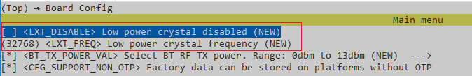
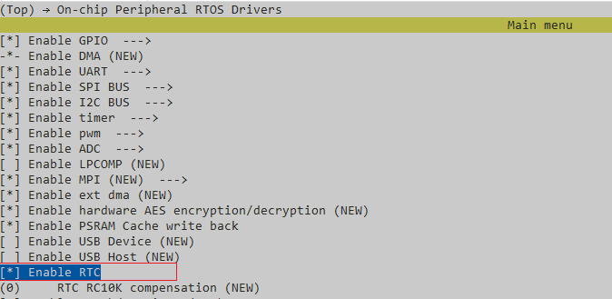
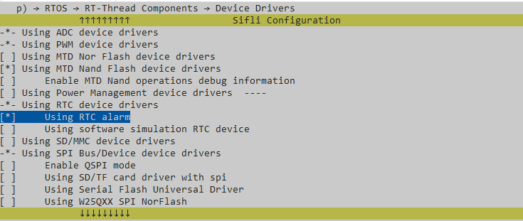

# RTC Example
Source path: example/rt_device/rtc
## Supported Platforms
<!-- 支持哪些板子和芯片平台 -->
+ sf32lb52-lcd series
+ sf32lb56-lcd series
+ sf32lb58-lcd series

## Overview
<!-- 例程简介 -->
This example demonstrates system time setting, system time reading, and alarm
usage based on the RT device framework:
+ Set date and time, read date and time.
+ Set Alarm.

## Example Usage
<!-- 说明如何使用例程，比如连接哪些硬件管脚观察波形，编译和烧写可以引用相关文档。
对于rt_device的例程，还需要把本例程用到的配置开关列出来，比如PWM例程用到了PWM1，需要在onchip菜单里使能PWM1 -->

### Hardware Requirements
Before running this example, you need to prepare a development board supported
by this example

### menuconfig Configuration
The following configuration has been set up OK for this example.
1. This example is based on external 32k crystal, need to configure LXT enable
   (LXT_DISABLE not checked):\
   
2. Enable RTC (`BSP_USING_ONCHIP_RTC` configuration automatically configures
   `RT_USING_RTC`):\
   
3. Enable RTC Alarm:\
   

### Compilation and Programming
Switch to the example project directory and run the scons command to execute
compilation:
```
scons --board=sf32lb52-lcd_n16r8 -j32
```
Run `build_sf32lb52-lcd_n16r8_hcpu\uart_download.bat`, select the port as
prompted to download:
```
$ ./uart_download.bat

     UART Download

Please input the serial port number: 5
```
For detailed steps on compilation and downloading, please refer to the relevant
introduction in [](/quickstart/get-started.md).

## Expected Results
<!-- 说明例程运行结果，比如哪几个灯会亮，会打印哪些log，以便用户判断例程是否正常运行，运行结果可以结合代码分步骤说明 -->
After the example starts, the serial port outputs as follows:
1. Set system time to 2024/01/01 08:30:00
```c
10-09 11:01:46:350    Set system time (via RT DEVICE):  2024 01 01 08:30:00
10-09 11:01:46:352    Current system time:  2024 01 01 08:30:00
```
2. Set system time to 2024/02/01 08:30:00
```c
10-09 11:01:46:354    Set system time (via RTT API):  2024 02 01 08:30:00
10-09 11:01:46:356    Current system time:  2024 02 01 08:30:00
```
3. Set one-shot alarm, alarm time is 08:32:00
```c
10-09 11:01:46:358    Set one-shot alarm: [08:32:00]
```
4. Alarm triggered
```c
10-09 11:03:46:301    Alarm triggered at 2024 02 01 08:32:00
```
5. Periodically get system time (every second)
```c
10-09 11:03:56:885    Current system time:  2024 02 01 08:32:11
10-09 11:03:57:852    Current system time:  2024 02 01 08:32:12
10-09 11:03:58:880    Current system time:  2024 02 01 08:32:13
10-09 11:03:59:847    Current system time:  2024 02 01 08:32:14
10-09 11:04:00:861    Current system time:  2024 02 01 08:32:15
```

## Exception Diagnosis

1. RTC timing is not accurate:\
   1.1 Confirm if the crystal configuration is correct:\
   For example, if there is no external 32k, you need to configure
   'LXT_Disable'.\
   1.2 Confirm that RTC has been enabled ([menuconfig
   configuration](#menuconfig配置)).\
   1.3 After RTC initialization, it will be recorded in the RTC ACKUP register:\
   `HAL_Set_backup(RTC_BACKUP_INITIALIZED, 1)`\
   When it is not a cold start, RTC will not reinitialize, so when RTC
   configuration changes, it is necessary to perform a cold start (or manually
   clear this flag).

## Reference Documentation
<!-- 对于rt_device的示例，rt-thread官网文档提供的较详细说明，可以在这里添加网页链接，例如，参考RT-Thread的[RTC文档](https://www.rt-thread.org/document/site/#/rt-thread-version/rt-thread-standard/programming-manual/device/rtc/rtc) -->
[RTC
Device](https://www.rt-thread.org/document/site/#/rt-thread-version/rt-thread-standard/programming-manual/device/rtc/rtc)

## Update Log
| Version | Date    | Release Notes                    |
| ------- | ------- | -------------------------------- |
| 0.0.1   | 10/2024 | Initial version                  |
| 0.0.2   | 08/2025 | Supplement `Exception Diagnosis` |
|         |         |                                  |
