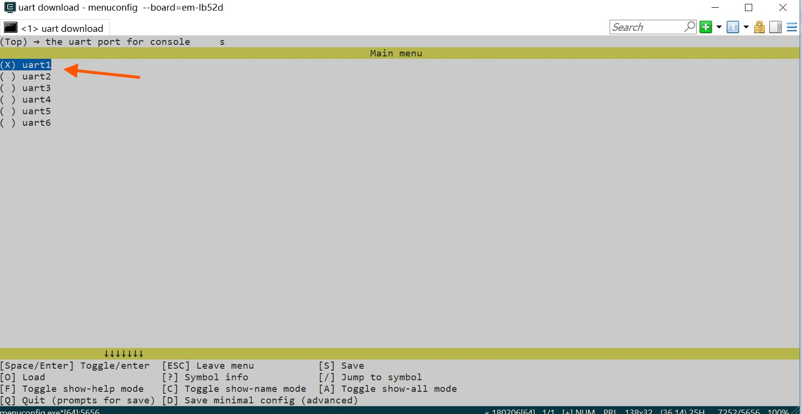
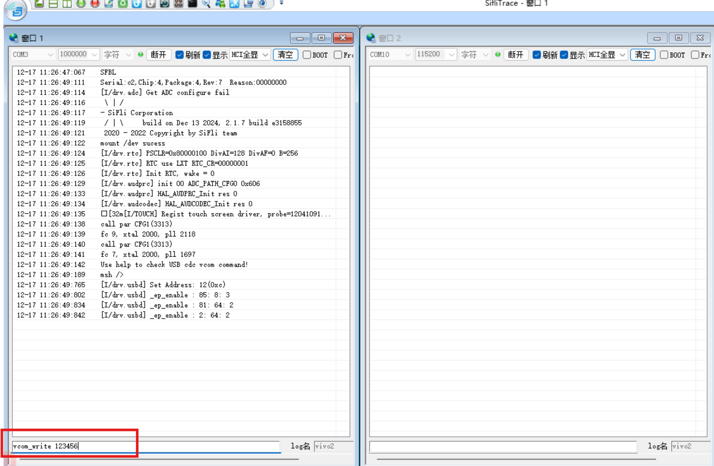
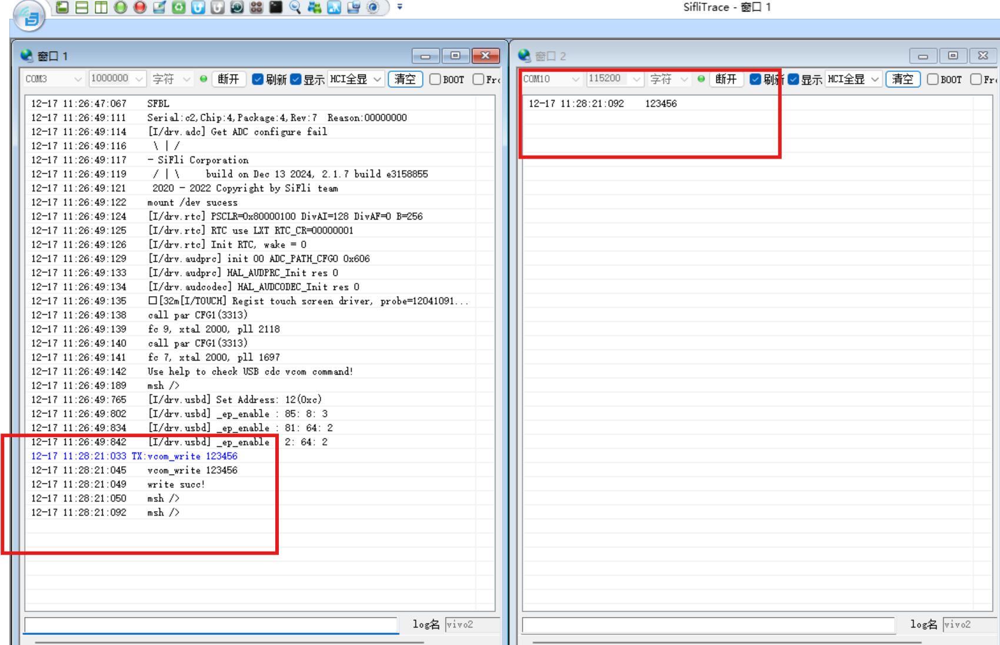
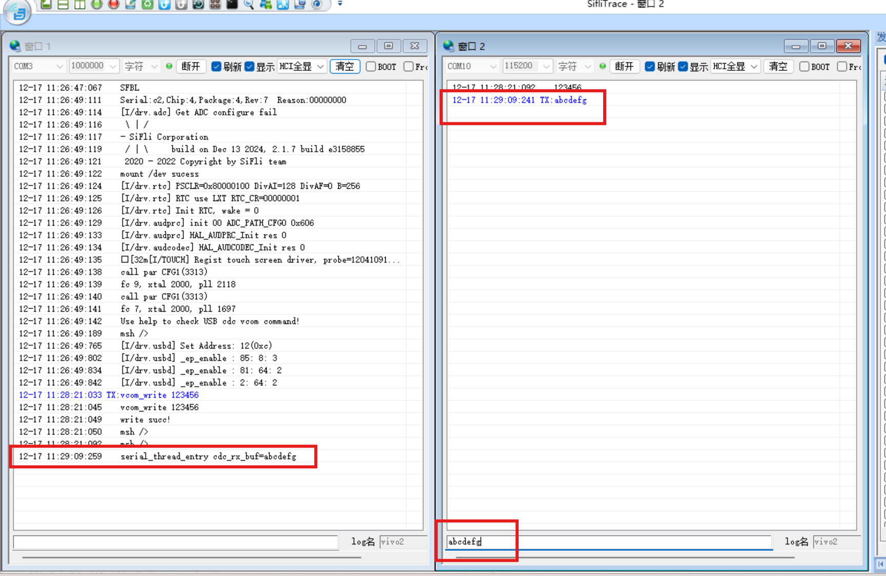
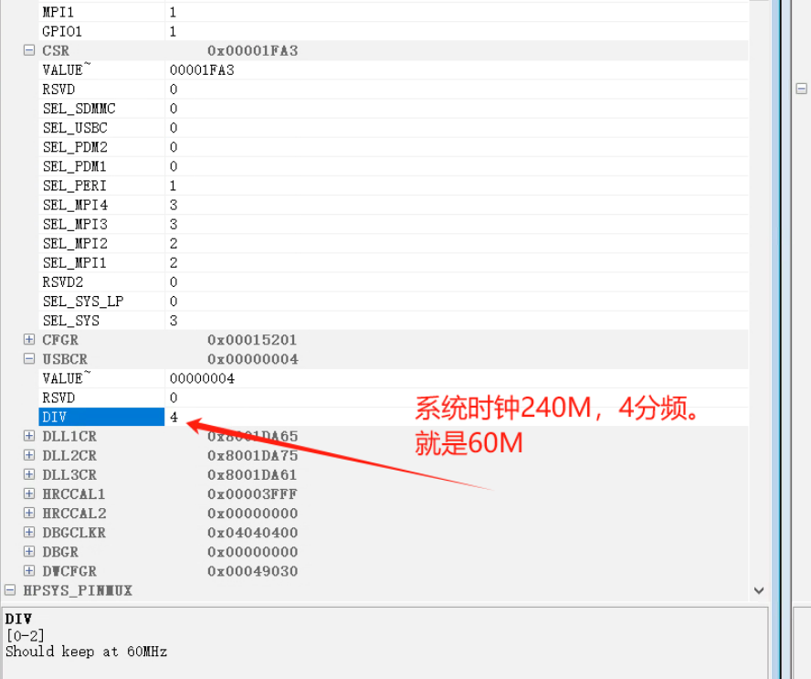
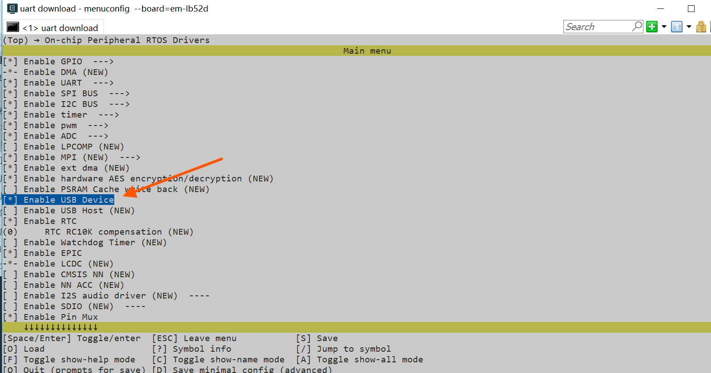

# USB_VCOM Example
Source path: example/rt_device/usb/usb_vcom
## Overview
The example demonstrates USB as a device functioning as virtual serial port,
which can access USB device through serial port on PC.

## Supported Development Boards
The example can run on the following development boards:<br>
* sf32lb52-lcd series
* sf32lb56-lcd series
* sf32lb58-lcd series

**Note:** Generally, examples run on the chip's HCPU. "eh-lb563" is equivalent
to "eh-lb563_hcpu". If you want to run the example on LCPU, you can use
"eh-lb563_lcpu". Currently USB functionality temporarily only supports running
on HCPU.

## Example Directory Structure
USB_MSTORAGE project contains 1 .c file (main.c). The tree structure below shows
other files in the project directory.
```
|--Readme.md
|--src
|    |--main.c
|    |--Sconscript
|--project  
        |--Kconfig
        |--Kconfig.proj
        |--proj.conf
        |--rtconfig.py
        |--SConscript
        |--SConstruct
```
## Example Usage
### Hardware Requirements
1. To run this example, a compatible development board is required. 2. A USB
data cable with data transfer capability is required. 3. For HDK52X V1.2
hardware, the following modifications are necessary:
| R0105 | R0710 | R0706 |
| ----- | ----- | ----- |
| NF    | NF    | NF    |

4. For HDK56X V1.1 hardware, the following modifications are necessary:
| R0210 | R0211 | R0202 | R0204 | R0634 | R0633 | R0132 | R0107 | R0103 | R0106 |
| ----- | ----- | ----- | ----- | ----- | ----- | ----- | ----- | ----- | ----- |
| NF    | NF    | NF    | NF    | NF    | NF    | NF    | NF    | 220K  | 390K  |
### Pin Configuration
**Note:** The table below shows pin configurations for VBUS control on each
development board.
|          | VBUS pin | DP   | DM   |
| -------- | -------- | ---- | ---- |
| eh-lb523 | PA32     | PA35 | PA36 |
| eh-lb520 | PA32     | PA35 | PA36 |
| eh-lb525 | PA32     | PA35 | PA36 |
| eh-lb561 | PA51     | PA17 | PA18 |
| eh-lb563 | PAXX     | PA17 | PA18 |

### menuconfig Configuration
```
//Execute command
menuconfig --board=sf32lb52-lcd_n16r8
```
**Note:** USB pins in HDK52X are not multiplexed with UART, so steps 1 and 2 can
be skipped.

1. Set "the device name for console" to configure the UART port for log output.


2. Enable UART4 for log output and disable UART1; "Enable UART4" 

3. Enable USB device functionality; "Enable USB Device"
* Configure log print serial port number "the device name for console" 
* Enable log print serial port uart4, disable uart1; "Enable UART4" 
* Enable USB device functionality; "Enable USB Device"

### Compilation and Programming
Follow these steps to complete compilation and programming.

```
scons --board=sf32lb52-lcd_n16r8 -j8
build_sf32lb52-lcd_n16r8_hcpu\uart_download.bat
```

(For operating different chip boards, just change the chip name, for example 587
board, just replace 'eh-lb525' with 'sf32lb58-lcd_n16r64n4')

## Example Output Results Display
The following results show the log after the example runs on the development
board. If you cannot see these logs, it means the example did not run
successfully as expected and requires troubleshooting. System startup
```c
usb_init
Use 'help' to view the USB CDC VCOM commands.
msh /&gt;
```

```c
void vcom_write(int argc, char **argv)
{
    rt_size_t len = rt_device_write(usb_vcom, 0, argv[1], strlen(argv[1]));
    if (len != strlen(argv[1])) rt_kprintf("Write failed!\n");
    else rt_kprintf("Write successful!\n");
}
MSH_CMD_EXPORT(vcom_write, write to vcom);
```
2. The string "123456" should be visible in the corresponding PC serial terminal
emulator.  3. For serial data reception, transmit
a string from the PC serial terminal. The HDK will print the following: abcdefg
```c
serial_thread_entry cdc_rx_buf=abcdefg
```

## Troubleshooting
If expected log does not appear, troubleshooting can be done from the following
aspects:
* Whether hardware connection is normal
* Whether pin configuration is correct
* Check if USB interface is loose
* Check if USB cable has data transmission capability
* Check if USB clock is 60MHz frequency

If virtual serial port number cannot be recognized, troubleshooting can be done
from the following aspects:
* Whether USB clock is enabled, refer to the following
* Whether USB data transmission line has data capability

### Check if USB Clock is Enabled
You can open Ozone, select chip to connect, then check  
* If clock is not enabled, you can enter menuconfig –board=sf32lb52-lcd_52d menu
  to enable it (specific operation as follows) 
  Then connect virtual serial port USB
## Example Extension

If you want to modify VBUS detection pin number, you can modify as follows:
 1.  Modify configuration menuconfig --board=sf32lb52-lcd_n16r8 and re-modify
     the parameter in "usb Insertion detection PIN" to the desired detection pin
     D:\MyWork\code_sdk\siflisdk\customer\boards\ec-lb555xxx
 2.  Modify pinmux configuration file **"\siflisdk\customer\boards\ec-lb
     corresponding model directory\bsp_pinmux.c"**, configure this pin to GPIO
     mode;
  ```c
  HAL_PIN_Set(PAD_PA32, GPIO_A32, PIN_NOPULL, 1); // USB VBUS
  ```
