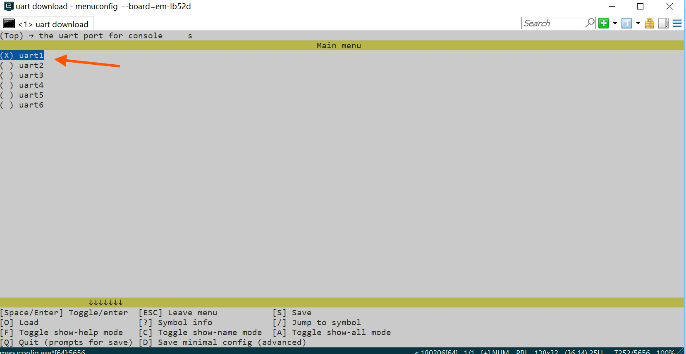

# USB_VCOM示例
## 概述
例程展示了USB作为device设备的虚拟串口功能，可以在pc上以串口方式访问USB设备。

## 支持的开发板
例程可以运行在以下开发板.<br>

* em-lb52d
* em-lb587

**注意：** 一般而言，例程都是运行芯片的HCPU，"eh-lb563_v2" 等效于"eh-lb563_v2_hcpu"，如果想在LCPU运行例程，可以使用"eh-lb563_v2_lcpu"。目前USB功能暂时只支持在HCPU上运行。

## 例程目录结构
USB_MSTORAGE工程包含了1个.c文件(main.c),下面的树状结构展示 了工程目录下的其他文件.
```c
|--Readme.md
|--src
|    |--main.c
|    |--Sconscript
|--project  
        |--Kconfig
        |--Kconfig.proj
        |--proj.conf
        |--rtconfig.py
        |--SConscript
        |--SConstruct
```
## 例程的使用
### 硬件需求
1、运行例程的前提，需要拥有一块支持该例程的开发板。
2、一根具备数据传输能力的USB数据线。
3、HDK52X的V1.2版本硬件需要做如下更改；
| R0105 | R0710 | R0706 |
|-------|-------|-------|
|   NF  |   NF  |   NF  |

4、HDK56X的V1.1版本硬件需要做如下更改；
| R0210 | R0211 | R0202 | R0204 | R0634 | R0633 | R0132 | R0107 | R0103 | R0106 |
|-------|-------|-------|-------|-------|-------|-------|-------|-------|-------|
|   NF  |   NF  |   NF  |   NF  |   NF  |   NF  |   NF  |   NF  | 220K  | 390K  |
### 管脚配置
**注意:** 下面表格展示了各开发板用于VBUS控制的管脚配置。
1、HDK52X的V1.2版本中USB的插拔引脚使用NTC功能引脚复用。
2、HDK56X的V1.1版本中USB的DP与DM引脚与UART1复用了，所以需要将LOG打印的uart1修改为uart4，并关闭uart1。
|               |   vbus pin  |  DP  |  DM  |
|---------------|-------------|------|------|
|eh-lb523_v2    |    PA32     | PA35 | PA36 |
|eh-lb520_v2    |    PA32     | PA35 | PA36 |
|eh-lb525_v2    |    PA32     | PA35 | PA36 |
|eh-lb561_v2    |    PA51     | PA17 | PA18 |
|eh-lb563_v2    |    PAXX     | PA17 | PA18 |

### menuconfig配置
```c
//指令执行
menuconfig --board=em-lb52d
```
**注意：** HDK52X中的USB引脚没有与UART复用因此可跳过1、2步骤。

1、配置log打印串口号 "the device name for console"


2、使能log打印打印串口uart4，关闭uart1；"Enable UART4"


3、使能USB的device功能；"Enable USB Device"
* 再编译界面中输入`menuconfig --board=em-lb52d`进入菜单，在`(Top) → On-chip Peripheral RTOS Drivers`下进行如下配置

* 在`(Top) → Device Drivers → Using USB`,进行如下使能CDC device,设置虚拟串口字符大小，使能虚拟串口的dma功能。

* 在`(Top) → Device Drivers → Using USB → Device type`下面，选择CDC device


### 编译和烧录
按照以下步骤，可以完成编译和烧录。

> scons --board=eh-lb525 --bconf=board_usbd_vcom.conf \
> build_eh-lb525\uart_download.bat

（操作不同的芯片板子只需将芯片名进行更改即可，例如587板子，只需将'eh-lb525'更换成'em-lb587'）

## 例程输出结果展示
下面结果展示了例程在开发板运行起来后的log。如果看不到这些log，就说明例程没能按预期运行成功，需要进行原因排查。
系统启动
```c
 usb_init
 Use help to check USB cdc vcom command!
 msh />
```
1、串口数据发送;输入finsh指令"vcom_write 123456"(使用串口工具SifliTrace)

```c
void vcom_write(int avgc, char **argv)
{
    rt_size_t len =  rt_device_write(usb_vcom, 0, argv[1], strlen(argv[1]));
    if (len != strlen(argv[1])) rt_kprintf("write fail!\n");
    else rt_kprintf("write succ!\n");
}
MSH_CMD_EXPORT(vcom_write, vcom write);
```
2、在对应的PC串口助手上能看到收到的"123456"

3、串口数据接收；在PC的串口助手上发送字符串。则HDK上会打印如下：abcdefg
```c
    serial_thread_entry cdc_rx_buf=abcdefg
```

 ## 故障排除
如果未能出现预期的log，可以从以下方面进行故障排除：
* 硬件连接是否正常
* 管脚配置是否正确
* 检查USB接口是否有松动
* 检查USB线是否具备数据传输功能
* 检查USB的时钟是否是60MHz的频率

如果未能识别出虚拟串口端口号，可以从以下几个方面进行故障排除
* USB的时钟是否使能，可参考如下
* USB数据传输线是否有数据能力

### 查看USB时钟是否使能
可以打开Ozone选择芯片进行连接，然后查看


* 如果时钟没有使能，则可进入menuconfig -–board=em-lb52d菜单，进行开启（具体操作如下）

在进行连接虚拟串口USB即可
 ## 例程扩展
 
 如果想要修改VBUS的检测引脚号，可按照如下方式进行修改。
 1.  修改配置menuconfig --board=eh-lb525_v2中重新修改 将"usb Insertion detection PIN"中的参数修改为想要的检测引脚
 D:\MyWork\code_sdk\siflisdk\customer\boards\ec-lb555xxx
 2.  修改pinmux配置文件 **"\siflisdk\customer\boards\ec-lb对应的型号目录\bsp_pinmux.c"**，将该引脚配置为GPIO模式；
  ```c
HAL_PIN_Set(PAD_PA32, GPIO_A32, PIN_NOPULL, 1);//USB VBUS
```