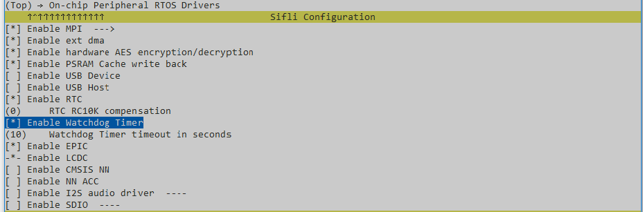
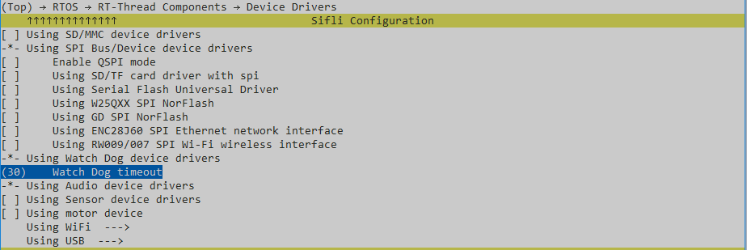

# WDT Example

Source code path: example/rt_device/wdt/wdt

## Supported Platforms
<!-- 支持哪些板子和芯片平台 -->
+ sf32lb52-lcd series
+ sf32lb56-lcd series
+ sf32lb58-lcd series

## Overview
<!-- 例程简介 -->
This example demonstrates WDT usage based on rt-device (using rt-thread),
including:
+ WDT on/off.
+ WDT feeding.
+ WDT timeout response.
```{tip}
This example is based on HCPU, using IWDT and WDT1.
```

## Example Usage
<!-- 说明如何使用例程，比如连接哪些硬件管脚观察波形，编译和烧写可以引用相关文档。
对于rt_device的例程，还需要把本例程用到的配置开关列出来，比如PWM例程用到了PWM1，需要在onchip菜单里使能PWM1 -->

### Hardware Requirements
Before running this example, you need to prepare a development board supported
by this example

### menuconfig Configuration

1. BSP enable WDT (automatically configures `RT_USING_WDT`):
   
2. Configure WDT timeout time (`WDT_TIMEOUT`):
   

### Compilation and Programming
Switch to example project directory and run scons command to execute
compilation:
```
scons --board=eh-lb525 -j32
```
Run `build_sf32lb52-lcd_n16r8_hcpu\uart_download.bat`, select port as prompted
to download:
```
$ ./uart_download.bat

     UART Download

Please input the serial port number: 5
```
For detailed steps on compilation and downloading, please refer to
[](/quickstart/get-started.md) related introduction.

## Expected Results of Example
<!-- 说明例程运行结果，比如哪几个灯会亮，会打印哪些log，以便用户判断例程是否正常运行，运行结果可以结合代码分步骤说明 -->
After example startup, serial port outputs as follows:
1. WDT off then on:
```c
11-01 11:05:24:772    WDT Example.
11-01 11:05:24:813    WDT off.
11-01 11:05:24:816    WDT on.
```
```{tip}
When using rt-thread, WDT initialization configuration and enable (rt_hw_watchdog_init) are already completed by default in startup process, no need to call initialization configuration and enable separately.
```
2. Cancel feeding in idle thread:
```c
11-01 11:05:24:820    Unregister idle hook.
```
```{tip}
rt_hw_watchdog_init registers idle hook for feeding. Cancel here to demonstrate manual feeding.
```
3. Feeding (every 5 seconds):
```c
11-01 11:05:29:709    Watchdog feeding.
11-01 11:05:34:699    Watchdog feeding.
11-01 11:05:39:668    Watchdog feeding.
11-01 11:05:44:660    Watchdog feeding.
11-01 11:05:49:629    Watchdog feeding.
11-01 11:05:54:600    Watchdog feeding.
11-01 11:05:59:594    Watchdog feeding.
11-01 11:06:04:575    Watchdog feeding.
11-01 11:06:09:558    Watchdog feeding.
11-01 11:06:14:553    Watchdog feeding.
```
3. After stopping feeding, WDT1 timeout (`WDT_TIMEOUT`, configured in
   menuconfig), generating interrupt. In interrupt (`WDT_IRQHandler`) WDT1/WDT2
   will be disabled, IWDT refreshed, IWDT timeout time updated (`WDT_TIMEOUT`):
```c
11-01 11:06:14:557    Stop watchdog feeding.
11-01 11:06:51:813    WDT1 timeout occurred.
11-01 11:06:51:817    WDT reconfiguration:
11-01 11:06:51:821      WDT1 and WDT2 have been stopped.
11-01 11:06:51:825      IWDT refreshed; timeout set to WDT_TIMEOUT.
```
```{tip}
Provides overridable function: wdt_store_exception_information, called by WDT_IRQHandler. Can be used to save scene, reboot system, etc.
```
4. IWDT timeout resets system:
```c
11-01 11:07:35:237    SFBL
11-01 11:07:37:445    Serial:c2, Chip:4, Package:3, Rev:2, Reason:00000000
```


## Exception Diagnosis

1. Confirm WDT configuration status (enable status, count configuration, working
   mode) through WDT registers: 

## Reference Documents
<!-- 对于rt_device的示例，rt-thread官网文档提供的较详细说明，可以在这里添加网页链接，例如，参考RT-Thread的[RTC文档](https://www.rt-thread.org/document/site/#/rt-thread-version/rt-thread-standard/programming-manual/device/rtc/rtc) -->

## Update Log
| Version | Date    | Release Notes   |
| ------- | ------- | --------------- |
| 0.0.1   | 10/2024 | Initial version |
|         |         |                 |
|         |         |                 |
