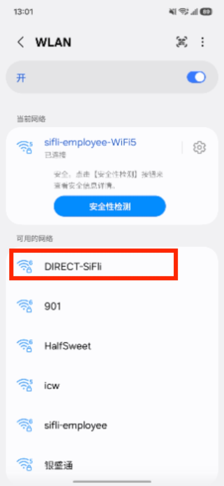
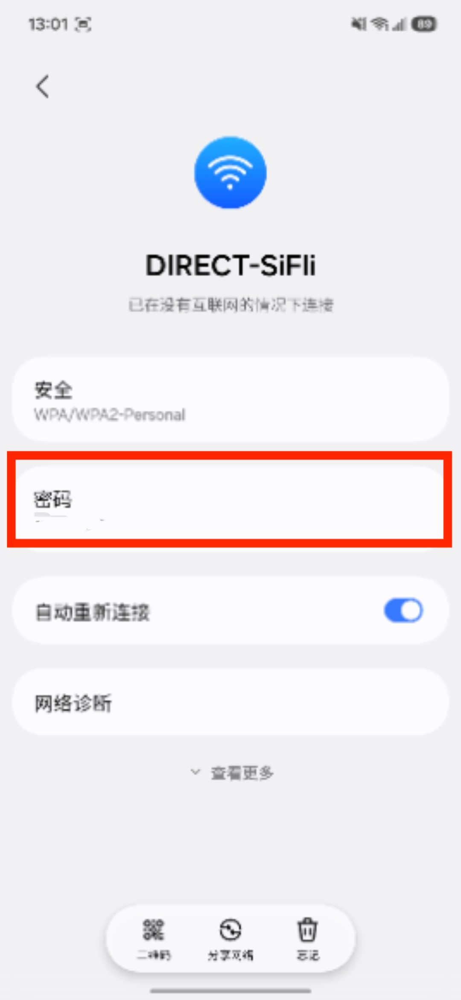
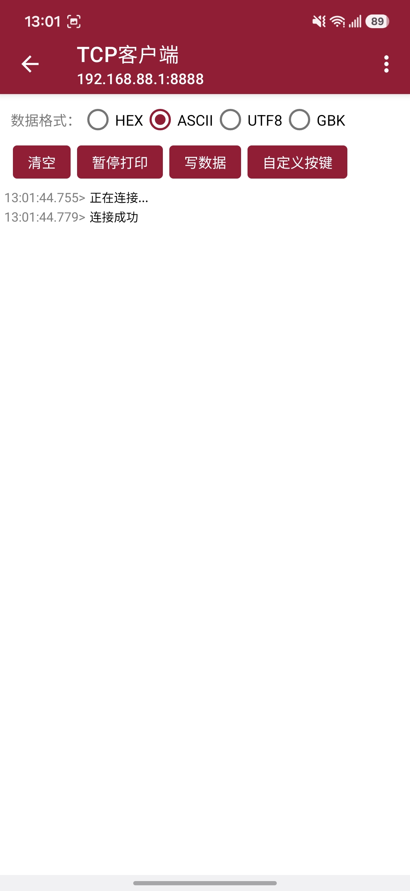
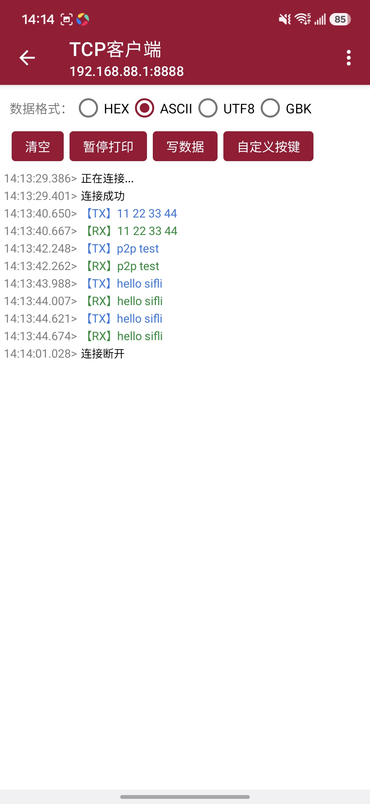

# Wi-Fi P2P Example

Source path: example/rt_device/wifi/p2p

## Overview

This example demonstrates creating a hotspot using Wi-Fi P2P GO mode. A mobile phone or other client connects to the hotspot and communicates with the board via a TCP Echo server.

## Supported Boards

This example runs on the following board:
* sf32lb58-core

> **Note:** The standard sf32lb58-core board is shipped with an SWT Wi-Fi module. This example depends on the AIC8800MC Wi-Fi module and its P2P driver. You must replace the on-board Wi-Fi module with the AIC8800MC before running this example; after replacement, the board effectively becomes a board using the AIC8800MC Wi-Fi module.

## Code Execution Logic

The application calls `rt_wlan_p2p_go_start(ssid, password)` to start P2P GO mode:
* Internally, this API uses a completion mechanism to wait for the firmware's `CUSTOM_MSG_START_P2PGO_IND` callback, returning only after P2P GO has successfully started.
* After P2P GO starts, the board IP address is 192.168.88.1.

Once P2P GO is started, a TCP Echo server thread is created:
* Listens on port 8888, receives client data, and echoes it back.
* A mobile phone or other client can connect to the P2P GO hotspot and test TCP communication.

Stopping P2P GO:
* Use the MSH command `p2p_stop` to stop P2P GO.

## Usage

Taking sf32lb58-core as an example:

### Hardware Requirements

1. A supported development board (the on-board Wi-Fi module must be the AIC8800MC)
2. A USB data cable capable of data transfer
3. An Android phone with a network debugging tool installed
4. An AIC8800MC Wi-Fi module (the standard sf32lb58-core ships with an SWT Wi-Fi module; replace it with the AIC8800MC to run this example)

### Modifying SSID and Password

You can change the SSID and password in `main.c`:

```c
#define P2P_GO_SSID         "DIRECT-SiFli"      /* P2P GO SSID */
#define P2P_GO_PASSWORD     "12345678"          /* P2P GO password (min 8 chars) */
```

### Menuconfig Settings

The default configuration is ready to use.

```bash
// Run this command in the example project directory
sdk.py menuconfig --board=sf32lb58-core_n16r32n1
```

1. **Enable SDIO Interface**
    - Path: On-chip Peripherals → SDIO → SDMMC2
    - Enable: SDIO, SDMMC2
    - Set "SDIO mode" under SDMMC2 to 2 (SDIO mode: 0=SDCARD / 1=EMMC / 2=SDIO)
        - Macros: `CONFIG_BSP_USING_SDIO`, `CONFIG_BSP_USING_SDMMC2`, `CONFIG_SDIO2_CARD_MODE=2`

    > **Note:** The SDMMC selection is board-specific and depends on which SDMMC controller the on-board Wi-Fi module is connected to (SDMMC2 on the sf32lb58-core). Refer to the board schematic to confirm.

2. **Enable AIC8800MC Wi-Fi Module**
    - Path: Peripherals → Wi-Fi → AIC8800MC
    - Enable: AIC8800MC Wi-Fi driver
        - Macro: `CONFIG_WIFI_USING_AIC8800MC`

3. **Enable lwIP Stack**
    - Path: RTOS → RT-Thread Components → Network
    - Enable: lwIP: light weight TCP/IP stack
        - Macro: `NET_USING_LWIP`

4. **Select lwIP Version (2.1.2)**
    - Path: RTOS → RT-Thread Components → Network → light weight TCP/IP stack
    - Enable: lwIP v2.1.2
        - Macro: `RT_USING_LWIP212`

5. **Enable RT-Thread Wi-Fi Framework**
    - Path: RTOS → RT-Thread Components → Device Drivers → Using WIFI
    - Enable: Using Wi-Fi framework
        - Macro: `RT_USING_WIFI`

6. **Enable P2P Support**
    - Path: Peripherals → Wi-Fi → AIC8800MC → Enable WiFi Direct (P2P) support
    - Enable: Enable WiFi Direct (P2P) support
        - Macro: `AIC_ENABLE_P2P`

### Build and Download

Follow these steps to build and download:

```bash
scons --board=sf32lb58-core_n16r32n1 -j8
build_sf32lb58-core_n16r32n1_hcpu\uart_download.bat
```

(For other boards, replace the board name accordingly. For example, for sf32lb52-wlan-core, replace `sf32lb58-core_n16r32n1` with `sf32lb52-wlan-core_n16r16`)

## Test Procedure

* After power-on, open Wi-Fi on your phone. You should see `DIRECT-SiFli`. Connect to the hotspot `DIRECT-SiFli` (password `12345678`).



* After connecting, use a network debugging tool to connect to `IP: 192.168.88.1 port: 8888`. Send any data to receive an echo. Send `p2p_stop` to stop P2P GO, and the network debugging tool will show a disconnection.



## Sample Output

* **Boot and start P2P GO as TCP server**

```log
07-24 14:13:14:117    [P2P] Starting P2P GO: SSID="DIRECT-SiFli"
07-24 14:13:14:117    >>> rwnx_send_fhcustmsg_start_p2p_req()
07-24 14:13:15:087    >>> rwnx_fhcustmsg_start_p2pgo_ind()
07-24 14:13:15:091    p2p_ind: P2P GO started, status=0
07-24 14:13:15:094    ip: 192.168.88.1,  gw: 0.0.0.0,  mk: 255.255.255.0
07-24 14:13:15:095    [65222] I/WLAN.mgnt: wifi connect success ssid:
07-24 14:13:15:097    [P2P] P2P GO started
07-24 14:13:15:097    [P2P Echo] server listening on port 8888

```

* **Phone connects to P2P GO and sends data**

```log
07-24 14:13:19:804    >>> rwnx_fhcustmsg_assoc_ap_ind()
07-24 14:13:19:807    P2P/AP: STA joined, MAC=22:06:B9:B6:35:0E
07-24 14:13:29:017    [P2P Echo] client connected: 192.168.88.10:33912
07-24 14:13:40:280    [P2P Echo] recv(11): 11 22 33 44
07-24 14:13:41:876    [P2P Echo] recv(8): p2p test
07-24 14:13:43:620    [P2P Echo] recv(11): hello sifli
07-24 14:13:44:287    [P2P Echo] recv(11): hello sifli
```

* **Stop P2P GO (command: p2p_stop)**

```log
07-24 14:13:54:102 TX:p2p_stop
07-24 14:13:54:108    p2p_stop
07-24 14:13:54:112    >>> rwnx_send_fhcustmsg_stop_p2p_req()
07-24 14:13:54:118    >>> rwnx_fhcustmsg_disassoc_ap_ind()
07-24 14:13:54:119    P2P/AP: STA left, MAC=22:06:B9:B6:35:0E
07-24 14:13:54:123    >>> rwnx_fhcustmsg_stop_p2pgo_ind()
07-24 14:13:54:125    p2p_ind: P2P GO stopped, status=0
07-24 14:13:54:126    [P2P] P2P GO stopped
07-24 14:13:54:129    msh />
```

## Troubleshooting

If the expected output does not appear, check the following:

* Verify that Wi-Fi is powered on.
* If using SDHCI mode, confirm it is configured as SDIO mode (see menuconfig settings above).
* Verify that the GPIO directions for the two pins connecting the host to the Wi-Fi chip are correct (one input, one output).
* Confirm that the `AIC_ENABLE_P2P` macro is enabled in menuconfig.
* Confirm that the SSID and password used on the phone match the configuration in `main.c`.

## Reference

- [SiFli-SDK Getting Started](https://docs.sifli.com/projects/sdk/latest/sf32lb52x/quickstart/index.html)
- [RT-Thread Wi-Fi Framework](https://www.rt-thread.org/document/site/#/rt-thread-version/rt-thread-standard/programming-manual/device/wlan/wlan)
