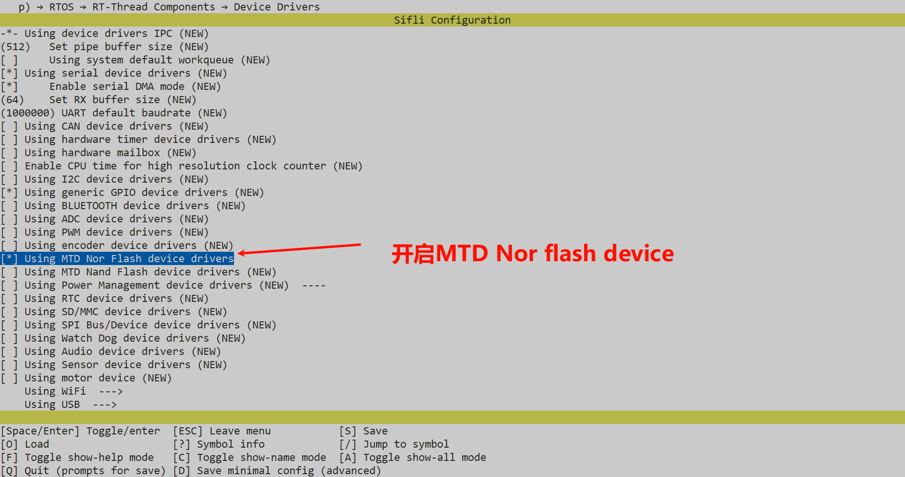
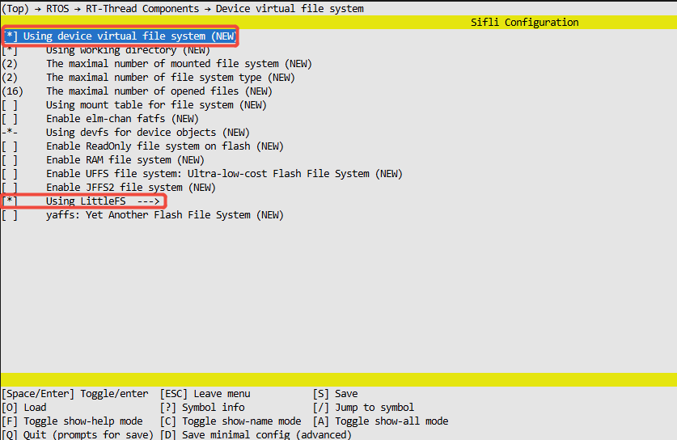
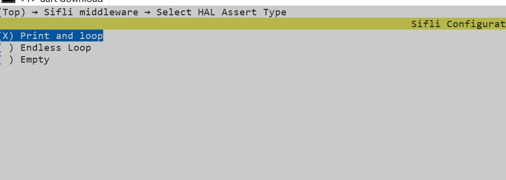

# LittleFs NOR Example

Source code path: example/storage/littlefs

## Supported Platforms
<!-- 支持哪些板子和芯片平台 -->

+ sf32lb52-lcd_n16r8

## Overview
<!-- 例程简介 -->
LittleFS is a lightweight, power-loss safe file system designed for embedded
systems, especially suitable for non-volatile storage devices such as NOR Flash.


## Usage Guide
This example demonstrates the file system functionality of LittleFs. You can
call common file commands in the UART console, such as:

```
df               - Display free disk space
mountfs          - Mount a device to the file system
mkfs             - Format a disk with a file system
mkdir            - Create a directory
pwd              - Print the name of the current working directory
cd               - Change the shell working directory
rm               - Remove (unlink) files
cat              - Concatenate and display file content
mv               - Rename SOURCE to DEST
cp               - Copy SOURCE to DEST
ls               - List information about files
```

### File System Packaging

The default compilation script does not download the file system partition image
file, so the first time the program runs, if the mount fails, it will
automatically format the partition. The specific implementation can be found in
the `mnt_init` function in `main.c`. The SDK also provides the functionality to
package files under a specified directory and generate a file system image file.
You can uncomment the following code in `SConstruct`. This code's function is to
package files under the disk directory during compilation and generate a
`fs_root.bin` file in the build directory. If the partition table in `ptab.json`
defines a partition with the `img` attribute as `fs_root`, the download script
will also download the bin file.

```
# fs_bin=FileSystemBuild("../disk", env)
# AddCustomImg("fs_root", bin=[fs_bin])
```
## Example Usage Instructions
### Hardware Requirements
1. Prerequisites for running the routine include a supported development board
and 2. a USB data cable capable of data transmission.
### menuconfig Configuration
```
//Execute command
 menuconfig --board=em-lb561
```
![alt text]{1} 2. Use device virtual file system and enable LittleFs file system

 3. Select HAL Assert type






### Compilation and Flashing
Switch to the example project directory and run the scons command to compile:
```c
&gt; scons --board=sf32lb52-lcd_n16r8 -j32
```
Switch to the example `project/build_xx` directory and run `uart_download.bat`,
select the port as prompted for download:
```c
$ ./uart_download.bat

     UART Download

Please input the serial port number: 5
```
For detailed steps on compilation and download, please refer to the relevant
introduction in [Quick Start](quick_start).

## Expected Results
The following results show the log after the example runs on the development
board. If you don't see these logs, it means the example didn't run as expected
and you need to investigate the cause.
```
mount fs on flash root success//indicates successful file system mounting
```
1. Execute the `ls` command via the serial port to view the files in the root
directory.

2. Enter `mkdir test2` to create a folder (directory) named "test2".

3. Enter `ls` again to verify if the "test2" folder (directory) was successfully
created.

4. Enter `pwd` to check the current working directory path. 

## Exception Diagnosis
If the expected log and phenomena do not appear, you can troubleshoot from the
following aspects:
* Whether the hardware connection is normal
* Check if the USB cable has data transmission capability
* Whether the above menuconfig is configured correctly
