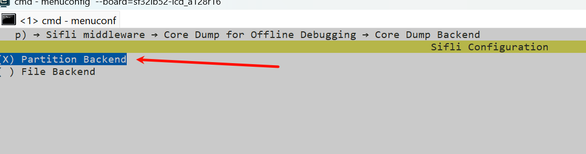
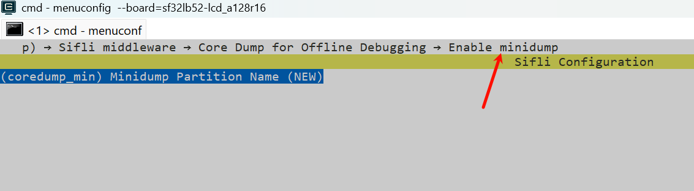
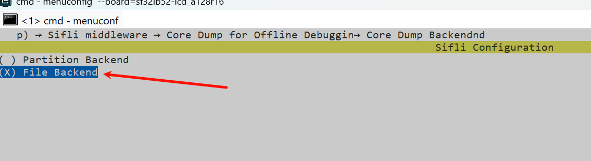
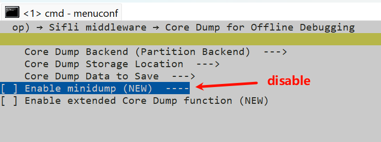
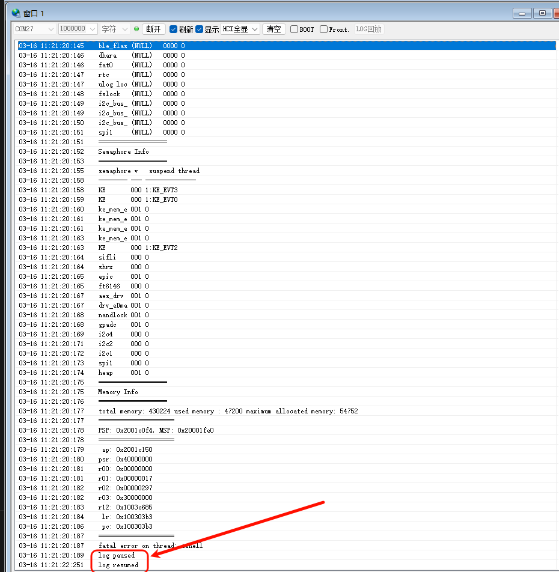
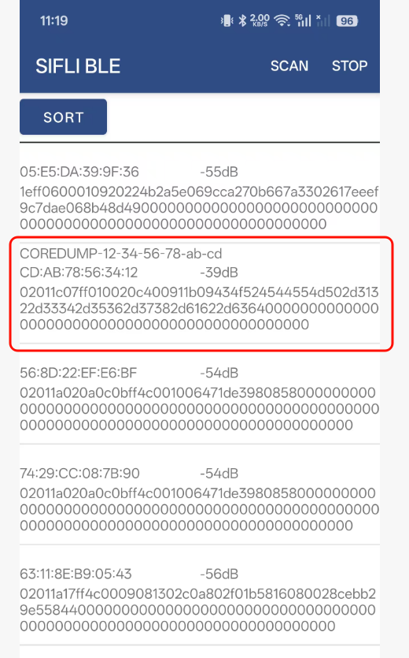
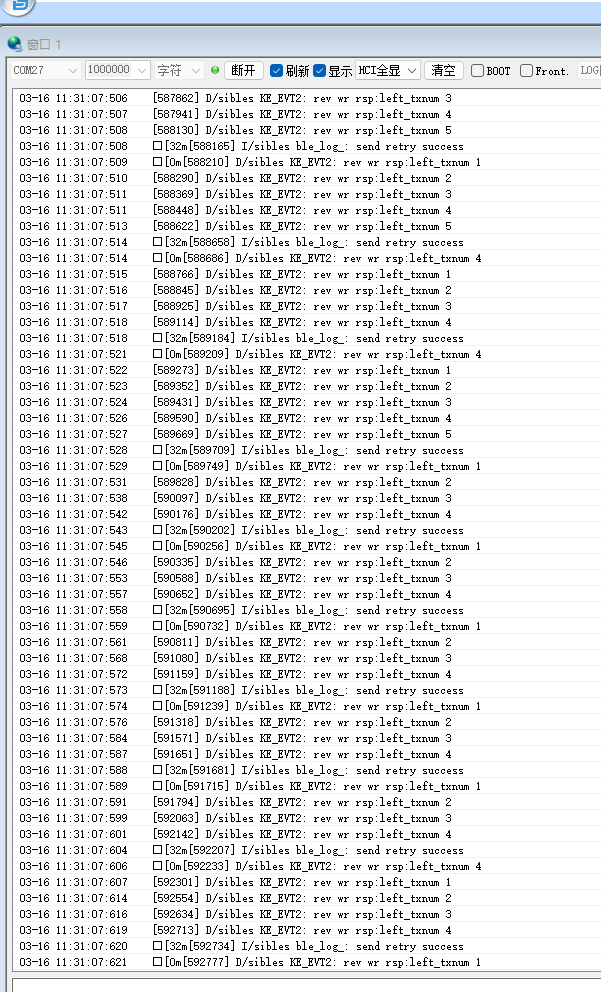

# coredump Example
Source path: example/system/coredump

## Overview
- This example demonstrates the process of saving crash information, and supports connecting to a phone via BLE to transfer the crash-scene data to the phone. After power-on, the device broadcasts a name in the form `COREDUMP-xx-xx-xx-xx-xx-xx`.

## Supported Platforms
Verified on the following platforms:
- sf32lb52-lcd_n16r8
- sf32lb52-lcd_a128r16

## Configuration and menuconfig
The example supports four mode combinations:
1) Partition mode, minidump disabled
2) Partition mode, minidump enabled
3) File mode, minidump disabled
4) File mode, minidump enabled
The default is 1. Partition mode, minidump disabled. You can change the mode with the following configurations:
2. Partition mode, minidump enabled


3. File mode, minidump disabled


4. File mode, minidump enabled


### Build and Flash
Taking sf32lb52-lcd_n16r8 as an example, follow the steps below to build and flash.
```
scons --board=sf32lb52-lcd_n16r8

.\build_sf32lb52-lcd_n16r8_hcpu\uart_download.bat
```

## Using the Example
After the program powers on, when a crash occurs (a crash can be triggered manually via assert), a log like the following appears, indicating that the crash-scene data is being saved.

Reset the development board again, open the SiFli BLE app on your phone, find the Bluetooth device with a name in the form `COREDUMP-xx-xx-xx-xx-xx-xx` and connect to it, then export the crash-scene data through the phone app.


During the export process, a large amount of corresponding logs will appear.


Finally, a bin file is generated on the phone. You can send this file to a computer and use the Context2Mem.exe tool to convert the .bin file into a dump file. The Context2Mem.exe tool is located at `SDK\tools\crash_dump_analyser\script`.
